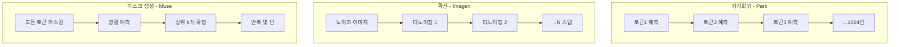
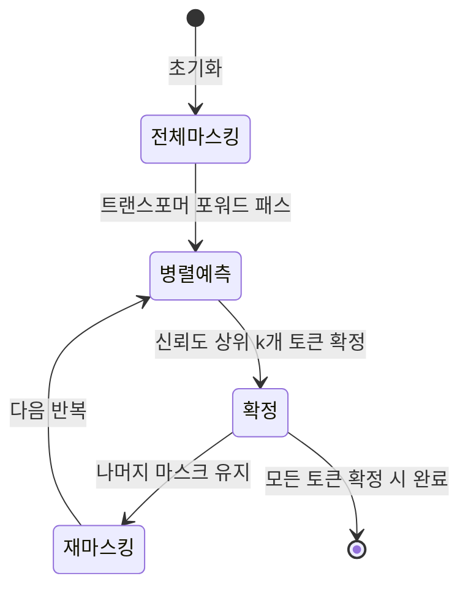
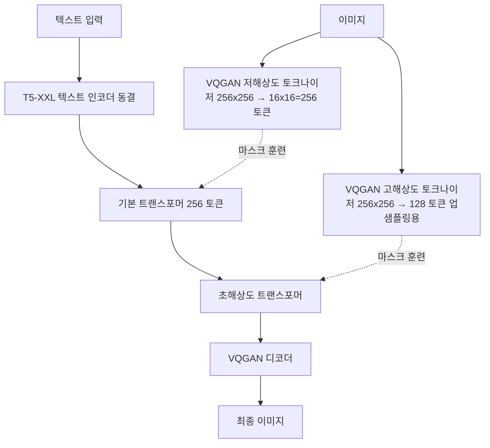

# Muse - 마스크 생성 트랜스포머 기반 텍스트-이미지 생성

## 배경

Muse(Chang et al., Google Research, 2023)는 **마스크 생성 트랜스포머(masked generative transformer)**를 텍스트-이미지 생성에 적용한 모델이다. 기존 자기회귀 모델(Parti)이나 확산 모델(Imagen)과 달리, 이미지 토큰의 일부를 마스킹하고 **병렬로 마스크를 채우는** 방식을 사용한다.

핵심 주장: 동일한 품질 수준에서 확산 모델보다 **약 10배 빠른 추론**을 달성한다. 이는 반복적 디노이징이나 순차적 토큰 예측 없이, 몇 번의 병렬 마스크 채우기 반복으로 이미지를 생성하기 때문이다.

MaskGIT(Chang et al., 2022)를 텍스트-이미지 대규모 생성으로 확장한 모델로 볼 수 있다.

## 마스크 생성 방식의 원리

### 텍스트-이미지 생성의 세 가지 패러다임

- **자기회귀**: 토큰 하나씩 순차 예측 → 느림
- **확산**: 50-1000 디노이징 스텝 → 중간 속도
- **마스크 생성**: 반복마다 여러 토큰을 병렬 예측/확정 → 빠름

### 마스크 스케줄 및 디코딩

마스크 생성 트랜스포머의 핵심 아이디어는 **신뢰도 기반 마스크 채우기**:

각 반복(iteration):
1. 트랜스포머가 마스크된 모든 위치를 **동시에** 예측
2. 예측 신뢰도(소프트맥스 확률)가 높은 상위 $k$개 토큰을 확정
3. 나머지는 여전히 마스크 상태로 다음 반복
4. $k$는 코사인 스케줄에 따라 감소: 처음에는 많이, 후반에는 적게 확정

총 반복 횟수: 약 24-36회로 1024개 토큰을 모두 확정할 수 있다. (자기회귀 방식의 1024번 vs 마스크 방식의 24-36번)

## 아키텍처 구조

### 전체 파이프라인

### 이중 VQGAN 토크나이저

Muse는 두 개의 VQGAN을 사용한다:

| VQGAN | 역할 | 토큰 수 | 코드북 크기 |
|-------|------|--------|-----------|
| 저해상도 | 256x256 → 16x16 패치 | 256 | 8192 |
| 고해상도 | 256x256 → 32x32 패치 | 1024 (4x 업샘플링용) | 8192 |

### 기본 모델 (Base Model)

T5-XXL 임베딩을 조건으로 받아 256개 이미지 토큰 시퀀스의 마스크를 채우는 트랜스포머:

- **T5-XXL**: 동결 상태. 텍스트 시퀀스 임베딩으로 제공
- **크로스어텐션**: 트랜스포머 각 레이어에서 T5 임베딩에 어텐션
- **마스크 토큰 [MASK]**: 마스크된 위치를 특수 학습 가능 토큰으로 대체

훈련 시 이미지 토큰의 랜덤 비율을 마스킹하고 원본 예측을 교차 엔트로피 손실로 학습:

$$\mathcal{L} = -\mathbb{E}_{m \sim M} \sum_{i \in m} \log p_\theta(x_i | x_{\bar{m}}, c)$$

- $m$: 마스크 위치 집합
- $c$: 텍스트 조건
- $x_{\bar{m}}$: 마스크되지 않은 토큰들

### 초해상도 모델 (Super-Resolution Model)

기본 모델 출력(256 토큰 → 256x256)을 받아 고해상도(1024 토큰 → 512x512)로 업샘플링:

- 저해상도 토큰을 **조건**으로 입력받음
- 고해상도 토큰 마스크를 병렬로 채움
- 동일한 마스크 생성 방식 적용

## 학습 설정

### 데이터

- **CC3M**, **CC12M**, **WebLI** (Google 내부 데이터) 등 수십억 이미지-텍스트 쌍
- T5-XXL은 완전 동결, VQGAN도 이미지 전용으로 사전 훈련 후 동결

### 하이퍼파라미터

| 항목 | 값 |
|------|---|
| 기본 모델 파라미터 | 632M |
| 초해상도 모델 파라미터 | 1B |
| T5-XXL | 4.6B (동결) |
| 마스크 비율 (훈련) | 0~1 균등 분포 |
| 마스크 스케줄 (추론) | 코사인 |
| 추론 반복 횟수 | 24 (기본), 36 (고품질) |

## 성능 비교

### CC3M FID 및 CLIP 점수

| 모델 | FID ↓ | CLIP ↑ | 추론 시간 (상대) |
|------|-------|--------|--------------|
| Imagen (Base) | 7.27 | 0.27 | 1x |
| **Muse** | **7.88** | **0.32** | **~10x 빠름** |
| DALL-E 2 | 10.39 | 0.26 | - |

FID는 Imagen보다 약간 높지만 CLIP 점수(텍스트 정렬)는 더 높고, **추론 속도는 약 10배 빠르다**.

### 추론 속도 분석

- Muse는 각 반복이 **병렬 연산**이므로 GPU 활용도가 높음
- 자기회귀 방식(Parti)의 1024 순차 스텝 vs Muse의 24-36 병렬 반복

## 인페인팅 및 아웃페인팅

마스크 생성 방식의 자연스러운 확장 능력:

- **인페인팅**: 이미지의 특정 영역을 마스킹하고 텍스트 조건으로 채우기
- **아웃페인팅**: 이미지 경계 외부를 마스킹하고 확장
- 별도 파인튜닝 없이 **훈련 시 마스킹 방식과 동일**한 추론 절차로 가능

## MaskGIT → Muse 계보

| 모델 | 연도 | 특징 |
|------|------|------|
| BERT | 2018 | 마스크 언어 모델링 (MLM) |
| MaskGIT | 2022 | 이미지 토큰에 MLM 적용, 클래스 조건 |
| **Muse** | **2023** | **MaskGIT + T5 텍스트 조건 + 대규모** |
| MAGE | 2023 | MaskGIT 자기지도 학습 확장 |
| MAR | 2024 | 연속 토큰 공간에서 마스크 AR |

## 실무 활용 관점

### 장점

- **빠른 추론**: 실시간 또는 대화형 이미지 편집에 적합
- **인페인팅 내장**: 별도 모델 없이 편집 가능
- **병렬 처리 효율**: GPU 활용도 높음

### 단점

- **자기회귀 대비 세부 정확도**: 순차 생성 대비 일부 세밀한 디테일이 부정확할 수 있음
- **비공개 모델**: 가중치 및 코드 미공개

## 관련 문서

- [[parti-autoregressive-image]]
- [[imagen-text-to-image]]
- [[dalle-3-architecture]]
- [[stable-diffusion-3-mmdit]]
- [[vq-vae]]
- [[diffusion-models]]
- [[latent-diffusion-model]]
- [[vision-transformer]]
- [[t5-text-to-text]]
- [[cross-attention]]
