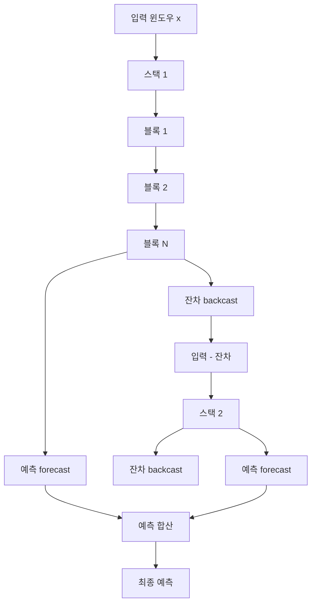
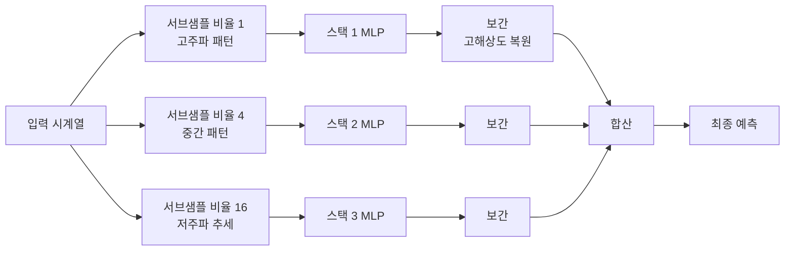

# N-BEATS / N-HiTS

## 개요

N-BEATS(Neural Basis Expansion Analysis for Interpretable Time Series Forecasting)와 N-HiTS(Neural Hierarchical Interpolation for Time Series Forecasting)는 Transformer나 순환 신경망(RNN) 없이 **순수 다층 퍼셉트론([[perceptron-mlp|MLP]])만으로** 당시 최고 수준의 시계열 예측 성능을 달성한 아키텍처다.

[[time-series-forecasting-dl|딥러닝 기반 시계열 예측]]에서 "복잡한 어텐션 메커니즘이 꼭 필요한가?"라는 질문에 강력한 반증을 제공했다.

## N-BEATS

### 기본 구조

N-BEATS는 **기저 확장(basis expansion)** 원리에 기반한다. 시계열 예측 문제를 예측값을 기저 함수(basis functions)의 선형 결합으로 표현하는 문제로 재정의한다.

각 **블록(block)**은 다음으로 구성된다:
1. 완전 연결 레이어(FC layers) 스택 - 입력 처리
2. **Backcast 헤드**: 입력 윈도우를 재구성하는 성분 출력
3. **Forecast 헤드**: 예측 시계열 성분 출력

각 블록의 backcast(잔차)를 다음 블록의 입력에서 빼는 **잔차 연결(residual connection)** 구조가 핵심이다.

### 두 가지 변형

| 변형 | 기저 함수 | 특성 |
|------|-----------|------|
| N-BEATS Generic | 학습 가능한 임의 기저 | 높은 표현력, 해석 어려움 |
| N-BEATS Interpretable | 추세(polynomial) + 계절성(Fourier) 고정 기저 | 해석 가능한 분해 |

Interpretable 변형은 예측 결과를 추세(trend) 성분과 계절성(seasonality) 성분으로 명시적으로 분리해 출력한다.

## N-HiTS

N-HiTS는 N-BEATS를 계승하면서 **계층적 보간(hierarchical interpolation)**을 추가했다.

### 핵심 개선: 다중 해상도 샘플링

장기 예측에서 고해상도 정보와 저해상도 추세 정보를 동시에 효율적으로 처리하기 위해, 스택별로 **다른 비율의 서브샘플링(MaxPool)**을 적용한다.

- 낮은 비율 스택: 단기 고주파 패턴 담당
- 높은 비율 스택: 장기 추세·저주파 패턴 담당
- 각 스택의 출력을 보간(interpolation)하여 원래 예측 길이로 복원

### N-HiTS 장점

1. **파라미터 효율**: 긴 예측 시계열을 저해상도에서 학습 후 보간하여 파라미터 수 절감
2. **장기 예측**: N-BEATS보다 긴 예측 구간에서 더 안정적인 성능
3. **속도**: Transformer 계열보다 훨씬 빠른 학습·추론

## M4, M5 대회에서의 성과

N-BEATS는 M4 예측 대회(2020)에서 순수 딥러닝 모델로는 처음으로 앙상블 없이 전통적 통계 방법을 능가하는 성과를 거뒀다. 이는 딥러닝 시계열 예측의 중요한 이정표였다.

## Nixtla NeuralForecast 통합

N-BEATS와 N-HiTS는 Nixtla의 NeuralForecast 라이브러리에 포함되어 있어 간단하게 사용할 수 있다. [[timegpt-foundation|TimeGPT]]와 같은 생태계를 공유한다.

## 관련 문서

- [[time-series-forecasting-dl]] - 딥러닝 기반 시계열 예측 전반
- [[perceptron-mlp]] - 기반 구성 요소인 MLP 원리
- [[informer-sparse-attention]] - 동시대 Transformer 기반 대안
- [[patchtst]] - 이후 등장한 패치 기반 접근법과 비교
