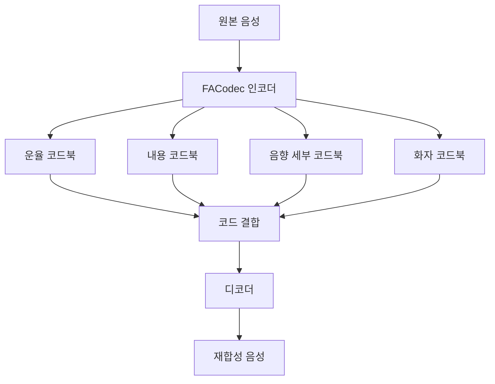
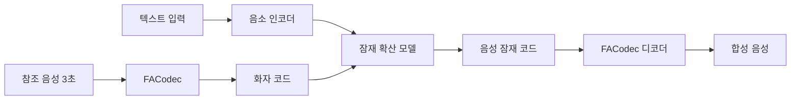

## 개요

NaturalSpeech 3는 Microsoft Research가 제안한 텍스트-음성 합성(TTS, Text-To-Speech) 시스템으로, 음성을 **분리 가능한 서브 공간(disentangled subspace)** 으로 분해한 뒤 각 속성을 독립적으로 생성하는 접근 방식을 택한다. 기존 자기회귀(autoregressive) 방식 대신 **비자기회귀(non-autoregressive)** 확산(diffusion) 모델을 사용해 빠르고 품질 높은 음성을 생성한다.

핵심 아이디어는 단일 표현 공간에 음성의 모든 속성(음색, 운율, 음소 발음, 음향 세부사항)을 몰아넣지 않고, 속성별 전용 코드북을 두는 것이다. 이를 통해 제로샷(zero-shot) 시나리오에서도 화자 특성을 정밀하게 제어할 수 있다.

## FACodec - 분해 음성 코덱

NaturalSpeech 3의 핵심 구성 요소는 **FACodec(Factorized Attribute Codec)** 이다. FACodec는 음성을 다음 네 가지 직교(orthogonal) 잠재 공간으로 분해한다:

| 코드북 | 인코딩 대상 | 설명 |
|--------|------------|------|
| 음소(prosody) | 억양, 에너지, 리듬 | 문장의 강세·속도 패턴 |
| 내용(content) | 음소 시퀀스 | 실제 언어 정보 |
| 음향 세부(acoustic detail) | 배경 소음, 녹음 환경 | 세밀한 음향 텍스처 |
| 화자(speaker) | 음색, 성대 특성 | 화자 아이덴티티 |

각 코드북은 잔차 벡터 양자화(RVQ, Residual Vector Quantization)를 기반으로 하되, 각 그룹이 특정 속성에만 집중하도록 속성 분해 손실(attribute disentanglement loss)로 훈련된다.

## 비자기회귀 확산 기반 생성

텍스트로부터 음성 코드를 생성하는 단계에는 **잠재 확산 모델(Latent Diffusion Model)** 을 사용한다. 자기회귀 모델(VALL-E 계열)은 코드를 토큰 하나씩 순차 생성하므로 긴 문장에서 속도와 안정성이 저하되는 반면, NaturalSpeech 3는 전체 시퀀스를 병렬로 정제(denoising)하여 다음 이점을 제공한다:

- 생성 속도가 시퀀스 길이에 덜 의존적
- 누적 오류(compounding error) 문제 완화
- 확산 스케줄 조정으로 품질/속도 트레이드오프 유연하게 제어

## 제로샷 화자 적응

참조 음성 클립(보통 3-10초)만으로 새로운 화자의 음색을 즉시 복제할 수 있다. 프로세스는:

1. 참조 음성을 FACodec로 인코딩해 화자 코드 추출
2. 타겟 텍스트의 음소 시퀀스 생성
3. 화자 코드를 조건으로 확산 모델이 음성 코드 생성
4. FACodec 디코더로 파형 복원

이 방식은 VALL-E([[valle-zero-shot-tts]]) 등 자기회귀 계열과 달리 화자 코드가 내용 코드와 명시적으로 분리되어 있어 화자 전이(speaker transfer) 정밀도가 높다.

## 성능 지표

Microsoft의 보고에 따르면 NaturalSpeech 3는:

- VCTK, LibriSpeech 기준 자연스러움 MOS에서 당시 최고 수준 달성
- 화자 유사도(SIM)에서 VALL-E 대비 개선
- 추론 속도는 자기회귀 모델 대비 수 배 빠름 [교차검증 필요 - 구체적 수치는 원 논문 확인 권장]

## 다른 TTS 아키텍처와 비교

| 시스템 | 생성 방식 | 분해 표현 | 제로샷 |
|--------|-----------|-----------|--------|
| VALL-E | 자기회귀 | 단일 RVQ | O |
| NaturalSpeech 3 | 비자기회귀 확산 | FACodec (4분해) | O |
| VoiceCraft | 자기회귀 | 단일 RVQ | O |
| [[voxcpm2]] | - | - | - |

## 실무 적용 관점

- **목소리 복제(voice cloning)**: 짧은 샘플만으로 실시간 더빙 또는 접근성 지원 서비스 구축 가능
- **감정/스타일 제어**: 운율 코드북을 독립적으로 수정해 감정 조절이 가능해짐
- **다국어 확장**: 내용 코드북이 언어별 음소에 의존하므로 다국어 모델에서 언어 코드를 교체하는 방식으로 확장 가능

FACodec는 음성 표현 학습 연구에서 속성 분해(attribute disentanglement)의 표준 방법론으로 자리 잡을 가능성이 높다. [[audio-language-models]]와 결합하면 멀티모달 대화 시스템의 고품질 음성 출력 레이어로도 활용될 수 있다.

## 관련 문서

- [[valle-zero-shot-tts]] - 자기회귀 방식 제로샷 TTS의 대표적 선행 연구
- [[voxcpm2]] - 음성 코드 생성 관련 아키텍처
- [[audio-language-models]] - 음성과 언어 모델의 통합 패러다임
- [[asr-evaluation-metrics]] - TTS 품질 평가에 공유되는 지표 체계
