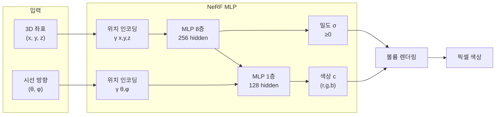
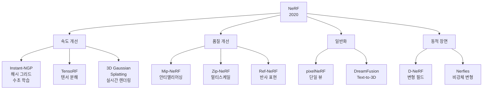

# NeRF - 신경 복사 필드

## 핵심 아이디어

**NeRF(Neural Radiance Fields)**는 2020년 Mildenhall et al.이 제안한 3D 장면 표현 기법이다. 핵심 아이디어는 간단하다: **MLP 하나가 3D 공간 전체를 암묵적으로 기억한다.**

전통적인 3D 표현(메시, 복셀, 포인트 클라우드)과 달리, NeRF는 장면을 명시적 자료구조에 저장하지 않는다. 대신 MLP의 가중치 자체가 "장면의 압축된 표현"이 된다.

## 수학적 기반

### 네트워크 함수

$$F_\Theta: (\mathbf{x}, \mathbf{d}) \rightarrow (\mathbf{c}, \sigma)$$

- $\mathbf{x} = (x, y, z)$: 3D 공간 좌표
- $\mathbf{d} = (\theta, \phi)$: 시선 방향 (구면 좌표)
- $\mathbf{c} = (r, g, b)$: 해당 지점의 색상 (방향에 의존)
- $\sigma$: 밀도(불투명도)로, 방향에 독립적

밀도 $\sigma$는 방향 독립적이고, 색상 $\mathbf{c}$는 방향에 따라 달라진다. 이를 통해 금속 광택, 반사 등 뷰 의존적(view-dependent) 효과를 표현한다.

### 위치 인코딩 (Positional Encoding)

MLP는 저주파 함수를 학습하는 경향이 있어 고주파 디테일(날카로운 경계, 세밀한 텍스처)을 표현하기 어렵다. 이를 해결하기 위해 **푸리에 특성 변환**을 적용한다:

$$\gamma(p) = (\sin(2^0 \pi p), \cos(2^0 \pi p), \ldots, \sin(2^{L-1} \pi p), \cos(2^{L-1} \pi p))$$

좌표에 대해 $L=10$, 방향에 대해 $L=4$를 적용한다. 이 인코딩 덕분에 MLP가 고주파 세부 정보를 학습할 수 있게 된다.

### 볼륨 렌더링 (Volume Rendering)

카메라 광선 $\mathbf{r}(t) = \mathbf{o} + t\mathbf{d}$를 따라 픽셀 색상을 계산한다:

$$C(\mathbf{r}) = \int_{t_n}^{t_f} T(t) \cdot \sigma(\mathbf{r}(t)) \cdot \mathbf{c}(\mathbf{r}(t), \mathbf{d}) \, dt$$

여기서 $T(t) = \exp\left(-\int_{t_n}^{t} \sigma(\mathbf{r}(s)) ds\right)$는 누적 투과율이다.

실제 구현에서는 광선 위에 점을 샘플링하여 수치 적분을 수행한다.

## 학습 절차

1. 다양한 시점에서 촬영한 **다중 뷰 이미지** 준비
2. 각 훈련 이미지의 픽셀마다 광선을 쏘아 예측 색상 계산
3. 실제 픽셀 색상과 MSE 손실로 역전파
4. 하나의 장면에 대해 MLP를 수십만~수백만 이터레이션 학습

**한 NeRF 모델 = 하나의 특정 장면**. 범용 모델이 아니라 장면별로 독립적으로 학습한다.

## 한계

| 한계 | 영향 |
|------|------|
| 학습 시간 | 단일 장면 학습에 수십 시간 (원래 논문 기준) |
| 렌더링 속도 | 실시간 렌더링 불가 (수초/프레임) |
| 장면 당 모델 | 새 장면마다 처음부터 학습 필요 |
| 동적 장면 불가 | 정적 장면만 표현 가능 |
| 대규모 장면 | 단일 MLP로 도시 단위 표현 어려움 |

## 후속 연구 계열

### Instant-NGP (2022)
NVIDIA가 제안한 해시 그리드(hash grid) 인코딩으로 학습 시간을 수십 시간에서 **수 초**로 단축. NeRF 실용화의 전환점.

### Mip-NeRF (2021)
단일 광선이 아닌 원뿔(cone)을 사용하여 안티앨리어싱 효과와 멀티스케일 표현을 개선.

### 3D Gaussian Splatting (2023)
명시적 가우시안으로 장면을 표현하고 차별화 래스터라이제이션을 사용. NeRF 대비 렌더링 100배 빠르며 현재 실시간 3D 재구성의 주류.

## NeRF의 유산

NeRF는 실용적 속도에서 3DGS에 주도권을 넘겼지만, 이론적·방법론적 기여는 크다:

- **암묵적 신경 표현(INR)** 패러다임 정착
- 미분 가능 렌더링(differentiable rendering) 연구 활성화
- Text-to-3D, 3D 생성 모델 연구의 기반
- 로봇공학, 자율주행 분야에서 장면 표현으로 채택

## 관련 문서

- [[3dgs-3d-gaussian-splatting]] - NeRF를 대체한 실시간 3D 표현 기법
- [[implicit-neural-representations]] - 암묵적 신경 표현의 일반 원리
- [[positional-encoding]] - 고주파 정보 인코딩
- [[volume-rendering-differentiable|differentiable-rendering]] - 미분 가능 렌더링
