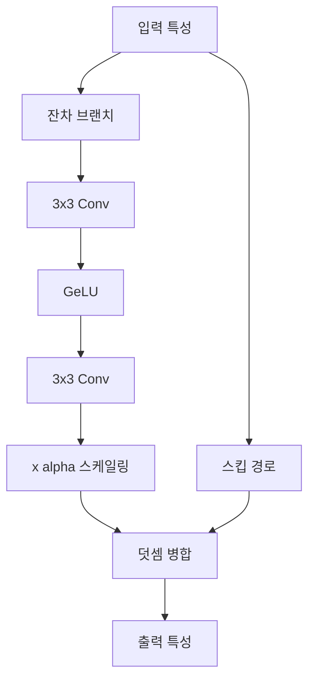

# NFNet - 정규화 없는 네트워크 (Normalizer-Free Networks)

## 배경과 문제 의식

[[batch-norm-layer-norm|배치 정규화(Batch Normalization)]]는 2015년 이후 대부분의 딥러닝 모델에서 사실상 필수 구성 요소로 자리 잡았다. 배치 정규화는 학습 안정성을 높이고, 더 높은 학습률을 사용할 수 있게 해주며, 일종의 암묵적 정규화 효과도 제공한다.

그러나 배치 정규화는 구조적 단점도 가지고 있다.

- **미니배치 의존성**: 배치 크기에 따라 성능이 크게 달라지며, 배치가 작으면 추정이 불안정해진다
- **분산 학습 오버헤드**: 배치 통계를 동기화해야 하므로 멀티 GPU/TPU 환경에서 통신 비용이 발생한다
- **추론 시 복잡성**: 학습/추론 시 동작 방식이 달라 구현 및 디버깅이 어렵다
- **메모리 오버헤드**: 이동 평균(running statistics)을 별도로 저장해야 한다

DeepMind의 Brock et al.(2021)은 "배치 정규화를 완전히 제거하면서도 같은 수준 이상의 성능을 내는 모델을 만들 수 있는가?"라는 질문에 답하여 **NFNet(Normalizer-Free Networks)**을 제안했다.

## 핵심 아이디어: 분산 보존 초기화

배치 정규화 없이 깊은 네트워크를 학습하면 **신호 분산(signal variance)**이 레이어를 거칠수록 폭발하거나 소멸하는 문제가 발생한다. NFNet은 이를 **분산 보존(variance preservation)** 초기화로 해결한다.

핵심 개념은 **신호-분산 추적(signal-variance tracking)**이다. 각 레이어 통과 후 특성(feature)의 기대 분산을 사전에 계산하여, 다음 레이어의 가중치 스케일을 조정하는 방식으로 초기화한다.

잔차 블록에서 두 경로(스킵 + 잔차 브랜치)를 합칠 때:

$$\text{Var}[\text{output}] = \text{Var}[\text{skip}] + \alpha^2 \cdot \text{Var}[\text{branch}]$$

여기서 $\alpha$는 학습 가능한 스케일 파라미터다. 분기 경로의 분산이 통제 가능하도록 각 잔차 브랜치의 마지막 가중치를 0으로 초기화하는 방법을 함께 사용한다.

## 아키텍처 구조

NFNet은 [[resnext-cardinality|ResNeXt]] 스타일의 그룹 합성곱과 SE(Squeeze-and-Excitation) 모듈을 기반으로 하며, 다음 구조적 특징을 갖는다.

- **배치 정규화 완전 제거**: 모든 BN 레이어를 삭제
- **Scaled Weight Standardization**: 합성곱 가중치를 정규화하여 특성 맵의 분산을 안정화
- **학습 가능한 스케일 파라미터**: 각 잔차 블록에서 분기 출력에 곱해지는 $\alpha$
- **Dropout 및 Stochastic Depth**: 정규화 역할을 명시적 드롭아웃으로 대체

## AGC: 적응적 그래디언트 클리핑

배치 정규화 없이 큰 학습률을 사용하면 그래디언트가 폭발하기 쉽다. NFNet의 핵심 학습 기법인 **AGC(Adaptive Gradient Clipping, 적응적 그래디언트 클리핑)**는 이 문제를 해결한다.

기존 그래디언트 클리핑은 전체 그래디언트의 L2 norm이 임계값을 초과할 때 전체를 스케일다운한다. AGC는 **각 가중치 행렬(W)의 단위(unit)별로** 그래디언트와 가중치의 비율을 기준으로 클리핑한다.

$$\hat{G} = \begin{cases} \lambda \cdot \frac{\|W\|_F}{\|G\|_F} \cdot G & \text{if } \frac{\|G\|_F}{\|W\|_F} > \lambda \\ G & \text{otherwise} \end{cases}$$

- $\|W\|_F$: 가중치 행렬의 Frobenius norm
- $\|G\|_F$: 그래디언트 행렬의 Frobenius norm
- $\lambda$: 클리핑 임계값 (보통 0.01 ~ 0.1)

이 방식의 장점은 가중치 크기에 비례한 허용 그래디언트 크기를 설정하므로, 레이어별 스케일 차이에도 일관된 학습 안정성을 제공한다는 점이다.

## 학습 설정 특이점

| 항목 | 기존 EfficientNet 계열 | NFNet |
|------|------------------------|-------|
| 정규화 | 배치 정규화 | 없음 (Scaled Weight Std) |
| 그래디언트 클리핑 | 고정 임계값 또는 없음 | AGC |
| 학습률 | 상대적으로 낮음 | 더 높은 학습률 가능 |
| 배치 크기 의존성 | 높음 | 낮음 |
| 분산 학습 통신 | BN 통계 동기화 필요 | 불필요 |

NFNet은 배치 정규화 없이도 **매우 큰 학습률(예: 0.1~1.0)**을 AGC와 함께 안전하게 사용할 수 있다.

## 성능 및 벤치마크

NFNet은 2021년 당시 ImageNet에서 EfficientNet 계열을 능가하는 SOTA를 달성했다.

| 모델 | ImageNet Top-1 | 파라미터 수 | 학습 시간 |
|------|----------------|-------------|-----------|
| EfficientNet-B7 | 84.3% | 66M | 기준 |
| NFNet-F0 | 83.6% | 72M | 더 빠름 |
| NFNet-F1 | 84.7% | 133M | 유사 |
| NFNet-F4 | 85.9% | 527M | 더 느림 |
| NFNet-F7 | 86.5% | 1B | 가장 느림 |

특히 **NFNet-F0는 EfficientNet-B7보다 8.7배 빠른 학습 속도**로 유사한 정확도를 달성했다는 점이 주목받았다.

## 실무 적용 관점

NFNet이 실무적으로 특히 유용한 상황은 다음과 같다.

**배치 크기 제약이 있는 경우**: GPU 메모리가 부족해 작은 배치를 써야 할 때, 배치 정규화 성능 저하 없이 학습할 수 있다.

**분산 학습 최적화**: BN의 AllReduce 통신을 제거하여 멀티노드 학습 효율을 높인다.

**사전학습-전이학습 파이프라인**: BiT([[bit-big-transfer]])처럼 대규모 사전학습 후 다양한 태스크로 전이할 때 BN 통계 불일치 문제가 없다.

AGC는 NFNet 외의 다른 아키텍처에도 독립적으로 적용 가능하며, 배치 정규화 있는 모델에서도 학습 안정성 개선에 효과적이라는 후속 연구 결과가 있다.

## 한계점

- 배치 정규화의 암묵적 정규화 효과(implicit regularization)를 Dropout 등 명시적 기법으로 보완해야 한다
- Scaled Weight Standardization과 AGC의 하이퍼파라미터 튜닝이 추가적으로 필요하다
- 커뮤니티 생태계(사전학습 모델, 튜토리얼 등)가 EfficientNet이나 ResNet 계열보다 적다

## 관련 문서

- [[resnet-skip-connections]] - 잔차 연결 기반 아키텍처
- [[batch-norm-layer-norm]] - 배치 정규화/레이어 정규화 비교
- [[resnext-cardinality]] - 그룹 합성곱 기반 확장
- [[bit-big-transfer]] - 정규화 전략을 달리한 대규모 사전학습
- [[mobilenet-efficientnet]] - EfficientNet 계열과의 비교
- [[wide-resnet]] - 너비 확장을 통한 성능 개선 접근법
