# 정규화 레이어 (Normalization Layers)

## 개요

정규화 레이어(Normalization Layer)는 신경망 내부 활성화 값(activation)의 분포를 안정화하여 **훈련 속도를 높이고 그래디언트 소실/폭발을 억제**하는 핵심 구성 요소다. 2015년 Batch Normalization 등장 이후 다양한 변형이 제안되었으며, 현재 딥러닝의 거의 모든 아키텍처에서 필수적으로 사용된다.

정규화가 없으면 네트워크 깊이가 깊어질수록 각 레이어의 입력 분포가 훈련 중 계속 변화하는 **내부 공변량 이동(Internal Covariate Shift)** 문제가 심화된다. 정규화 레이어는 이 문제를 해결하면서 더 높은 학습률을 가능하게 한다.

## 정규화의 공통 연산

모든 정규화 기법은 다음 형태를 공유한다:

$$\text{Norm}(x) = \gamma \cdot \frac{x - \mu}{\sqrt{\sigma^2 + \epsilon}} + \beta$$

- $\mu$: 정규화 축에 따른 평균 (일부 기법에서 생략)
- $\sigma^2$: 분산
- $\gamma, \beta$: 학습 가능한 스케일/시프트 파라미터
- $\epsilon$: 수치 안정성을 위한 작은 상수 (예: 1e-5)

기법마다 **어느 차원을 기준으로 통계를 계산하느냐**가 다르다.

## 5대 정규화 기법 비교

### 1. Batch Normalization (BatchNorm, 2015)

**Ioffe & Szegedy (2015)** 제안. 미니배치(batch) 방향으로 통계를 계산한다.

$$\mu_j = \frac{1}{N} \sum_{i=1}^{N} x_{ij}, \quad \sigma_j^2 = \frac{1}{N} \sum_{i=1}^{N} (x_{ij} - \mu_j)^2$$

- **대상 축**: 배치(N) + 공간(H, W) 축 → 채널(C) 별로 독립 정규화
- **장점**: CNN에서 강력한 정규화 효과, 내재적 정규화로 dropout 불필요
- **단점**: 배치 크기가 작으면 통계 추정이 불안정; RNN/Transformer에 부적합; 추론 시 이동 평균 필요

### 2. Layer Normalization (LayerNorm, 2016)

**Ba et al. (2016)** 제안. 각 샘플의 특성(feature) 차원 전체에서 통계를 계산한다.

$$\mu_i = \frac{1}{H} \sum_{j=1}^{H} x_{ij}, \quad \sigma_i^2 = \frac{1}{H} \sum_{j=1}^{H} (x_{ij} - \mu_i)^2$$

- **대상 축**: 특성(H) 차원 → 샘플 별 독립 정규화
- **장점**: 배치 크기 독립; RNN/Transformer에 적합; 추론 시 별도 통계 불필요
- **단점**: CNN에서는 BatchNorm보다 성능이 낮은 경우 있음

### 3. RMSNorm (2019)

**Zhang & Sennrich (2019)** 제안. LayerNorm에서 평균 빼기(re-centering)와 bias를 제거.

$$\text{RMSNorm}(x) = \gamma \cdot \frac{x}{\sqrt{\frac{1}{H} \sum_{j=1}^{H} x_j^2 + \epsilon}}$$

- **대상 축**: LayerNorm과 동일하나 평균 계산 없음
- **장점**: LayerNorm 대비 약 10-15% 연산 감소; LLaMA/Mistral/Gemma 등 채택
- **단점**: re-centering 없어 이론적으로 표현력 약간 손실 (실제 영향 미미)

자세한 내용은 [[rmsnorm]] 참조.

### 4. Group Normalization (GroupNorm, 2018)

**Wu & He (2018)** 제안. 채널을 G개 그룹으로 나누어 그룹 내에서 통계를 계산한다.

$$\mu_{ig} = \frac{1}{H \cdot W \cdot C/G} \sum_{c \in \text{group}_g, h, w} x_{ichw}$$

- **대상 축**: 채널 그룹 + 공간(H, W) 축
- **장점**: 배치 크기에 무관; 소배치에서 BatchNorm보다 안정적
- **단점**: 그룹 수 G 하이퍼파라미터 추가; G=1이면 LayerNorm, G=C이면 InstanceNorm과 동일

자세한 내용은 [[group-normalization]] 참조.

### 5. Instance Normalization (InstanceNorm, 2017)

**Ulyanov et al. (2017)** 제안. 각 샘플의 각 채널별로 독립적으로 정규화한다.

$$\mu_{ic} = \frac{1}{HW} \sum_{h,w} x_{ichw}$$

- **대상 축**: 공간(H, W) 축 → 샘플×채널 별 독립 정규화
- **장점**: 스타일 전이, 이미지 생성에서 강력한 효과 (스타일 정보 제거)
- **단점**: 언어 모델에 부적합; 배치 정보 무시

## 정규화 기법 시각화

```mermaid
flowchart LR
    subgraph 입력["입력 텐서 (N, C, H, W)"]
        direction TB
        N["N: 배치"]
        C["C: 채널"]
        HW["H x W: 공간"]
    end

    subgraph 기법["정규화 기법"]
        BN["BatchNorm\n배치+공간 기준\n채널별 통계"]
        LN["LayerNorm\n채널+공간 기준\n샘플별 통계"]
        RMS["RMSNorm\nLayerNorm에서\n평균 제거"]
        GN["GroupNorm\n채널 그룹+공간\n그룹별 통계"]
        IN["InstanceNorm\n공간 기준\n샘플×채널별 통계"]
    end

    입력 --> BN
    입력 --> LN
    LN --> RMS
    입력 --> GN
    입력 --> IN
```



위 다이어그램은 각 기법이 입력 텐서의 어느 축을 기준으로 통계를 계산하는지를 보여준다.

## 차원별 정규화 범위 비교표

| 기법 | N (배치) | C (채널) | H, W (공간) | 주용도 |
|------|:---:|:---:|:---:|------|
| BatchNorm | O | - | O | CNN 분류/검출 |
| LayerNorm | - | O | O | Transformer, NLP |
| RMSNorm | - | O | O | LLM (LayerNorm 경량화) |
| GroupNorm | - | 그룹 내 | O | 소배치 CNN, 생성 모델 |
| InstanceNorm | - | - | O | 스타일 전이, GAN |

(O: 해당 축 포함해서 통계 계산, -: 해당 축은 개별 처리)

## Transformer에서의 정규화 위치

### Pre-Norm vs Post-Norm

Transformer 블록에서 정규화 레이어의 위치는 두 가지 패턴이 있다.

```mermaid
flowchart TD
    subgraph PostNorm["Post-Norm (원래 Transformer)"]
        pn_in[입력 x] --> pn_sa[Self-Attention]
        pn_sa --> pn_add1[잔차 연결]
        pn_in --> pn_add1
        pn_add1 --> pn_ln1[LayerNorm]
        pn_ln1 --> pn_ff[Feed-Forward]
        pn_ff --> pn_add2[잔차 연결]
        pn_ln1 --> pn_add2
        pn_add2 --> pn_ln2[LayerNorm]
    end

    subgraph PreNorm["Pre-Norm (현대 LLM 표준)"]
        pre_in[입력 x] --> pre_ln1[LayerNorm/RMSNorm]
        pre_ln1 --> pre_sa[Self-Attention]
        pre_sa --> pre_add1[잔차 연결]
        pre_in --> pre_add1
        pre_add1 --> pre_ln2[LayerNorm/RMSNorm]
        pre_ln2 --> pre_ff[Feed-Forward]
        pre_ff --> pre_add2[잔차 연결]
        pre_add1 --> pre_add2
    end
```



**Post-Norm**: Vaswani et al. (2017) 원래 Transformer 설계. 잔차 연결 후 정규화.
- 학습 초기 불안정, Warmup 필수
- 최종 성능이 미세하게 더 높다는 보고 있음

**Pre-Norm**: GPT-2, BERT 이후 대부분의 LLM 표준.
- 안정적인 학습, Warmup 없이도 수렴 가능
- 매우 깊은 네트워크(100+ 레이어)에서 필수적

### Post-Norm 이후 LLM 트렌드

| 모델 | 정규화 타입 | 위치 |
|------|-----------|------|
| Transformer (2017) | LayerNorm | Post-Norm |
| GPT-2 (2019) | LayerNorm | Pre-Norm |
| BERT (2019) | LayerNorm | Post-Norm |
| GPT-3 (2020) | LayerNorm | Pre-Norm |
| LLaMA (2023) | RMSNorm | Pre-Norm |
| Mistral (2023) | RMSNorm | Pre-Norm |
| Gemma (2024) | RMSNorm | Pre-Norm |
| DeepSeek-V2 (2024) | RMSNorm | Pre-Norm |

**현재 LLM 사실상 표준**: Pre-Norm + RMSNorm

## 코드 예시

```python
import torch
import torch.nn as nn


class LayerNorm(nn.Module):
    """PyTorch 기본 LayerNorm 사용 예시"""

    def __init__(self, d_model: int, eps: float = 1e-5):
        super().__init__()
        self.norm = nn.LayerNorm(d_model, eps=eps)

    def forward(self, x: torch.Tensor) -> torch.Tensor:
        return self.norm(x)


class RMSNorm(nn.Module):
    """RMSNorm 직접 구현 (LLaMA 스타일)"""

    def __init__(self, d_model: int, eps: float = 1e-6):
        super().__init__()
        self.eps = eps
        self.weight = nn.Parameter(torch.ones(d_model))  # gamma only, no beta

    def forward(self, x: torch.Tensor) -> torch.Tensor:
        # RMS = sqrt(mean(x^2))
        norm_x = x * torch.rsqrt(x.pow(2).mean(-1, keepdim=True) + self.eps)
        return norm_x * self.weight


class PreNormTransformerBlock(nn.Module):
    """Pre-Norm 패턴의 Transformer 블록 (현대 LLM 표준)"""

    def __init__(self, d_model: int, nhead: int, dim_ff: int):
        super().__init__()
        self.norm1 = RMSNorm(d_model)
        self.attn = nn.MultiheadAttention(d_model, nhead, batch_first=True)
        self.norm2 = RMSNorm(d_model)
        self.ff = nn.Sequential(
            nn.Linear(d_model, dim_ff),
            nn.GELU(),
            nn.Linear(dim_ff, d_model),
        )

    def forward(self, x: torch.Tensor) -> torch.Tensor:
        # Pre-Norm + 잔차 연결
        normed = self.norm1(x)
        attn_out, _ = self.attn(normed, normed, normed)
        x = x + attn_out  # 잔차

        normed = self.norm2(x)
        x = x + self.ff(normed)  # 잔차
        return x
```

## BatchNorm의 추론 시 동작

BatchNorm은 훈련과 추론 시 동작이 다르다. 훈련 시 미니배치 통계($\mu_B$, $\sigma_B^2$)를 사용하고, 추론 시 훈련 중 계산한 이동 평균(running mean/var)을 사용한다.

```python
model.train()  # 훈련 모드: 배치 통계 사용
model.eval()   # 추론 모드: 이동 평균 통계 사용
```

LayerNorm/RMSNorm은 이런 모드 구분이 없어 배포가 단순하다.

## 왜 중요한가 / 실무 가이드

- **LLM 사전학습/파인튜닝**: Pre-Norm + RMSNorm이 사실상 표준. 새 모델을 설계한다면 이를 따르는 것이 안전하다.
- **이미지 분류 CNN**: BatchNorm이 여전히 강력. 배치 크기가 32 이상이면 BatchNorm, 그 이하면 GroupNorm 고려.
- **생성 모델 (Diffusion, GAN)**: GroupNorm 또는 InstanceNorm이 소배치 환경에서 안정적.
- **스타일 전이**: Adaptive Instance Normalization (AdaIN)이 핵심 기법.
- **하이퍼파라미터 민감도**: LayerNorm/RMSNorm은 학습률에 덜 민감해 튜닝이 쉽다.

## 관련 문서

- [[batch-norm-original-paper]] - Ioffe & Szegedy (2015) 원 논문 요약
- [[layer-norm-original-paper]] - Ba et al. (2016) LayerNorm 원 논문
- [[group-normalization]] - Wu & He (2018) GroupNorm
- [[rmsnorm]] - LLM 표준 정규화 기법 상세
- [[transformer-architecture]] - Transformer 전체 구조
- [[self-attention-mechanism]] - 어텐션과 정규화 상호작용
