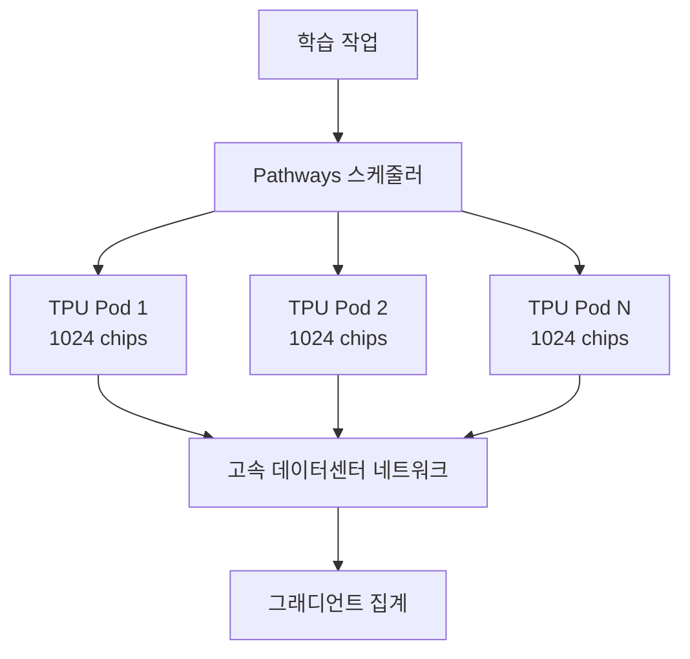
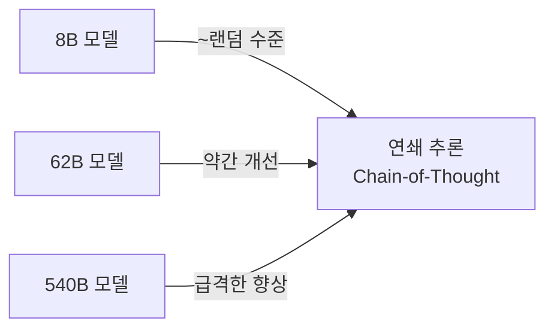

# PaLM - Google의 대규모 언어 모델

## 개요

PaLM(Pathways Language Model)은 Google이 2022년 발표한 대규모 언어 모델이다. Chowdhery et al.(2022)의 논문으로 공개되었으며, 540B 파라미터 규모로 당시 최대 공개 언어 모델이었다. Google의 Pathways 인프라를 활용해 6,144개 TPU v4 칩에서 학습했으며, 연쇄 추론(chain-of-thought)에서의 창발적 능력으로 특히 주목받았다.

## Pathways 시스템



기존 데이터 병렬/모델 병렬 학습의 한계를 넘어서기 위해 Google이 개발한 차세대 ML 인프라.

- **멀티포드 분산**: 서로 다른 TPU Pod를 데이터센터 네트워크(DCN)로 연결해 전체를 단일 학습 작업으로 처리
- **효율적 연산 배치**: 작업을 최적의 하드웨어에 동적 배치
- 6,144 TPU v4 칩(칩 2개 = 1 TensorCore) 활용, 실효 하드웨어 FLOPs 이용률(MFU) 약 46.2%

## 아키텍처 설계

PaLM은 표준 Transformer decoder-only 구조를 기반으로 여러 개선을 적용했다.

### 핵심 구조 선택

| 구성요소 | PaLM 선택 | 표준 Transformer 대비 |
|---------|---------|-------------------|
| 활성화 함수 | SwiGLU | ReLU/GELU 대비 성능 향상 |
| 어텐션 | 병렬 어텐션+FFN | 순차 적용 대비 학습 15% 가속 |
| 위치 인코딩 | RoPE (Rotary Position Embedding) | ALiBi와 함께 긴 시퀀스에 강점 |
| 어텐션 변형 | Multi-Query Attention (MQA) | KV 캐시 메모리 절감, 추론 가속 |
| 어휘 | 256K SentencePiece (BPE) | 다국어 커버리지 강화 |
| 레이어 정규화 | Pre-norm (입력 전 LN) | 학습 안정성 향상 |

### 병렬 어텐션 + FFN

일반 Transformer는 어텐션 → FFN을 직렬로 처리하지만, PaLM은 **동일 입력에 대해 병렬로 처리**한다:

```
표준: x → Attention(LayerNorm(x)) → FFN(LayerNorm(x + attn_out))
PaLM: y = x + Attention(LayerNorm(x)) + FFN(LayerNorm(x))
```

동일한 파라미터 수에서 학습 속도 약 15% 향상. 품질 손실은 미미.

### Multi-Query Attention (MQA)

키(K)와 값(V)을 모든 어텐션 헤드가 공유. 쿼리(Q)만 헤드별로 유지.

- KV 캐시 크기를 헤드 수 배만큼 감소
- 추론 시 메모리 대역폭 요구사항 대폭 감소
- GQA(Grouped Query Attention)의 선행 개념

## 학습 설정

- **데이터 규모**: 780B 토큰 (웹 텍스트, 책, 코드, 다국어, 위키피디아 등)
- **컨텍스트 길이**: 2,048 토큰
- **배치 크기**: 2,048 (단계적으로 증가)
- **옵티마이저**: Adafactor
- **학습 완료**: 약 60일

## 능력과 창발 현상

PaLM 논문에서 가장 주목받은 부분은 **창발적 능력(emergent abilities)**이다.



- 8B → 62B에서 연쇄 추론 성능이 점진적으로 향상
- 540B에서 **급격한 비선형 향상** 관찰 (임계 규모 창발)
- 수학 문제, 복잡한 추론, 코딩에서 특히 두드러짐

주요 벤치마크 성과 (발표 당시):
- BIG-Bench: 150개 도전적 과제 중 다수에서 인간 평균 초과
- GSM8K (수학 풀이): 연쇄 추론 적용 시 58% 정확도
- HumanEval (코딩): 26.2%

## PaLM-2: 컴퓨팅 최적 학습

2023년 발표된 PaLM-2는 PaLM보다 **작지만 더 뛰어난 성능**을 달성했다. Chinchilla 법칙(Hoffmann et al., 2022)의 교훈을 적용:

- **컴퓨팅 최적 학습(compute-optimal training)**: 모델 크기보다 데이터 품질과 양에 투자
- **다국어 강화**: 100개 이상 언어 데이터 비중 증가
- **코드 강화**: GitHub 코드로 코딩 능력 향상
- Bard(현 Gemini) 서비스의 초기 백엔드 모델

## Gemini로의 계승

Google은 PaLM 계열 이후 **Gemini(2023)** 아키텍처로 전환했다.

- PaLM의 설계 원칙 다수 계승 (MQA, SwiGLU 등)
- 처음부터 네이티브 멀티모달로 설계 (텍스트, 이미지, 오디오, 비디오)
- TPU v5 활용으로 학습 효율 대폭 향상
- Gemini Ultra → Pro → Flash → Nano의 크기 스펙트럼

## PaLM의 유산

PaLM이 LLM 발전에 기여한 핵심:

1. **Pathways 인프라 실증**: 초대형 분산 학습의 실용 가능성 증명
2. **아키텍처 혁신 확산**: 병렬 어텐션+FFN, MQA가 이후 모델들에 광범위 채택
3. **창발 능력 문서화**: Wei et al.(2022) "창발적 능력" 논문의 핵심 사례
4. **코드+언어 통합**: 언어와 코드를 단일 모델로 학습하는 방향 설정

## 관련 문서

- [[neural-scaling-laws|Neural Scaling Laws]]
- [[Gemini 아키텍처]]
- [[GQA (Grouped Query Attention)]]
- [[Multi-Query Attention]]
- [[SwiGLU 활성화 함수]]
- [[RoPE 위치 인코딩]]
- [[창발적 능력 (Emergent Abilities)]]
