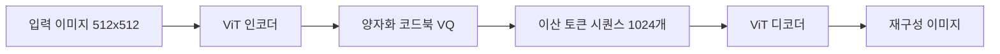
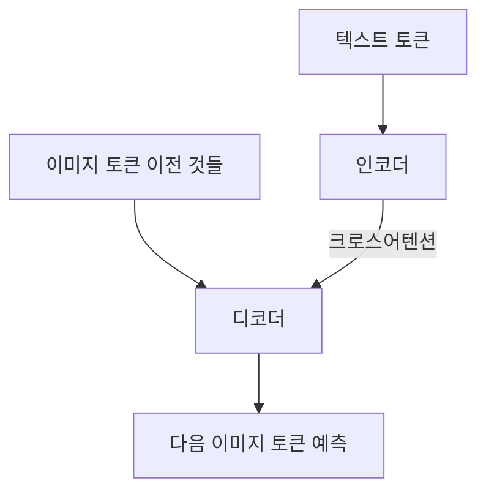
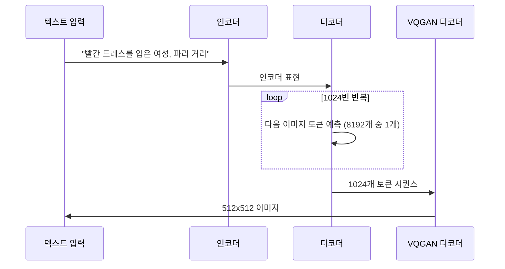
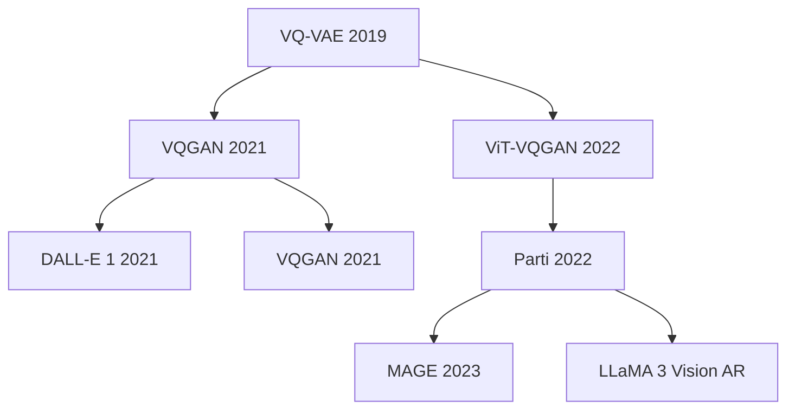

# Parti - 자기회귀 텍스트-이미지 생성

## 배경

Parti(Pathways Autoregressive Text-to-Image, Yu et al., Google Research, 2022)는 **자기회귀(autoregressive) 트랜스포머**를 사용하여 텍스트에서 이미지를 생성하는 모델이다. 확산 모델 기반 접근법과 달리, 이미지를 이산적(discrete) 토큰 시퀀스로 변환한 후 언어 모델처럼 토큰을 순차적으로 예측한다.

핵심 주장은 **스케일링이 자기회귀 이미지 생성의 품질을 크게 향상**시킨다는 것이다. 20억(2B) 파라미터에서 200억(20B) 파라미터로 확장하면서 사실적 이미지 생성과 복잡한 구성적 이미지에서 당시 SOTA를 달성했다.

## 자기회귀 이미지 생성의 접근 방식

확산 모델과 자기회귀 모델의 비교:

| 항목 | 확산 모델 (Imagen, DALL-E 2) | 자기회귀 (Parti) |
|------|--------------------------|--------------|
| 이미지 표현 | 연속 픽셀 공간 / 잠재 벡터 | 이산 토큰 시퀀스 |
| 생성 방식 | 반복 디노이징 | 토큰 하나씩 순차 예측 |
| 훈련 목표 | 노이즈 예측 / 점수 매칭 | 다음 토큰 예측 (교차 엔트로피) |
| 속도 | 비교적 빠름 (병렬 디노이징) | 느림 (순차 생성) |
| 모달리티 통일성 | 이미지-텍스트 분리 | 단일 시퀀스로 통합 가능 |

자기회귀 방식의 장점: **NLP와 동일한 훈련 목표** 덕분에 대규모 언어 모델과 동일한 스케일링 법칙이 적용된다.

## 아키텍처 구조

Parti는 두 주요 컴포넌트로 구성된다:

### 1. ViT-VQGAN - 이미지 토크나이저

이미지를 이산 토큰으로 변환하는 핵심 컴포넌트:

- **ViT 인코더**: 이미지를 패치로 분할하고 트랜스포머로 인코딩
- **VQ (Vector Quantization)**: 연속 임베딩을 유한 코드북에서 가장 가까운 벡터로 매핑
- **코드북 크기**: 8192개 항목 (13비트)
- **토큰 수**: 512x512 이미지 → 1024개 토큰

전통적 VQGAN이 CNN 기반 인코더/디코더를 쓰는 반면, ViT-VQGAN은 Vision Transformer를 사용하여 더 나은 재구성 품질을 달성한다.

### 2. 자기회귀 트랜스포머 - 시퀀스 모델

텍스트 토큰 뒤에 이미지 토큰을 순차적으로 예측하는 트랜스포머:

- **인코더-디코더 구조**: 텍스트 시퀀스를 인코더로 처리, 이미지 토큰을 디코더에서 자기회귀 생성
- **크로스어텐션**: 디코더 각 레이어에서 인코더 출력에 어텐션
- **인과적 마스킹**: 디코더는 이전 이미지 토큰만 볼 수 있음

### 생성 흐름

## 스케일링 실험

Parti의 핵심 발견은 스케일링의 효과:

### 모델 크기별 성능 (MS-COCO FID)

| 모델 크기 | 파라미터 | FID ↓ | CLIP 점수 ↑ |
|---------|---------|-------|-----------|
| Parti-350M | 350M | 7.23 | 0.295 |
| Parti-750M | 750M | 5.02 | 0.308 |
| Parti-3B | 3B | 3.42 | 0.318 |
| Parti-20B | 20B | 3.22 | 0.322 |

스케일링에 따른 지속적 개선을 보여준다. 특히 구성적 이미지(여러 객체가 특정 공간 관계로 배치된 경우)에서 큰 모델이 소형 모델 대비 현저히 우수하다.

### PartiPrompts 평가 세트

Google이 Parti와 함께 공개한 **PartiPrompts**는 1632개의 도전적인 프롬프트를 포함한다:
- 추상 개념, 세계 지식, 비현실적 구성 등 다양한 카테고리
- 이후 텍스트-이미지 모델 평가의 표준 벤치마크 중 하나가 됨

## 흥미로운 창발적 능력

20B 스케일에서 Parti는 사전에 명시적으로 훈련하지 않은 능력을 보였다:

- **텍스트 렌더링**: 이미지 내 단어나 문장 생성 (당시 DALL-E 2 등이 어려워하던 능력)
- **희귀 개념 결합**: 문헌에서 드물게 공존하는 개념들의 조합 생성
- **스타일 모방**: 특정 예술 스타일 재현

## 한계

- **순차 생성의 속도**: 1024개 토큰을 하나씩 생성 → 고해상도 이미지 생성에 시간 소요
- **이산화 손실**: VQ 과정에서 세부 정보 손실 (VQ 병목)
- **추론 비용**: 20B 파라미터 모델은 대규모 GPU 필요
- **비공개**: 모델 가중치와 ViT-VQGAN 모두 미공개

## 자기회귀 이미지 생성의 계보

- **DALL-E 1**: 최초의 대규모 자기회귀 텍스트-이미지
- **VQGAN**: CNN 기반 VQ 이미지 토크나이저 표준
- **ViT-VQGAN**: Parti에서 도입, ViT 기반 고품질 토크나이저
- **MAGE**: Parti의 마스킹 기반 자기지도 학습 확장
- **최신 경향**: LLaMA 3.2, GPT-4o 등 멀티모달 LLM이 자기회귀 이미지 이해/생성 통합

## Parti vs Imagen (동시기 비교)

두 모델 모두 2022년 Google에서 발표했으며 서로 다른 접근법:

| 항목 | Parti | Imagen |
|------|-------|--------|
| 생성 방식 | 자기회귀 (이산 토큰) | 확산 모델 (연속) |
| 텍스트 인코더 | T5-XXL | T5-XXL |
| 강점 | 구성적 장면, 텍스트 렌더링 | 사실적 사진, 고품질 |
| 약점 | 느린 추론 | 구성적 복잡도 |

## 관련 문서

- [[imagen-text-to-image]]
- [[dalle-3-architecture]]
- [[muse-masked-image]]
- [[stable-diffusion-3-mmdit]]
- [[vq-vae]]
- [[vision-transformer]]
- [[transformer-architecture]]
- [[clip]]
- [[cross-attention]]
