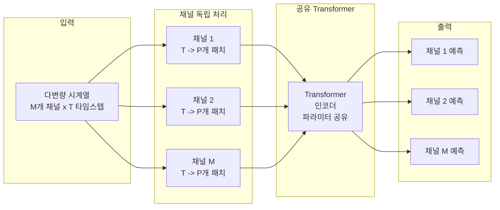
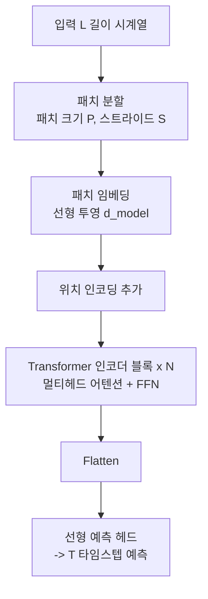
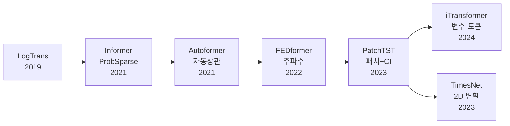

# PatchTST - 패치 기반 시계열 Transformer

## 배경: 시계열 Transformer의 문제

Transformer를 시계열 예측(LTSF, Long-Term Time Series Forecasting)에 적용하는 연구가 활발했으나, 2022년 "Are Transformers Effective for Time Series Forecasting?" (Zeng et al.)이라는 논문이 충격적인 결과를 발표했다: **단순 선형 모델 DLinear가 대부분의 Transformer 모델을 앞선다.**

이 결과는 시계열 Transformer 설계에 근본적인 결함이 있음을 시사했다. PatchTST(Nie et al., ICLR 2023)는 이 문제를 진단하고 두 가지 핵심 개선으로 해결한다.

## 핵심 아이디어

### 1. 패치 임베딩 (Patch Embedding)

기존 시계열 Transformer: 타임스텝 $t$의 값 $x_t$ 하나하나를 토큰으로 사용 -> **의미 없는 단일 값이 토큰**이 됨

PatchTST: 시계열을 **겹치는 또는 비겹치는 패치(patch)**로 분할하여 각 패치를 토큰으로 사용.

```
원본:  [x1, x2, x3, x4, x5, x6, x7, x8, ... x512]

점별:  [x1] [x2] [x3] ... [x512]  <- 512개 토큰, 각각 의미 없음

패치:  [x1..x16][x9..x24][x17..x32] ...   <- ~42개 토큰, 각각 국소 패턴
         patch1    patch2    patch3
```

**패치 크기 = 16, 스트라이드 = 8** (겹침 8 타임스텝)으로 설정하면 512 타임스텝 입력이 약 64개 패치로 줄어든다.

장점:
- 토큰 수 감소 -> Self-Attention $O(N^2)$ 복잡도 대폭 감소
- 각 토큰이 국소 시간적 맥락을 포함 -> 의미 있는 패턴 학습
- ViT의 패치 임베딩 아이디어를 1D 시계열에 직접 응용

### 2. 채널 독립 전략 (Channel Independence, CI)

다변량 시계열(multivariate time series)에서 각 변수(채널)를 **독립적으로** 처리한다.



채널들이 **같은 Transformer 가중치를 공유**하지만 서로 어텐션하지 않는다. 이는 직관에 반하지만 실험에서 채널 혼합(channel mixing) 전략보다 일관되게 좋은 성능을 보인다.

이유 추측:
- 채널 간 허위 상관관계(spurious correlation) 학습 방지
- 학습 데이터 M배 증가 효과 (채널 수만큼 더 많은 독립 샘플)
- 단일 채널의 자기회귀 패턴 학습에 집중

## 아키텍처 전체 흐름



표준 Transformer 인코더 구조를 그대로 사용하되, 입력 준비 방식(패치)과 채널 처리(독립)만 변경한다.

## 성능 비교

PatchTST는 장기 예측(Long-Term Forecasting) 벤치마크에서 기존 방법 대비 **MSE 약 21% 감소**를 달성했다.

| 모델 | 아이디어 | PatchTST 대비 MSE |
|------|---------|------------------|
| Autoformer | 자동 상관 어텐션 | +40% |
| FEDformer | 주파수 도메인 어텐션 | +35% |
| Informer | 희소 어텐션 (ProbSparse) | +45% |
| DLinear | 단순 선형 분해 | +5~10% |
| **PatchTST** | 패치 + 채널 독립 | - |
| iTransformer | 변수-토큰 반전 | -5~10% (일부 데이터셋) |

DLinear를 처음으로 일관되게 능가한 Transformer 기반 모델 중 하나다.

## 자기지도 사전학습 (Self-Supervised Pretraining)

PatchTST는 패치 마스킹(masked patch prediction)으로 사전학습이 가능하다. BERT의 마스킹 방식을 시계열에 적용:

1. 입력 시계열의 일부 패치를 랜덤 마스킹
2. 마스킹된 패치의 원래 값을 예측하도록 학습
3. 다운스트림 예측 태스크에 파인튜닝

이 접근법은 레이블 없는 시계열 데이터를 활용하여 **전이 학습**을 가능하게 한다. 특히 데이터가 적은 도메인에서 효과적이다.

## 한계

1. **채널 독립의 단점**: 채널 간 인과 관계가 명확한 경우(예: 기온이 전력 소비에 영향) 이를 활용 못 함
2. **패치 크기 민감도**: 패치 크기 선택이 성능에 영향, 도메인마다 최적값 다름
3. **단기 예측**: 장기 예측에 최적화, 단기(1~4 스텝) 예측에서는 단순 모델과 경쟁
4. **계산 비용**: 여전히 선형 모델 대비 무거움

## 시계열 Transformer 진화 개요



## 관련 문서

- [[vision-transformer-vit]] - ViT: PatchTST가 패치 개념을 차용한 이미지 Transformer
- [[self-attention-mechanism|Attention]] - Self-Attention 메커니즘
- [[time-series-forecasting]] - 시계열 예측 일반 개요
- [[dlinear-timeseries]] - PatchTST가 능가한 강력한 선형 기준선
