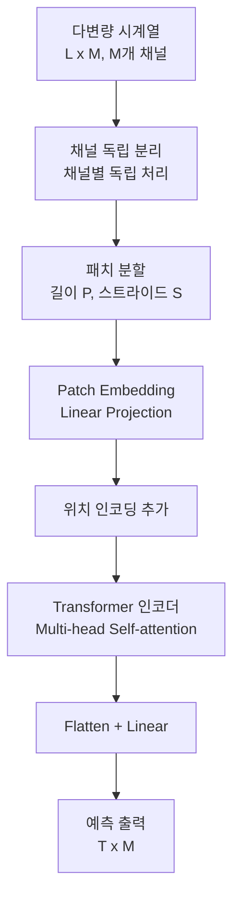
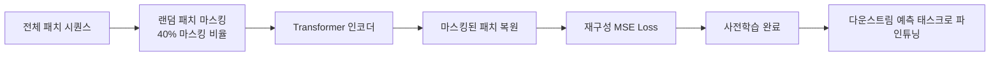

# PatchTST

PatchTST(Patch Time Series Transformer)는 2023년 Nie 외 연구진(프린스턴 대학 + IBM)이 발표한 시계열 예측 모델이다. [[vision-transformer]]에서 이미지를 패치로 분할하는 아이디어를 시계열에 적용하여, 긴 시계열을 **겹치는 시간 세그먼트(patch)**로 나눈 뒤 각 패치를 토큰으로 처리한다. [[time-series-forecasting-dl]] 분야에서 이전까지 지배적이던 채널 혼합(channel mixing) 방식 대신 채널 독립(channel independence) 전략을 채택하여 당시 SOTA를 달성했다.

## 핵심 아이디어: 패치 분할

기존 시계열 Transformer들은 각 타임스텝을 하나의 토큰으로 처리했다. 이 방식의 문제점은 다음과 같다.

- 시퀀스 길이가 곧 토큰 수가 되어, 긴 입력에서 어텐션 계산 비용이 $O(L^2)$으로 폭증
- 개별 타임스텝 값이 갖는 의미는 매우 국소적이어서 토큰으로서 의미론적 단위가 부족함

PatchTST는 시계열을 길이 P의 패치로 나누어, 토큰 수를 $L$에서 $\lfloor L/S \rfloor$으로 줄인다 (S: 스트라이드).

```mermaid
flowchart LR
    subgraph 기존 방식
        TS1[t1] --- TS2[t2] --- TS3[...] --- TSN[tL]
        TSN --> ATTN1[L개 토큰 -> O(L^2) 어텐션]
    end

    subgraph PatchTST
        P1[패치1\nt1~tP] --- P2[패치2\ntS+1~tS+P] --- P3[...] --- PN[패치N]
        PN --> ATTN2[L/S개 토큰 -> O(L^2/S^2) 어텐션]
    end
```

패치 하나가 연속된 시간 구간의 국소 컨텍스트를 담으므로, 의미론적으로 더 풍부한 토큰 표현이 된다.

## 아키텍처



### 핵심 설계 선택

**채널 독립(Channel Independence)**: 다변량 시계열의 각 채널(변수)을 독립적으로 처리한다. 채널 간 상호작용을 모델링하지 않는다는 점에서 직관에 반하지만, 실험적으로 채널 혼합보다 더 좋은 성능을 보였다. 채널 간 노이즈 상호작용을 차단하는 정규화 효과로 해석된다.

**겹치는 패치(Overlapping Patches)**: 패치가 겹칠 수 있도록 스트라이드 S를 패치 크기 P보다 작게 설정하여 인접 패치 간 연속성을 보존한다. 일반적으로 P=16, S=8로 설정한다.

**표준 ViT 인코더**: 어텐션, FFN, LayerNorm으로 구성된 표준 [[vision-transformer]] 블록을 시계열 도메인에 그대로 이식했다. 도메인 전용 특수 설계를 최소화했음에도 성능이 우수하다.

## 자기지도 사전학습 (Masked Patch Modeling)

PatchTST는 BERT의 마스킹 전략을 차용한 **Masked Patch Modeling(MPM)**을 지원한다. 전체 패치 중 일부를 마스킹하고, 이를 재구성하도록 모델을 사전학습시킨다.



레이블이 없는 대규모 시계열 데이터로 사전학습 후, 소규모 레이블 데이터로 파인튜닝하는 전이학습(transfer learning) 패러다임을 시계열 도메인에 도입했다.

## 성능 비교

ETTh1, ETTh2, ETTm1, ETTm2, Weather, Electricity, Traffic 등 표준 벤치마크에서 평가했다.

| 예측 길이 | PatchTST | FEDformer | Autoformer | 비교 모델 기준 |
|---------|---------|----------|------------|------------|
| 96 | 0.370 | 0.448 | 0.449 | MSE (ETTh1) |
| 192 | 0.413 | 0.465 | 0.500 | MSE (ETTh1) |
| 336 | 0.422 | 0.500 | 0.521 | MSE (ETTh1) |
| 720 | 0.447 | 0.521 | 0.514 | MSE (ETTh1) |

기존 Transformer 기반 시계열 모델 대비 10-20% MSE 감소를 달성했다.

## [[itransformer]]와의 비교

PatchTST 이후 등장한 [[itransformer]]는 상반된 접근법을 취한다.

| 관점 | PatchTST | [[itransformer]] |
|------|---------|------------|
| 토큰 단위 | 시간 패치 (시간 세그먼트) | 변수 전체 시퀀스 |
| 어텐션 방향 | 시간축 (temporal) | 변수축 (variate) |
| 채널 처리 | 독립 (no mixing) | 혼합 (mixing) |
| 강점 | 단일 변수 또는 채널 독립 예측 | 변수 간 상관관계 포착 |

두 모델은 상호 보완적이며, 데이터 특성에 따라 성능이 달라진다.

## 한계

**해석 가능성 부재**: [[temporal-fusion-transformer]]와 달리 PatchTST는 예측 근거를 설명하는 메커니즘이 없다. 패치 어텐션 가중치를 시각화할 수 있지만, 비즈니스 해석은 어렵다.

**채널 독립의 한계**: 변수 간 강한 상관관계가 중요한 도메인(예: 다변량 금융 데이터)에서는 채널 독립 설계가 성능을 제한할 수 있다.

**정적 컨텍스트 미지원**: 카테고리형 메타데이터나 미래 알려진 입력을 처리하는 메커니즘이 없다. 이런 이종 입력이 중요한 경우 [[temporal-fusion-transformer]]가 더 적합하다.

## 관련 문서
- [[time-series-foundation-models]] -- 시계열 파운데이션 모델 개요
- [[n-beats-n-hits]] -- N-BEATS / N-HiTS

- [[time-series-forecasting-dl]] - PatchTST가 속하는 딥러닝 시계열 예측 맥락
- [[vision-transformer]] - 패치 분할 아이디어의 원천
- [[itransformer]] - 변수를 토큰으로 처리하는 대안 접근법
- [[temporal-fusion-transformer]] - 이종 입력과 해석 가능성을 갖춘 시계열 모델
