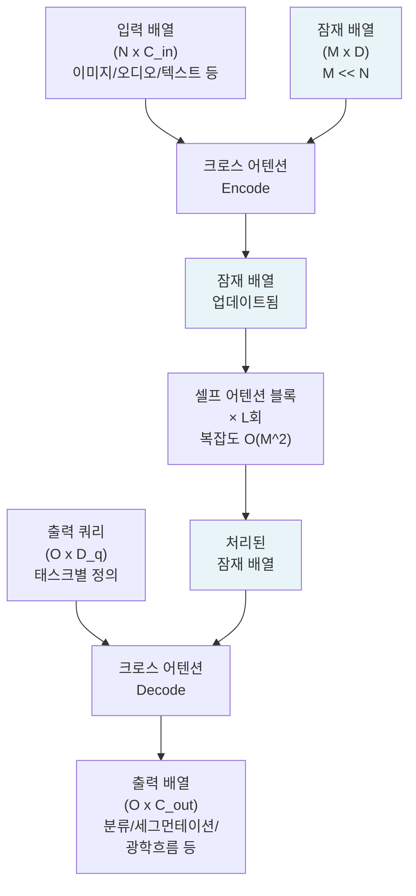
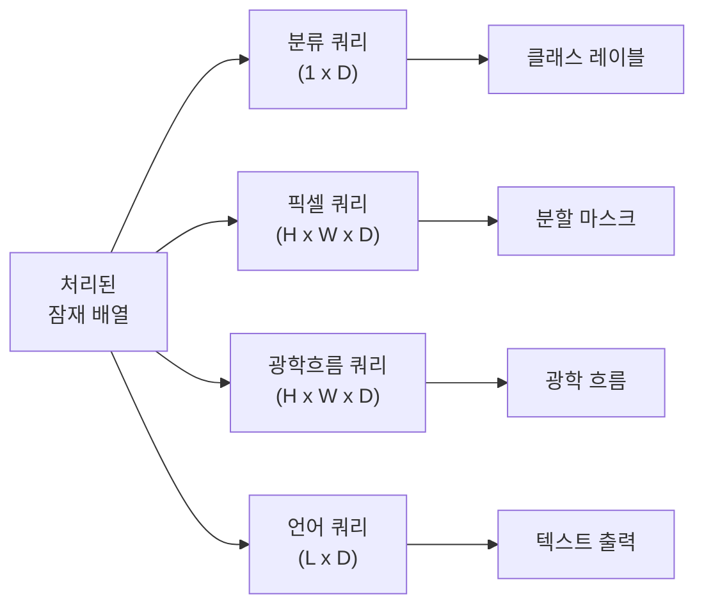

# Perceiver IO - 범용 멀티모달 아키텍처

## 개요

Perceiver IO(2021, Jaegle et al., DeepMind)는 입력과 출력의 형태에 구애받지 않는 범용 신경망 아키텍처다. 이미지, 오디오, 포인트 클라우드, 비디오, 텍스트 등 어떤 형태의 입력이든 하나의 통일된 구조로 처리한다. 핵심은 **잠재 배열(latent array)** 과 **크로스 어텐션(cross-attention)** 을 통해 입력 크기와 독립적인 계산 복잡도를 달성하는 것이다.

## 트랜스포머의 스케일링 문제

표준 [[transformer-architecture]]에서 셀프 어텐션의 복잡도는 입력 길이 $N$에 대해 $O(N^2)$이다. 고해상도 이미지(224x224 = 50176 픽셀)나 긴 오디오 시퀀스를 직접 처리하면 연산 비용이 폭발적으로 증가한다. Perceiver는 이 문제를 잠재 공간 병목으로 해결한다.

## 핵심 구조: 잠재 배열과 크로스 어텐션

Perceiver IO의 핵심은 세 단계다.

1. **Encode**: 입력 배열 → 잠재 배열로 [[cross-attention]] (입력 크기가 쿼리가 아닌 키/값이 됨)
2. **Process**: 잠재 배열 내부에서 셀프 어텐션 반복 (입력 크기와 무관)
3. **Decode**: 출력 쿼리 → 잠재 배열에서 크로스 어텐션으로 필요한 출력 추출

잠재 배열의 크기 M은 입력 크기 N과 독립적으로 고정된다(보통 256~512). 따라서 셀프 어텐션의 복잡도는 $O(M^2)$이고, 크로스 어텐션은 $O(M \cdot N)$으로 선형에 가깝게 처리된다.

## 입력 독립 스케일링

Perceiver IO가 "입력 독립적(input-agnostic)"이라는 의미는 다음과 같다.

- 이미지 픽셀이든 오디오 샘플이든 포인트 클라우드든 **동일한 크로스 어텐션 인코더**를 사용
- 입력 종류에 따라 달라지는 것은 **위치 인코딩** 방식뿐
- 출력 쿼리를 태스크에 따라 바꾸면 분류/분할/회귀 등 다양한 출력 가능

### 위치 인코딩 전략

| 입력 타입 | 위치 인코딩 방식 |
|-----------|----------------|
| 이미지 | 2D 푸리에 특징 (x, y 좌표 주파수 분해) |
| 오디오 | 1D 푸리에 특징 (시간축) |
| 포인트 클라우드 | 3D 위치 인코딩 |
| 텍스트 | 학습 가능한 임베딩 |

## 출력 쿼리 설계

Perceiver IO의 유연성은 **출력 쿼리**에서 나온다. 쿼리를 어떻게 정의하느냐에 따라 같은 잠재 배열에서 다른 출력을 추출할 수 있다.

하나의 아키텍처로 분류, 세그먼테이션, 광학 흐름, 언어 생성을 모두 처리한다.

## 원래 Perceiver와의 차이

**Perceiver(2021 초기 버전)**는 출력 디코딩 단계가 없었다. 잠재 배열을 풀링해 분류 레이블만 출력했다. **Perceiver IO**는 범용 출력 디코딩 단계를 추가해 임의 형태의 출력을 지원한다.

## 실험 결과 및 성능

- **ImageNet 분류**: 표준 ViT 대비 유사한 성능, 더 적은 FLOPs
- **광학 흐름(Sintel)**: 기존 전용 모델과 경쟁적인 성능
- **AudioSet**: 오디오 분류 벤치마크 달성
- **멀티모달 동시 처리**: 이미지+오디오+레이블을 단일 패스로 처리

## 한계

- 크로스 어텐션 인코딩 단계에서도 $O(M \cdot N)$ 비용이 발생해 매우 긴 입력에는 여전히 부담
- 아키텍처 범용성이 높은 만큼 태스크 특화 아키텍처보다 최고 성능이 떨어지는 경우 있음
- 위치 인코딩 설계가 도메인 전문 지식을 여전히 요구

## 후속 연구

- **Hierarchical Perceiver**: 로컬-글로벌 계층 구조로 이미지 처리 효율화
- **Perceiver AR**: 언어 모델링에 Perceiver 구조 적용 (자기회귀 생성)
- 개념은 [[cross-attention]] 기반 인코더-디코더 패턴의 일반화로 볼 수 있음

## 관련 문서

- [[cross-attention]] - Perceiver IO의 핵심 연산 메커니즘
- [[transformer-architecture]] - 기반이 되는 셀프 어텐션 구조
- [[vision-transformer]] - 이미지 특화 트랜스포머와 비교
- [[encoder-decoder-architectures]] - 인코더-디코더 패턴의 일반 개요
