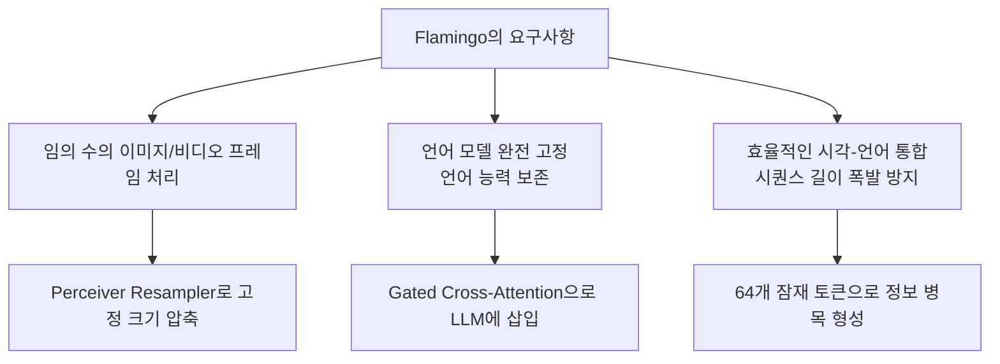
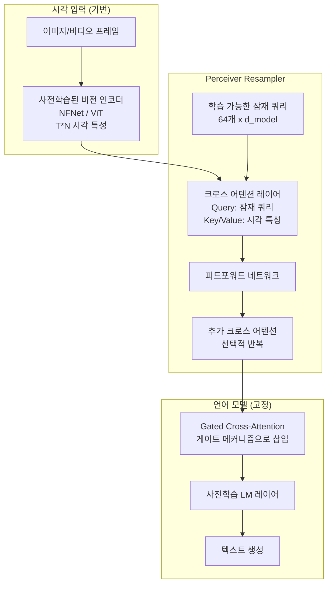
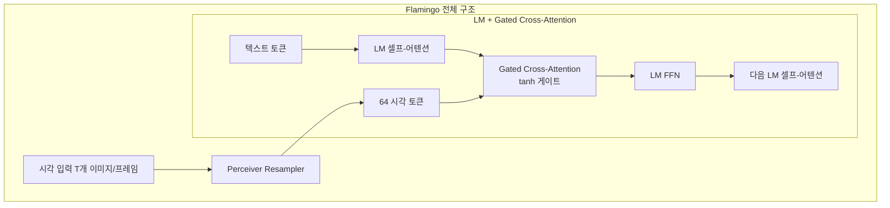
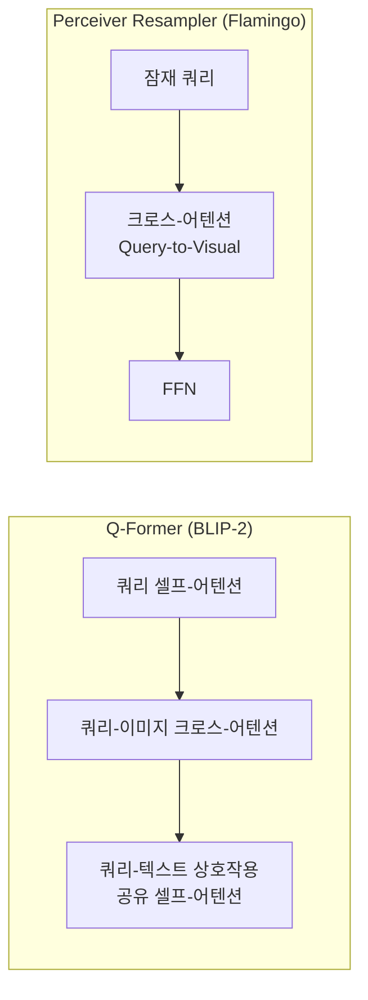
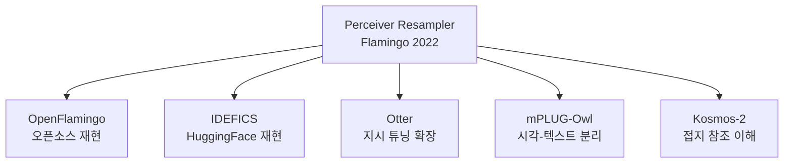
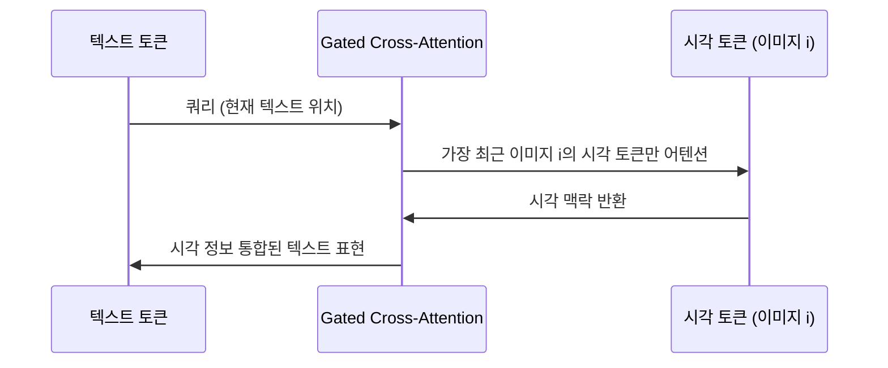

# Perceiver Resampler

Perceiver Resampler는 임의 크기의 시각 특성 시퀀스를 고정된 수의 시각 토큰으로 압축하는 경량 어댑터 모듈이다. Flamingo(Alayrac et al. 2022, DeepMind)에서 처음 제안되었으며, 이미지/비디오 등 다양한 시각 입력을 동일한 크기의 표현으로 변환해 언어 모델과 유연하게 연결한다.

## 등장 배경과 핵심 문제

Flamingo는 거대한 사전학습 언어 모델(Chinchilla 70B 등)의 지식을 보존하면서 시각 이해 능력을 추가하려 했다. 이를 위해 세 가지 요구사항이 있었다:



핵심 문제: 비디오의 경우 수십~수백 프레임이 있고, 각 프레임이 ViT의 256개 패치를 생성하면 총 수천~수만 개의 시각 토큰이 생성된다. 이를 언어 모델에 직접 공급하면 O(n^2) 어텐션 비용이 폭발한다.

## 아키텍처 상세



### 핵심 구성 요소

**잠재 쿼리 (Latent Queries)**

Perceiver IO에서 빌려온 아이디어. 64개의 학습 가능한 쿼리 벡터가 시각 특성을 "질의"한다:

$$\text{queries}: \mathbf{Q} \in \mathbb{R}^{64 \times d}$$

입력 시각 토큰 수 $T \times N$에 관계없이 출력은 항상 $64 \times d$. **진정한 크기 독립성**을 달성한다.

**교차 어텐션 메커니즘**

$$\text{Attention}(\mathbf{Q}, \mathbf{K}, \mathbf{V}) = \text{softmax}\left(\frac{\mathbf{Q}\mathbf{K}^T}{\sqrt{d_k}}\right)\mathbf{V}$$

- Query: 잠재 쿼리 64개 (학습 가능)
- Key/Value: 시각 인코더 출력 (이미지 특성, 가변 크기)
- 계산 복잡도: $O(64 \times T \times N)$ (64는 고정이므로 선형에 가까움)

**반복 레이어**

크로스 어텐션 + FFN 블록을 여러 번 반복해 표현을 정제한다. Flamingo에서는 6개 레이어를 사용.

### 시간 위치 인코딩 (Temporal Position Encoding)

비디오 처리 시 프레임 간 시간 순서를 인코딩:

$$\mathbf{x}_{t,n} = \mathbf{v}_{t,n} + \mathbf{e}_t^{time}$$

$\mathbf{v}_{t,n}$은 시간 $t$의 $n$번째 패치 특성, $\mathbf{e}_t^{time}$은 학습 가능한 시간 임베딩. 서로 다른 프레임의 특성을 구분한다.

## Flamingo에서의 시각-언어 통합

Perceiver Resampler는 홀로 작동하지 않는다. Flamingo는 이를 Gated Cross-Attention과 결합한다.



### Gated Cross-Attention (GCA)

기존 LM 레이어 사이에 GCA 레이어를 삽입한다:

$$\mathbf{Y} = \mathbf{X} + \tanh(\alpha) \cdot \text{CrossAttn}(\mathbf{X}, \mathbf{V})$$

- $\mathbf{X}$: 텍스트 특성
- $\mathbf{V}$: Perceiver Resampler 출력 (64 시각 토큰)
- $\alpha$: 학습 가능한 스칼라, 초기값 0

초기에 $\tanh(0) = 0$이므로 GCA의 영향이 없다. 학습이 진행되며 $\alpha$가 증가해 시각 정보를 점진적으로 통합. **언어 모델의 초기 안정성을 보장**한다.

## [[Q-Former (Querying Transformer)]]와의 비교

두 모듈은 유사한 역할을 수행하지만 설계 원칙이 다르다:



| 항목 | Perceiver Resampler | Q-Former |
|------|---------------------|---------|
| 텍스트 상호작용 | 없음 (순수 시각 압축) | 내부에서 통합 |
| 언어 모델 통합 | Gated Cross-Attention | 소프트 비주얼 프롬프트 |
| 사전학습 방식 | Flamingo 엔드-투-엔드 | 3단계 목표 별도 사전학습 |
| 설계 철학 | 범용 시각 압축기 | 시각-언어 정렬 특화 |
| 비디오 처리 | 네이티브 지원 | 별도 Video Q-Former 필요 |
| LLM 수정 | GCA 레이어 삽입 | 없음 (soft prompt 방식) |

## Perceiver IO와의 관계

Perceiver Resampler는 Perceiver IO (Jaegle et al. 2021)의 아이디어를 계승한다:

**Perceiver IO**: 임의 크기 입력 -> 고정 크기 잠재 배열 -> 임의 크기 출력의 범용 아키텍처. 입력이 이미지든 오디오든 포인트 클라우드든 동일한 구조로 처리.

**Perceiver Resampler**: Perceiver IO의 인코딩 부분만 가져와 시각-언어 멀티모달에 특화.

## 후속 모델들의 채택

Perceiver Resampler 또는 유사한 크로스-어텐션 기반 압축기는 다양한 모델에서 채택되었다:



**OpenFlamingo**: Flamingo를 오픈소스로 재현. LLaMA, RedPajama와 결합.  
**IDEFICS**: HuggingFace에서 Flamingo 아키텍처를 재현한 오픈 모델.

## 멀티모달 시퀀스 처리

Flamingo의 독특한 특징은 **인터리브드(interleaved) 이미지-텍스트 시퀀스** 처리다:

```
<이미지1> 이 고양이의 이름은 무엇인가요?
<답변>: 오렌지
<이미지2> 이 강아지의 이름은?
<답변>:
```

GCA 레이어는 텍스트 토큰이 "가장 최근에 본" 이미지를 참조하도록 마스킹된다. 이를 통해 멀티턴 시각 대화와 인-컨텍스트 학습이 가능해진다.



## [[어텐션 메커니즘 (Attention Mechanism)]] 관점

Perceiver Resampler의 크로스-어텐션은 어텐션의 비대칭 활용의 좋은 예다:

- **Query**: 고정 크기 잠재 쿼리 (64개). 무엇을 알고 싶은지 정의
- **Key/Value**: 가변 크기 시각 특성. 이미지에서 얻을 수 있는 정보
- **결과**: 고정 크기 압축 표현

Query 크기를 고정함으로써 어텐션 계산의 출력 크기를 제어한다. 이는 어텐션을 정보 필터링 메커니즘으로 사용하는 패턴이다.

## 실무 관점

### 구현 시 주요 결정

1. **잠재 쿼리 수**: Flamingo는 64개 사용. 늘리면 더 풍부한 표현 (LLM 시퀀스 비용 증가)
2. **크로스-어텐션 레이어 수**: 6개가 기본. 깊을수록 정제되지만 파라미터 증가
3. **GCA 삽입 빈도**: 매 LM 레이어마다 vs 4개마다. 빈도가 높을수록 강한 시각 통합
4. **게이트 초기화**: $\alpha = 0$ 초기화가 학습 안정성에 중요

### Perceiver Resampler를 선택하는 상황

- 비디오 등 가변 길이 입력이 핵심인 경우
- 거대한 사전학습 LM을 완전히 보존해야 할 때
- 인터리브드 멀티모달 시퀀스(few-shot 비주얼 프롬프팅)가 필요할 때
- 비교적 적은 시각-언어 쌍 데이터로 효율적 학습을 원할 때

### 코드 스케치 (개념 참고)

```python
import torch
import torch.nn as nn

class PerceiverResampler(nn.Module):
    def __init__(self, dim: int, depth: int = 6, num_latents: int = 64, num_heads: int = 8):
        super().__init__()
        self.latents = nn.Parameter(torch.randn(num_latents, dim))
        self.layers = nn.ModuleList([
            nn.ModuleList([
                nn.MultiheadAttention(dim, num_heads, batch_first=True),
                nn.LayerNorm(dim),
                nn.Sequential(
                    nn.Linear(dim, dim * 4),
                    nn.GELU(),
                    nn.Linear(dim * 4, dim),
                ),
                nn.LayerNorm(dim),
            ])
            for _ in range(depth)
        ])

    def forward(self, visual_features: torch.Tensor) -> torch.Tensor:
        # visual_features: (batch, T*N, dim) - 가변 크기
        b = visual_features.shape[0]
        x = self.latents.unsqueeze(0).expand(b, -1, -1)  # (batch, 64, dim)

        for cross_attn, norm1, ff, norm2 in self.layers:
            # 크로스 어텐션: 잠재 쿼리가 시각 특성에 어텐션
            attended, _ = cross_attn(query=x, key=visual_features, value=visual_features)
            x = norm1(x + attended)
            x = norm2(x + ff(x))

        return x  # (batch, 64, dim) - 항상 고정 크기
```

## 관련 문서

- [[flamingo-paper]] -- Flamingo 원 논문 (Alayrac et al. 2022)
- [[multimodal-llm]] -- 멀티모달 LLM 아키텍처 전반
- [[attention-mechanism]] -- 크로스-어텐션의 기반 메커니즘
- [[q-former]] -- 대안적 브릿지 모듈 (BLIP-2)
- [[비디오 이해 (Video Understanding)]] -- Perceiver Resampler의 비디오 처리 활용
