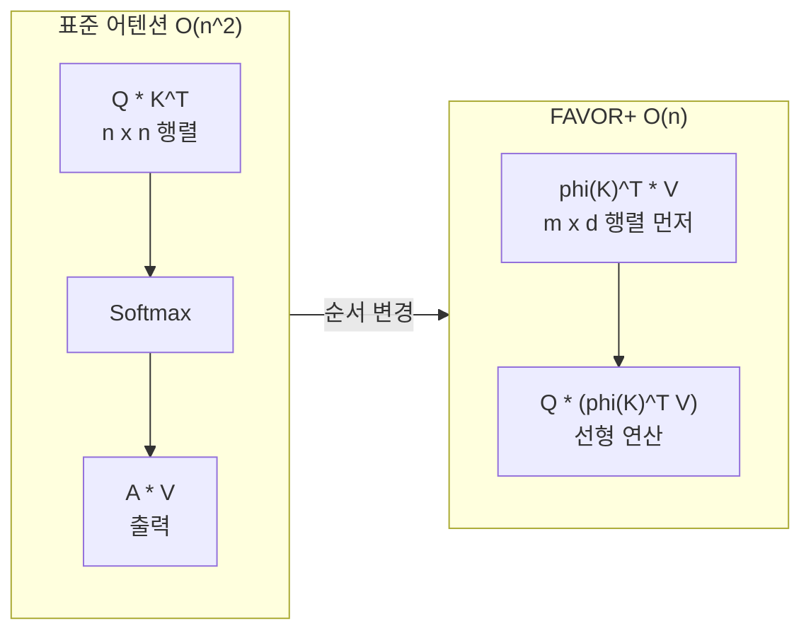

# Performer / FAVOR+ - 무작위 특성 어텐션

## 개요

Performer는 2020년 Google Brain이 제안한 Transformer 변형으로, 기존 셀프 어텐션의 O(n^2) 복잡도를 **O(n) 선형 복잡도**로 줄이는 아키텍처다. 핵심 아이디어는 **FAVOR+ (Fast Attention Via positive Orthogonal Random features)**라는 수학적 기법으로, 소프트맥스 어텐션을 커널 함수로 근사하고 이를 무작위 특성(random features)으로 분해하여 행렬 계산 순서를 바꾸는 것이다.

## 소프트맥스 어텐션의 병목

표준 어텐션은 쿼리-키 유사도 행렬 A를 먼저 계산한 뒤 소프트맥스를 적용한다.

$$A = \text{softmax}\left(\frac{QK^T}{\sqrt{d}}\right), \quad \text{Output} = AV$$

이때 $QK^T$가 $n \times n$ 행렬이므로 메모리 O(n^2), 연산 O(n^2 * d)이 필요하다. 시퀀스 길이가 4096 이상이 되면 단일 GPU에 올리기조차 어려워진다.

## FAVOR+ 핵심 아이디어

FAVOR+는 소프트맥스 커널 $k(q, k) = \exp(q \cdot k^T / \sqrt{d})$를 다음과 같이 양의 무작위 특성으로 근사한다.

$$k(q, k) \approx \phi(q)^T \phi(k), \quad \phi(x) = \frac{1}{\sqrt{m}} [f_1(x), ..., f_m(x)]$$

여기서 $\phi$는 m차원 무작위 특성 맵이다. 이 분해를 이용하면 행렬 연산 순서를 바꿀 수 있다.



핵심 수식 변환:

$$\text{Output}_i = \frac{\sum_j k(q_i, k_j) v_j}{\sum_j k(q_i, k_j)} \approx \frac{\phi(q_i)^T \cdot (\sum_j \phi(k_j) v_j^T)}{\phi(q_i)^T \cdot (\sum_j \phi(k_j))}$$

분자의 $\sum_j \phi(k_j) v_j^T$와 분모의 $\sum_j \phi(k_j)$는 **키/값을 순서대로 집계**하므로 전체 행렬을 메모리에 올릴 필요가 없다.

## 무작위 특성 설계 - Positive Random Features

소프트맥스 근사에 일반 삼각함수 기반 무작위 특성을 쓰면 음수 값이 등장해 분모가 0에 근접하는 불안정성이 생긴다. FAVOR+는 이를 **양의(positive) 무작위 특성**으로 해결한다.

$$\phi(x) = \frac{\exp(\|x\|^2/2)}{\sqrt{m}} \left[\exp(\omega_1^T x), ..., \exp(\omega_m^T x)\right]$$

$\omega_i \sim N(0, I)$는 무작위 방향 벡터다. 이 설계로 근사값이 항상 양수가 되어 수치 안정성을 보장한다.

**직교 무작위 특성(Orthogonal Random Features)**: 무작위 벡터 $\omega_i$를 서로 직교하도록 설정하면 분산이 줄어들어 근사 품질이 향상된다.

## 성능 및 복잡도 비교

| 특성 | 표준 Transformer | Performer (FAVOR+) |
|------|-----------------|-------------------|
| 시간 복잡도 | O(n^2 d) | O(n m d), m << n |
| 공간 복잡도 | O(n^2 + nd) | O(nm + nd) |
| 정확한 어텐션 | O | X (근사) |
| 인果관계(causal) 지원 | O | O |
| 기존 사전학습 모델 적용 | - | O (재학습 없이 교체 가능) |

m(무작위 특성 수)은 일반적으로 256~512로 설정하며, n이 수천 이상일 때 n과의 비율 차이가 커져 효율이 두드러진다.

## 실험 결과

- **단백질 서열 모델링**: 시퀀스 길이 4096에서 표준 Transformer 대비 18배 빠른 학습
- **언어 모델링**: LM1B 벤치마크에서 Reformer와 유사한 perplexity, 더 단순한 구현
- **이미지 생성 (PixelCNN 비교)**: 긴 픽셀 시퀀스에서 메모리 효율 우수

## 한계와 후속 연구

- 무작위 근사이므로 **근사 오차가 있음** - 정밀한 어텐션이 필요한 태스크에서 손실 가능
- m(특성 수)과 성능 사이의 트레이드오프 조정 필요
- [[attention-mechanism-overview]]의 표준 어텐션 대비 짧은 시퀀스(n < 512)에서는 오히려 느릴 수 있음
- 후속 연구인 [[linear-attention]] 계열(e.g., RetNet, GLA)이 FAVOR+ 아이디어를 더 실용적으로 발전시킴

## 실무 적용

```python
# Performer 어텐션 (개념 코드 - 실제는 performers-pytorch 라이브러리 참고)
import torch

def favor_plus_attention(q, k, v, num_features=256):
    """
    q, k: (batch, heads, seq_len, head_dim)
    v: (batch, heads, seq_len, head_dim)
    """
    d = q.shape[-1]
    # 직교 무작위 특성 샘플링
    omega = torch.randn(num_features, d)
    # QR 분해로 직교화
    omega, _ = torch.linalg.qr(omega.T)
    omega = omega.T * (d ** 0.25)

    # 양의 무작위 특성 변환
    def phi(x):
        proj = x @ omega.T  # (..., num_features)
        return torch.exp(proj - x.norm(dim=-1, keepdim=True) ** 2 / 2) / (num_features ** 0.5)

    q_prime = phi(q)
    k_prime = phi(k)

    # 선형 어텐션: O(n * m * d) 복잡도
    kv = torch.einsum('...nd,...ne->...de', k_prime, v)
    qkv = torch.einsum('...nd,...de->...ne', q_prime, kv)
    denom = torch.einsum('...nd,...d->...n', q_prime, k_prime.sum(dim=-2))
    return qkv / denom.unsqueeze(-1)
```

## 관련 문서

- [[transformer-architecture]] - 기반이 되는 표준 Transformer 구조
- [[attention-mechanism-overview]] - 소프트맥스 어텐션의 수학적 토대
- [[linear-attention]] - FAVOR+와 같은 방향의 선형 어텐션 계열 연구
- [[sparse-attention-patterns]] - 어텐션 복잡도를 줄이는 대안적 접근
