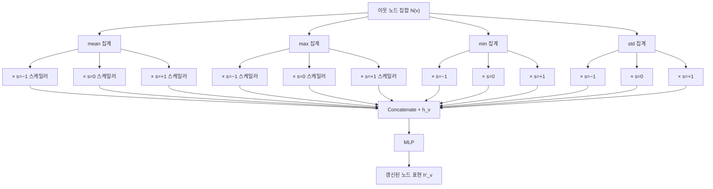

# PNA - 다중 집계 GNN (Principal Neighbourhood Aggregation)

## 동기와 배경

그래프 신경망(GNN)의 표현력은 집계(aggregation) 함수에 크게 의존한다. 기존 GNN들은 단일 집계 함수에 의존했다.

- **GCN**: 정규화된 평균 집계
- **GraphSAGE**: 평균/max 집계 중 하나 선택
- **GIN**: 합 집계로 WL 테스트 등가 달성

단일 집계 함수는 정보 손실이 불가피하다. 예를 들어 평균은 이웃 수(차수) 정보를 잃고, max는 분포 형태를 잃는다. PNA(Principal Neighbourhood Aggregation)는 2020년 Cambridge/Oxford 공동 연구로, 이 문제를 다중 집계와 차수 스케일러를 결합해 해결한다.

## 핵심 메커니즘

### 다중 집계 (Multiple Aggregators)

PNA는 4가지 기본 집계 함수를 동시에 사용한다:

| 집계 함수 | 포착하는 정보 |
|----------|-------------|
| mean (평균) | 이웃 특징의 평균 분포 |
| max (최대) | 이웃 중 가장 두드러진 특징 |
| min (최소) | 이웃 중 가장 약한 특징 |
| std (표준편차) | 이웃 특징의 다양성/분산 |

각 집계 결과를 연결(concatenation)하면 이웃 분포의 더 풍부한 통계적 요약이 만들어진다.

### 차수 스케일러 (Degree Scaler)

집계 결과에 이웃 차수 $d$ 기반의 스케일링을 적용한다:

$$\text{scaler}(d) = \left(\frac{\log(d+1)}{\delta}\right)^s$$

여기서:
- $\delta$는 훈련 집합 전체 차수 분포의 평균 log 차수
- $s \in \{-1, 0, 1\}$로 증폭(amplification), 동일(identity), 감쇠(attenuation) 세 가지 스케일러 정의

세 가지 스케일러를 각 집계 함수에 조합하면 총 $4 \times 3 = 12$ 가지 (집계, 스케일러) 쌍이 생성된다.

### 전체 업데이트 규칙

```
PNA 레이어 출력 = MLP(concat(aggr_1 * scaler_1, aggr_2 * scaler_2, ..., aggr_12 * scaler_12, h_v))
```



위 다이어그램은 PNA 레이어의 집계-스케일-결합 파이프라인이다.

## 표현력 분석

PNA 논문은 집계 함수의 표현력을 이론적으로 분석했다. 핵심 관찰:

- **단일 집계는 구조적으로 구별 불가능한 그래프를 양산**한다. 평균 집계만 사용하면 이웃 수가 다른 두 노드를 같은 표현으로 매핑할 수 있다.
- **차수 정보는 별도로 명시**되어야 한다. 집계 결과에 차수 스케일러를 곱하면 차수 $d=2$ 이웃의 평균 집계와 $d=10$ 이웃의 평균 집계가 구별된다.
- **WL 테스트의 한계 극복**: PNA는 WL 테스트와 동등한 수준을 넘어서, 차수 정보를 활용해 WL이 구별 못하는 일부 그래프 쌍을 구별할 수 있다.

## 학습 디테일

### 집계 함수 선택

훈련 전 집계 함수 집합을 고정한다. 논문은 {mean, max, min, std} 조합이 최적임을 실험으로 확인했다. 합 집계(sum)는 std와 함께 쓰면 중복이 발생해 제외 가능하다.

### 스케일러 보정

$\delta$는 훈련 데이터 전체의 차수 분포에서 계산된 평균 log 차수이다. 테스트 시에도 훈련 $\delta$를 그대로 사용한다.

### 차원 폭발 주의

12개 (집계, 스케일러) 쌍은 차원을 12배 증가시킨다. 실제 구현에서는 중간 MLP로 차원을 줄이거나, 집계 함수 수를 줄여 계산 비용을 조절한다.

## 성능

PNA는 벤치마크 데이터셋에서 단일 집계 GNN 대비 일관된 성능 향상을 보인다:

- **ZINC 분자 특성 예측**: GIN 대비 MAE 약 20-30% 감소
- **MNIST, CIFAR-10 수퍼픽셀 그래프**: GCN, GIN 대비 정확도 향상
- **PATTERN, CLUSTER 노드 분류**: WL GNN 대비 우수

특히 **이질적인 그래프(heterogeneous degree distribution)**에서 효과가 두드러진다.

## 후속 영향

PNA의 다중 집계 아이디어는 이후 연구에 영향을 주었다:

- **DGN (Directional Graph Networks)**: PNA에 방향성 집계 추가
- **GPS (General, Powerful, Scalable)**: 글로벌 어텐션 + 로컬 MPNN 결합, PNA를 MPNN 구성요소로 채택
- **분자 특성 예측 벤치마크 표준**: ZINC 데이터셋에서 PNA가 베이스라인 기준선이 됨

## 한계

- **계산 비용**: 단일 집계 GNN 대비 집계 함수 수 배 증가
- **하이퍼파라미터 선택**: 어떤 집계 함수 조합이 최적인지 태스크마다 다를 수 있음
- **귀납적 일반화 한계**: 차수 스케일러는 훈련 차수 분포 가정에 의존하므로, 훈련-테스트 차도 분포 차이가 크면 성능 하락 가능

## 관련 문서

- [[graph-neural-networks]]
- [[gin-graph-isomorphism]]
- [[graphsage-inductive-gnn]]
- [[graph-attention-network]]
- [[representation-learning-theory]]
