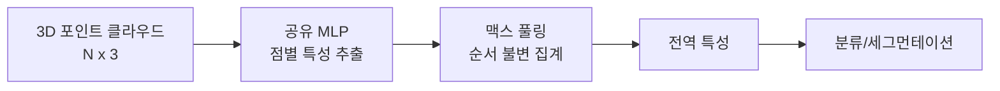

# 포인트 클라우드 네트워크

3D 점 집합(point cloud)을 직접 처리하는 신경망. 복셀화나 메시 변환 없이 **비정형 점 집합**을 입력으로 받아 분류, 세그먼테이션, 검출을 수행한다.

## 핵심 모델

| 모델 | 핵심 아이디어 | 연도 |
|------|-------------|------|
| **PointNet** | 공유 MLP + 맥스 풀링 = 순서 불변 | 2017 |
| **PointNet++** | 계층적 집계 (Set Abstraction) | 2017 |
| **DGCNN** | 동적 그래프 CNN (EdgeConv) | 2019 |
| **Point Transformer** | 벡터 어텐션으로 로컬 관계 학습 | 2021 |
| **Point-E/Shape-E** | 텍스트->포인트 클라우드 생성 | 2023 |

## PointNet의 이론적 기반

**순서 불변성**: 점의 순서가 바뀌어도 출력 동일. 공유 MLP + 대칭 함수(맥스 풀링)로 실현.

$$f(\{x_1, ..., x_n\}) = \gamma\left(\max_{i=1}^n h(x_i)\right)$$

이 구조가 임의의 연속 집합 함수를 근사할 수 있음이 증명됨.

## 응용 분야

- **자율주행**: LiDAR 포인트 클라우드에서 차량/보행자 검출
- **로보틱스**: 물체 파지를 위한 3D 인식
- **건축/측량**: 3D 스캔 데이터 처리

## 관련 문서

- [[3d-gaussian-splatting]] -- 3DGS
- [[nerf-neural-radiance-fields|NeRF]] -- NeRF
- [[graph-neural-networks]] -- GNN (점 집합도 그래프)
