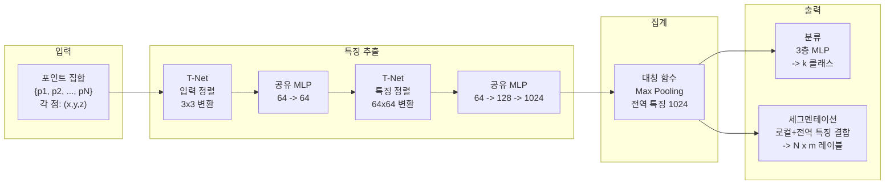
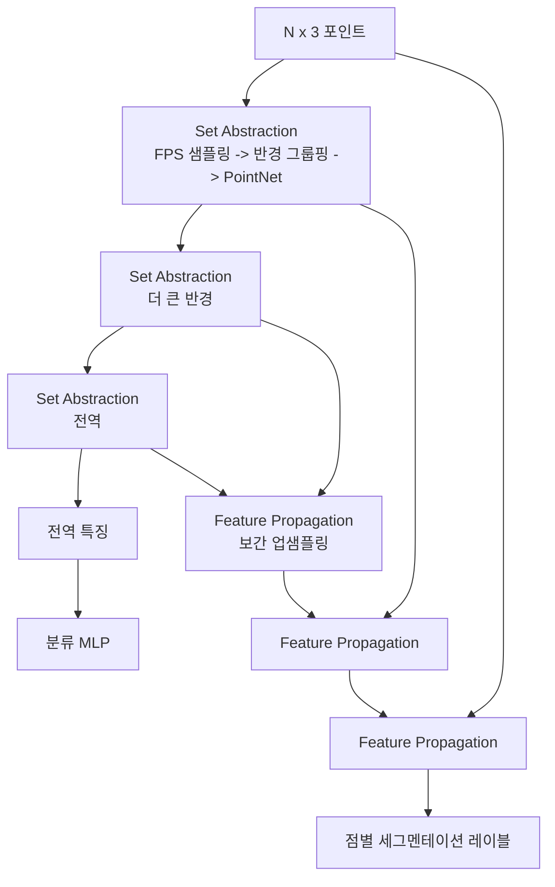
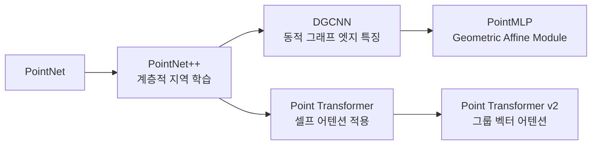

# PointNet - 포인트 클라우드 딥러닝

## 핵심 문제: 포인트 클라우드의 특수성

**포인트 클라우드(point cloud)**는 3D 공간 내 점들의 집합이다. LiDAR, 깊이 카메라 등에서 직접 얻어지는 원시 3D 데이터 형식이지만, 신경망으로 처리하기에 세 가지 특성이 까다롭다:

1. **비정형(unstructured)**: 이미지처럼 격자 구조가 없음
2. **순열 불변(permutation invariant)**: 점의 순서가 바뀌어도 같은 형상을 의미
3. **변환 불변(transformation invariant)**: 회전/이동해도 같은 물체

기존 방법(복셀화, 멀티뷰 렌더링)은 이 원시 데이터를 변환하면서 정보 손실이 발생했다. 2017년 Qi et al.의 **PointNet**은 포인트 클라우드를 직접 입력으로 받는 최초의 실용적 딥러닝 아키텍처다.

## PointNet 아키텍처

### 핵심 설계 원칙

**1. 공유 MLP (Shared MLP)**

각 점에 동일한 MLP를 독립적으로 적용한다. 이는 합성곱과 유사하게 파라미터를 점 전체에서 공유하며, 순열에 영향을 받지 않는다.

**2. 대칭 함수 (Symmetric Function)**

순열 불변성을 보장하는 핵심 장치다. 모든 점의 특징에 max pooling을 적용하여 하나의 전역 특징(global feature)을 만든다:

$$f(\{x_1, \ldots, x_n\}) = \gamma(MAX_{i=1}^{n}(h(x_i)))$$

여기서 $h$는 공유 MLP, $MAX$는 원소별 최댓값, $\gamma$는 후처리 MLP다.

이론적으로 **임의의 연속적 집합 함수는 이 조합으로 근사할 수 있다** (논문의 핵심 정리).

**3. T-Net (Transformation Network)**

미니 PointNet 구조로 구성된 공간 변환 행렬 예측 네트워크:
- **입력 T-Net**: $3 \times 3$ 변환 행렬로 입력 좌표계 정렬
- **특징 T-Net**: $64 \times 64$ 변환 행렬로 특징 공간 정규화

T-Net 출력에 정규화 손실 $L_{reg} = \|I - AA^T\|_F^2$를 추가해 직교 변환이 되도록 유도한다.

## 성능 결과

### ModelNet40 분류

| 모델 | 정확도 |
|------|--------|
| 3DShapeNets (복셀) | 77.3% |
| VoxNet (복셀) | 83.0% |
| MVCNN (멀티뷰) | 90.1% |
| **PointNet** | **89.2%** |
| PointNet++ | 91.9% |

### ShapeNet 파트 세그멘테이션

mIoU 83.7% (당시 최고 수준)

## PointNet++: 계층적 지역 학습

PointNet의 한계: 전역 집계 과정에서 **지역적 구조(local structure)** 정보를 잃는다. PointNet++는 이를 해결하기 위해 계층적 설계를 도입한다.

**Set Abstraction** 블록의 3단계:
1. **FPS(Farthest Point Sampling)**: 균일하게 분포된 중심점 선택
2. **Ball Query Grouping**: 반경 $r$ 내 이웃 점들을 그룹화
3. **PointNet**: 각 그룹에 PointNet 적용하여 지역 특징 추출

**Feature Propagation**: 세그멘테이션을 위해 거리 기반 보간으로 모든 점에 특징 전파.

## 후속 발전

- **DGCNN**: 각 점의 k-최근접 이웃 그래프를 동적으로 구성하고 엣지 특징 학습
- **Point Transformer**: 포인트 클라우드에 Self-Attention 적용
- **PointMLP**: 기하학적 친화 모듈(Geometric Affine Module)로 국소 형상 인식 강화

## 실무 활용

| 분야 | 활용 |
|------|------|
| 자율주행 | LiDAR 포인트 클라우드 3D 객체 탐지 (보행자, 차량) |
| 로봇공학 | 파지 위치 예측, 장면 이해 |
| 의료 | CT 스캔 기반 3D 장기 세그멘테이션 |
| 문화재 | 스캔한 유물의 3D 분류 및 복원 |
| 제조업 | 결함 탐지, 품질 검사 |

## 관련 문서

- [[nerf-neural-radiance-fields]] - 암묵적 3D 표현 방식
- [[3dgs-3d-gaussian-splatting]] - 명시적 가우시안 기반 3D 표현
- [[graph-neural-networks]] - DGCNN이 사용하는 그래프 신경망
- [[self-attention-mechanism|Attention]] - Point Transformer의 기반 메커니즘
