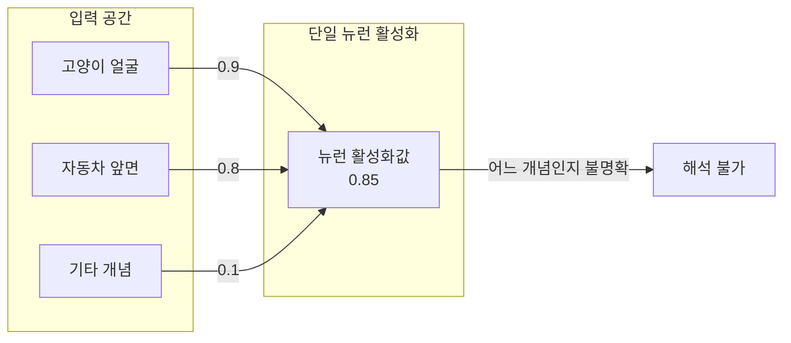
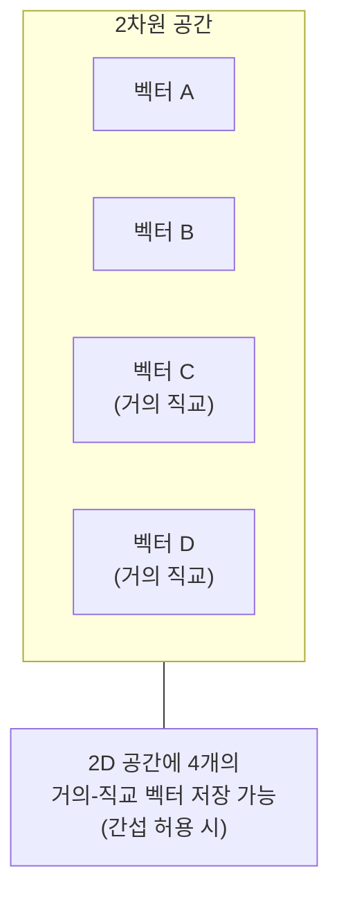
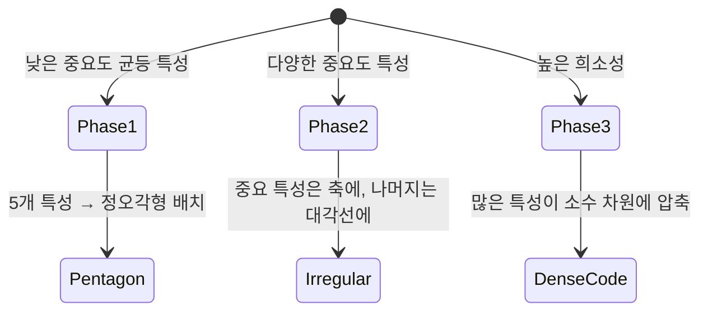

# 다의성과 중첩 (Polysemanticity & Superposition)

## 개요

**다의성(Polysemanticity)**은 신경망의 단일 뉴런이 여러 무관한 개념을 동시에 인코딩하는 현상이다. **중첩(Superposition)**은 이 현상의 기하학적 설명으로, 신경망이 n차원 공간에 n개보다 훨씬 많은 특성(feature)을 중첩하여 저장하는 메커니즘이다. 이 두 현상은 Anthropic의 [[mechanistic-interpretability-2026]] 연구에서 핵심 발견으로, LLM의 내부를 해석하기 어려운 근본적인 이유를 설명한다.

## 다의성: 뉴런이 여러 개념을 동시에 담는다

초기 신경망 해석 가능성 연구에서는 단일 뉴런이 특정 개념(예: 고양이 귀)에 반응한다는 "단의성(monosemanticity)" 가설이 있었다. 그러나 실제 대형 언어 모델을 분석하면 대부분의 뉴런이 다의적이다.

**실제 관찰된 다의적 뉴런 예시 (InceptionV1):**
- 특정 뉴런이 "고양이 얼굴", "자동차 앞면", "개 얼굴"에 동시에 강하게 반응
- 이 세 개념들은 의미적으로 전혀 무관하지만, 시각적으로 비슷한 구조(중앙에 대칭적 특성)를 공유

LLM에서의 다의성:
- GPT-2의 특정 레이어 뉴런이 "법적 용어", "야구 용어", "음악 관련 단어"에 모두 반응
- 문맥에 따라 다른 역할을 하지만 개별 활성화값만으로는 역할을 구분할 수 없음

## 중첩 가설 (Superposition Hypothesis)

Anthropic의 2022년 논문 "Toy Models of Superposition"에서 제시된 이론이다.

### 핵심 주장

> 신경망은 n개의 뉴런으로 n개 이상의 특성을 저장할 수 있다. 이는 각 특성이 희소하게 활성화되는 한 가능하다.

### 기하학적 직관

n차원 공간에서 완전히 직교하는 벡터는 최대 n개만 존재한다. 그러나 **거의 직교하는(quasi-orthogonal)** 벡터는 훨씬 많이 존재한다.

$$\text{용량} = O\left(n \log n / \epsilon^2\right) \quad \text{(간섭 허용 오차 } \epsilon \text{일 때)}$$

### 중첩이 발생하는 조건

1. **특성의 중요도**: 더 중요한 특성은 간섭을 덜 받도록 위치
2. **특성의 희소성**: 한 번에 활성화되는 특성이 적을수록 간섭이 줄어들어 더 많은 특성 저장 가능
3. **균등/비균등 중첩**: 모든 특성이 균등하게 겹치면 다각형 구조, 그렇지 않으면 더 복잡한 기하학적 구조

## 실험적 증거 (Toy Models)

Anthropic은 5-40개 특성을 2-5차원 공간에 학습시키는 토이 모델로 중첩을 직접 시연했다.

**주요 발견:**
- 특성 중요도가 균등하고 희소성이 높을 때 중첩이 가장 강하게 발생
- 중첩된 특성들은 거의-직교 방향으로 배치됨
- 특성 수가 차원 수의 5-10배까지도 저장 가능함을 확인

## 해석 가능성에 대한 함의

다의성과 중첩은 해석 가능성 연구에 심각한 도전을 제기한다.

| 접근법 | 다의성/중첩에서의 한계 |
|--------|----------------------|
| 단일 뉴런 분석 | 뉴런 하나 = 여러 개념 → 해석 불명확 |
| 선형 탐침(Linear Probe) | 선형으로 분리 가능한 특성만 탐지 |
| 활성화 최대화 | 다의적 뉴런에서 여러 패턴이 혼재 |
| **SAE** | 중첩된 특성을 고차원에서 분리 → **현재 최선의 해결책** |

[[sparse-autoencoders-mech-interp]](SAE)는 이 문제를 정면으로 해결하려는 시도다 - 낮은 차원 활성화를 과완전 고차원 공간으로 매핑하여 각 특성을 분리한다.

## 위상 전이 (Phase Transition)

Anthropic은 토이 모델에서 **위상 전이(phase transition)**를 발견했다 - 특정 임계점에서 중첩이 갑자기 발생하거나 사라지는 현상.

- 특성 중요도 λ < λ_c: 각 특성이 전용 뉴런에 저장 (단의성)
- 특성 중요도 λ > λ_c: 중첩 시작, 여러 특성이 공유 차원에 저장

이는 신경망이 왜 불연속적으로 행동 변화를 보이는지(일부 능력이 갑자기 나타나는 창발 현상)를 설명하는 하나의 실마리다.

## 개입 실험 (Intervention)

중첩 가설이 옳다면, 특정 방향 벡터를 활성화에 더하는 방식으로 특정 특성을 인위적으로 활성화할 수 있어야 한다.

**Activation Steering 실험:**
- "바나나" 개념과 관련된 방향 벡터를 추출
- 이 벡터를 활성화에 더하면 모델이 바나나 관련 단어를 더 자주 생성

이는 개념이 단일 뉴런이 아니라 **방향 벡터**로 인코딩됨을 시사하며, 중첩 가설을 지지한다.

## 관련 문서

- [[sparse-autoencoders-mech-interp]] - 중첩된 특성을 분리하는 SAE 기법
- [[mechanistic-interpretability-2026]] - 다의성/중첩 발견 이후의 해석 가능성 연구 흐름
- [[superposition-neural-scaling]] - 중첩과 신경망 스케일링의 관계
