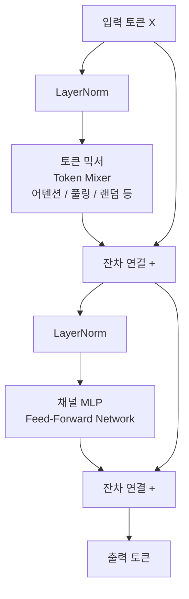
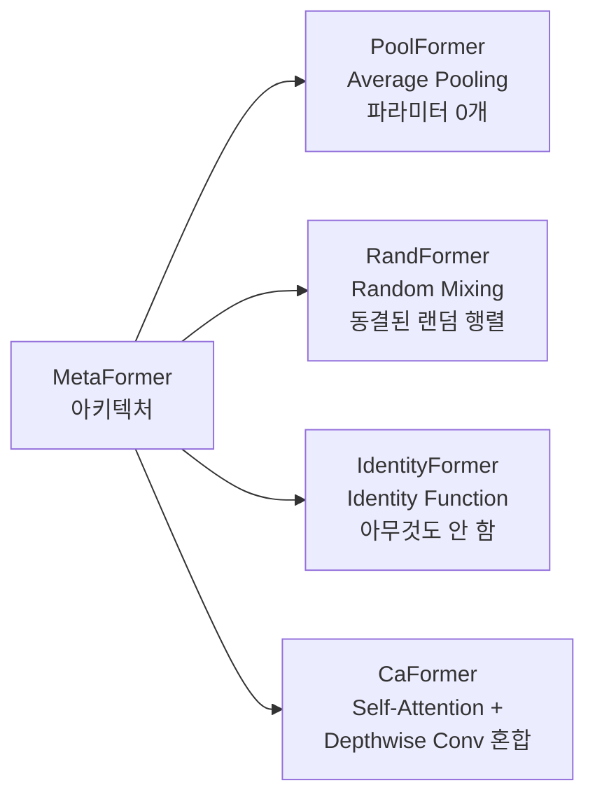

# PoolFormer와 MetaFormer 가설

## 핵심 주장

2022년 Sea AI Lab이 제안한 **MetaFormer 가설**은 Transformer의 성능 원천에 대한 통념을 뒤집는다. 기존에는 Self-Attention이 Transformer의 핵심 성능 동력이라고 여겨졌지만, MetaFormer 가설은 이렇게 주장한다:

> "Transformer의 성능은 어텐션(Attention) 자체에서 오는 것이 아니라, **토큰 믹서(Token Mixer)와 채널 믹서(Channel Mixer)를 교대로 쌓는 일반 아키텍처 구조**에서 온다."

이 주장을 검증하기 위해 Self-Attention 대신 **단순한 average pooling**을 토큰 믹서로 사용한 PoolFormer를 실험했고, ImageNet-1K에서 ViT 및 ResNet과 경쟁하는 성능을 달성했다.

## MetaFormer 아키텍처

MetaFormer는 특정 모델이 아니라 **일반화된 아키텍처 패턴(general architecture)**이다. 핵심 구조는 다음과 같다:



MetaFormer 블록에서 **토큰 믹서는 교체 가능한 플러그인**이다. Self-Attention, average pooling, random matrix, identity 함수 어느 것을 넣어도 아키텍처는 동일하게 작동한다.

## PoolFormer: Average Pooling 토큰 믹서

PoolFormer는 MetaFormer의 토큰 믹서로 커널 크기 3의 average pooling을 사용한다. 파라미터가 **전혀 없는** 연산이다.

```python
# PoolFormer의 토큰 믹서 (파라미터 0개)
class Pooling(nn.Module):
    def __init__(self, pool_size=3):
        super().__init__()
        self.pool = nn.AvgPool2d(
            pool_size, stride=1,
            padding=pool_size // 2,
            count_include_pad=False
        )

    def forward(self, x):
        return self.pool(x) - x  # 주변 - 자신 = 차이 정보
```

주목할 점은 `pool(x) - x` 형태로 **자기 자신을 빼서 주변 토큰과의 차이 정보**만 전달한다는 것이다.

## 실험 결과 (ImageNet-1K)

| 모델 | 파라미터 | Top-1 정확도 | MACs |
|------|---------|------------|------|
| PoolFormer-S12 | 12M | 77.2% | 1.8G |
| PoolFormer-S24 | 21M | 80.3% | 3.4G |
| PoolFormer-S36 | 31M | 81.4% | 5.0G |
| PoolFormer-M36 | 56M | 82.1% | 8.8G |
| PoolFormer-M48 | 73M | 82.5% | 11.6G |
| ViT-S/16 | 22M | 79.9% | 4.6G |
| ResNet-50 | 25M | 79.8% | 4.1G |

PoolFormer-S24는 ViT-S/16 대비 유사한 파라미터 수로 더 높은 정확도를 달성했다. 파라미터가 없는 average pooling만으로 이 결과가 나왔다는 점이 핵심이다.

## MetaFormer 가설 검증: 후속 실험들

가설을 더 강하게 검증하기 위해 다양한 토큰 믹서 변형을 실험했다:



- **RandFormer**: 학습 불가능한 랜덤 행렬로 토큰 믹싱 → 여전히 의미 있는 성능
- **IdentityFormer**: 토큰 믹서 자체를 항등 함수로 대체 → 어느 정도 기준 성능 달성
- **CaFormer**: 하위 레이어는 Depthwise Conv, 상위 레이어는 Self-Attention → SOTA 달성

IdentityFormer가 어느 정도 작동한다는 것 자체가 **채널 MLP(FFN)만으로도 기본 표현력이 있으며**, 토큰 믹서는 추가 성능 향상 역할임을 시사한다.

## 시사점과 영향

MetaFormer 가설이 중요한 이유:

1. **어텐션 필수론 반박**: 수조 플롭의 Self-Attention이 반드시 필요하지 않다
2. **아키텍처 탐색 공간 정의**: 좋은 모델 = 좋은 토큰 믹서 × MetaFormer 골격
3. **효율적 설계 방향**: 경량 모델은 pooling/conv 기반 토큰 믹서로 충분
4. **이론적 이해 진전**: Transformer의 归纳 편향(inductive bias)이 어디서 오는지 분리 분석 가능

이후 ConvNeXt, Mamba 등 비-어텐션 아키텍처가 강세를 보이는 흐름과 맥을 같이 한다. MetaFormer는 "토큰 믹서를 무엇으로 쓸 것인가"라는 질문을 중심 설계 결정으로 격상시켰다.

## 한계

- **위치 인코딩 의존**: average pooling은 공간 구조를 암묵적으로 사용하므로 위치 정보가 이미 특성 맵에 내재
- **이미지 특화**: 언어 등 비정형 시퀀스에 average pooling을 그대로 적용하기 어려움
- **매우 깊은 모델**: 채널 MLP의 역할이 지나치게 커질 수 있음

## 관련 문서

- [[vision-transformer-vit]] - ViT: Self-Attention 기반 비전 Transformer
- [[convnext]] - ConvNeXt: Conv 기반 MetaFormer 변형
- [[mamba-original-paper|mamba-ssm]] - Mamba: 상태 공간 모델 기반 토큰 믹서
- [[self-attention-mechanism|Attention]] - Attention 메커니즘 원리
