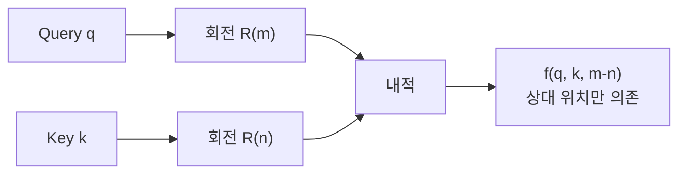

## 개요

위치 인코딩(Positional Encoding)은 [[self-attention-mechanism]]에 시퀀스 내 토큰의 순서 정보를 주입하는 기법이다. 어텐션 연산 자체는 순열 불변(permutation invariant)하여 입력 순서를 구별하지 못하므로, 위치 정보를 별도로 제공해야 한다. 원본 [[transformer-architecture]]의 사인/코사인 고정 인코딩에서 출발하여, 학습 가능한 위치 임베딩, RoPE(Rotary Position Embedding), ALiBi(Attention with Linear Biases)로 발전했다. 현대 LLM 대다수는 RoPE를 채택하고 있다.

## 사인/코사인 인코딩 (Sinusoidal)

원본 Transformer(2017)에서 제안된 고정 인코딩이다:

```
PE(pos, 2i) = sin(pos / 10000^(2i/d_model))
PE(pos, 2i+1) = cos(pos / 10000^(2i/d_model))
```

- pos: 시퀀스 내 절대 위치
- i: 차원 인덱스
- d_model: 모델 차원

각 차원이 서로 다른 주기의 사인/코사인 파형을 가지며, 이를 통해 모델이 상대 위치를 선형 변환으로 추론할 수 있다. 학습 불필요하며 이론적으로 임의 길이로 외삽 가능하다.

### 한계

실제로는 학습 시 보지 못한 긴 위치에서 성능이 저하된다. 절대 위치를 인코딩하므로 상대적 거리 정보가 직접적이지 않다.

## 학습 가능한 위치 임베딩 (Learned)

BERT, GPT-2 등에서 채택한 방식으로, 각 위치에 학습 가능한 임베딩 벡터를 할당한다:

```
출력 = 토큰 임베딩 + 위치 임베딩[pos]
```

사인/코사인보다 약간 나은 성능을 보이지만, 학습 시 최대 위치를 고정해야 하므로 길이 외삽이 불가능하다 (GPT-2: 1024 위치).

## RoPE (Rotary Position Embedding)

Su et al.(2021)이 제안한 방식으로, 현재 LLaMA, Mistral, Qwen 등 대다수 LLM의 표준이다. 토큰 임베딩에 더하는 대신, Q와 K 벡터를 위치에 비례하는 각도로 회전시킨다.

### 핵심 원리



d_k 차원을 2차원 쌍으로 나누고, 각 쌍을 위치에 비례하는 각도 theta로 회전한다:

```
R(pos) * q = [q_0 cos(pos*theta_0) - q_1 sin(pos*theta_0),
              q_0 sin(pos*theta_0) + q_1 cos(pos*theta_0),
              ...]
```

회전된 Q와 K의 내적은 상대 위치 (m - n)에만 의존한다. 이것이 RoPE의 핵심 성질이다.

### 장점

- **상대 위치 인코딩**: 내적이 절대 위치가 아닌 상대 거리에 의존
- **장거리 감쇠**: 거리가 멀수록 내적 값이 자연스럽게 감소
- **길이 외삽**: theta base를 조정하여 학습 길이를 넘어 외삽 가능 (NTK-aware, YaRN)
- **효율성**: 추가 파라미터 없음, 회전 연산만 추가

### 길이 외삽 기법

| 기법 | 핵심 아이디어 |
|------|-------------|
| 위치 보간 (PI) | 위치 인덱스를 학습 길이 비율로 축소 |
| NTK-aware | theta base를 확대하여 고주파 정보 보존 |
| YaRN | NTK + 저주파/고주파 차등 스케일링 |
| Dynamic NTK | 추론 시 시퀀스 길이에 따라 동적 조정 |

Gemma 3는 로컬 어텐션(theta=10K)과 글로벌 어텐션(theta=1M)에 서로 다른 RoPE base를 사용하는 하이브리드 접근을 취한다.

## ALiBi (Attention with Linear Biases)

Press et al.(2021)이 제안한 방식으로, 위치 임베딩을 완전히 제거하고 어텐션 점수에 거리에 비례하는 선형 편향을 직접 더한다:

```
어텐션 점수 = Q * K^T - m * |i - j|
```

- m: 헤드별 고정 기울기 (기하급수적으로 설정)
- |i - j|: 토큰 간 절대 거리

임베딩 계층을 변경하지 않으므로 구현이 간단하며, 학습 길이 대비 우수한 외삽 성능을 보인다. 다만 RoPE 대비 절대적 성능에서 약간 뒤지는 경향이 있어, 2025년 기준 RoPE가 더 널리 채택되고 있다.

## 방식 비교

| 방식 | 유형 | 위치 타입 | 외삽 | 현재 채택 |
|------|------|---------|------|----------|
| 사인/코사인 | 고정, 덧셈 | 절대 | 제한적 | 원본 Transformer |
| Learned | 학습, 덧셈 | 절대 | 불가 | BERT, GPT-2 |
| RoPE | 고정, 회전 | 상대 | 확장 가능 | LLaMA, Mistral, Qwen |
| ALiBi | 고정, 편향 | 상대 | 우수 | GPT-NeoX, Falcon |

## 최신 동향

Command R7B는 RoPE 계층(슬라이딩 윈도우 어텐션)과 NoPE 계층(글로벌 어텐션, 위치 인코딩 없음)을 교대 배치하는 하이브리드 구조를 사용한다. [[long-context-scaling]]에서 위치 인코딩 설계는 핵심 요소이며, [[mamba-3]] 같은 SSM은 위치 인코딩 없이 순차적 상태 업데이트로 순서 정보를 암묵적으로 처리한다.

## 대표 자료

- [Vaswani et al., "Attention Is All You Need" -- 사인/코사인 인코딩 (arXiv:1706.03762)](https://arxiv.org/abs/1706.03762)
- [Su et al., "RoFormer: Enhanced Transformer with Rotary Position Embedding" (arXiv:2104.09864)](https://arxiv.org/abs/2104.09864)
- [Press et al., "Train Short, Test Long: Attention with Linear Biases" (arXiv:2108.12409)](https://arxiv.org/abs/2108.12409)

## 관련 문서

- [[transformer-architecture]] -- 위치 인코딩이 적용되는 전체 구조
- [[self-attention-mechanism]] -- 위치 인코딩이 보완하는 핵심 연산
- [[multi-head-attention]] -- 헤드별 위치 인코딩 적용
- [[rotary-position-embedding]] -- RoPE 상세: 회전 행렬 원리, NTK/YaRN 확장
- [[long-context-scaling]] -- 긴 시퀀스에서의 위치 인코딩 외삽
- [[mamba-3]] -- 위치 인코딩 없는 순차 처리 대안
