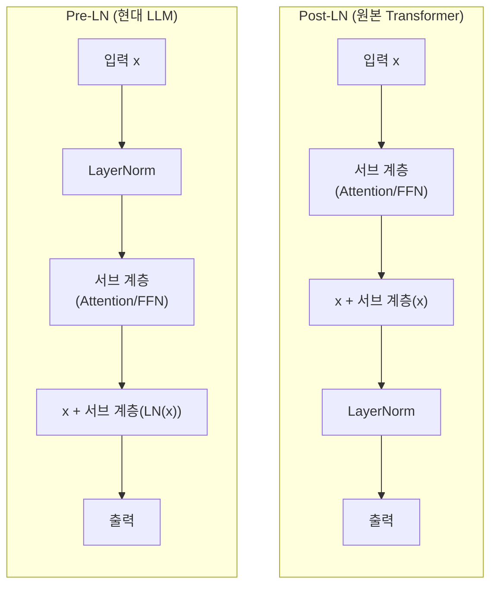
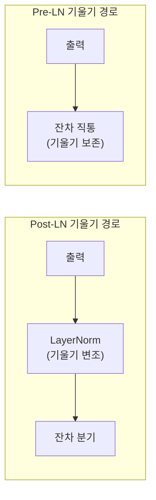

## 개요

Pre-LN과 Post-LN은 [[transformer-architecture]]에서 레이어 정규화(Layer Normalization)를 서브 계층(어텐션, FFN) 앞에 배치하느냐 뒤에 배치하느냐의 차이다. 원본 Transformer(2017)는 Post-LN을 사용했으나, Xiong et al.(2020, ICML)이 "On Layer Normalization in the Transformer Architecture"에서 Post-LN의 출력 근처 기울기 폭발 문제를 평균장 이론(mean field theory)으로 분석하고 Pre-LN의 학습 안정성 우위를 증명한 이후, Pre-LN이 현대 LLM의 사실상 표준이 되었다.

## 구조 비교



### Post-LN (원본)

```
출력 = LayerNorm(x + SubLayer(x))
```

정규화가 잔차 연결 이후에 적용된다. 잔차 경로를 통한 신호가 정규화를 거치므로 최종 출력의 스케일이 안정적이다.

### Pre-LN (현대)

```
출력 = x + SubLayer(LayerNorm(x))
```

정규화가 서브 계층 이전에 적용된다. 잔차 경로가 정규화 없이 직접 통과하므로 기울기가 더 안정적으로 흐른다.

## 왜 Pre-LN이 더 안정적인가

### Xiong et al.의 분석

Post-LN에서 초기화 시점의 기울기 분석 결과:

- **출력 근처 파라미터**: 기울기의 기대값이 매우 크다
- **입력 근처 파라미터**: 기울기의 기대값이 상대적으로 작다

이 불균형이 학습 초기에 출력 근처 파라미터의 급격한 업데이트를 유발하여 학습이 불안정해진다. 학습률 워밍업(warmup)은 이 문제를 완화하는 우회 방법이다.

Pre-LN에서는 초기화 시점부터 기울기가 잘 정돈되어(well-behaved) 있어 워밍업 없이도 안정적 학습이 가능하다. 비교 실험에서 Pre-LN은 워밍업 없이 Post-LN + 워밍업과 동등한 성능을 달성하면서 학습 시간을 단축했다.

### 잔차 경로 관점



Pre-LN에서 잔차 경로는 LayerNorm을 거치지 않고 직접 연결되므로, 기울기가 변조 없이 전파된다. 이는 ResNet의 "깨끗한 항등 경로(clean identity path)"와 동일한 원리다.

## Post-LN의 장점

Pre-LN이 안정성에서 우세하지만, Post-LN도 장점이 있다:

- **표현력**: 일부 연구에서 Post-LN이 Pre-LN보다 높은 최종 성능을 달성 (적절한 워밍업 사용 시)
- **출력 스케일**: 정규화가 잔차 합 이후에 적용되어 각 층의 출력 스케일이 일정

이로 인해 일부 최신 연구는 두 방식의 장점을 결합하는 접근을 시도한다.

## RMSNorm: LayerNorm의 경량 대안

Zhang & Sennrich(2019)가 제안한 RMSNorm은 LayerNorm에서 평균 빼기(centering) 연산을 제거한 경량 버전이다:

```
LayerNorm(x) = gamma * (x - mean) / sqrt(var + epsilon) + beta
RMSNorm(x)   = gamma * x / sqrt(mean(x^2) + epsilon)
```

평균 계산과 편향(beta)을 제거하여 연산량을 줄이면서, 실험적으로 LayerNorm과 동등한 성능을 보인다. LLaMA, Mistral, Gemma 등 현대 LLM 대다수가 Pre-RMSNorm을 채택한다.

## 현대 LLM의 정규화 설계

| 모델 | 배치 | 방식 |
|------|------|------|
| 원본 Transformer | Post-LN | LayerNorm |
| BERT | Post-LN | LayerNorm |
| GPT-2 | Pre-LN | LayerNorm |
| GPT-3 | Pre-LN | LayerNorm |
| LLaMA 1/2/3 | Pre-LN | RMSNorm |
| Mistral | Pre-LN | RMSNorm |
| Qwen 2.5 | Pre-LN | RMSNorm |
| Gemma 2/3 | Pre-LN + Post-LN | RMSNorm |

Gemma 2는 Pre-LN과 Post-LN을 동시에 적용하는 하이브리드 방식으로, 학습 안정성과 표현력을 모두 확보하려는 시도다.

## 관련 개념: QK-Norm과 기타 정규화

어텐션 내부에서 Q, K 벡터를 정규화하는 QK-Norm도 학습 안정성에 기여한다. [[gated-attention]]의 시그모이드 게이트도 유사한 안정화 효과를 제공하며, 특히 loss spike 제거에서 Pre-LN과 상보적으로 작용한다.

## 대표 자료

- [Xiong et al., "On Layer Normalization in the Transformer Architecture" (ICML 2020, arXiv:2002.04745)](https://arxiv.org/abs/2002.04745)
- [Zhang & Sennrich, "Root Mean Square Layer Normalization" (arXiv:1910.07467)](https://arxiv.org/abs/1910.07467)
- [Ba et al., "Layer Normalization" (arXiv:1607.06450)](https://arxiv.org/abs/1607.06450)

## 관련 문서

- [[transformer-architecture]] -- Pre-LN/Post-LN이 적용되는 전체 구조
- [[transformer-ffn]] -- 정규화가 적용되는 서브 계층 중 하나
- [[self-attention-mechanism]] -- 정규화가 적용되는 또 다른 서브 계층
- [[gated-attention]] -- 학습 안정성에 기여하는 상보적 기법
- [[encoder-decoder-architectures]] -- 모델별 정규화 설계 차이
