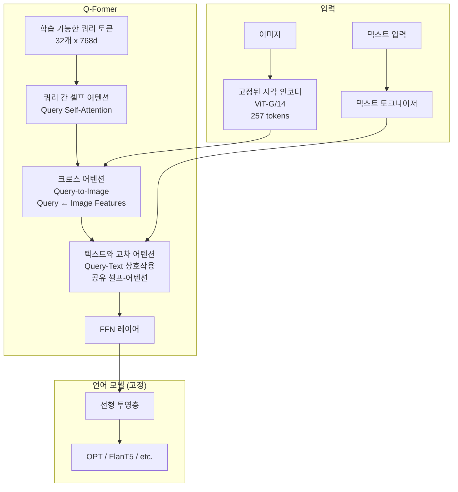
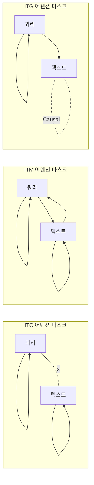
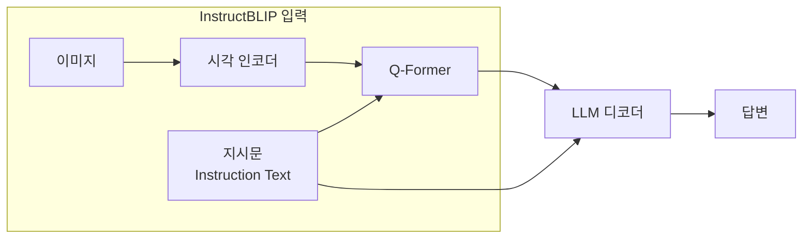
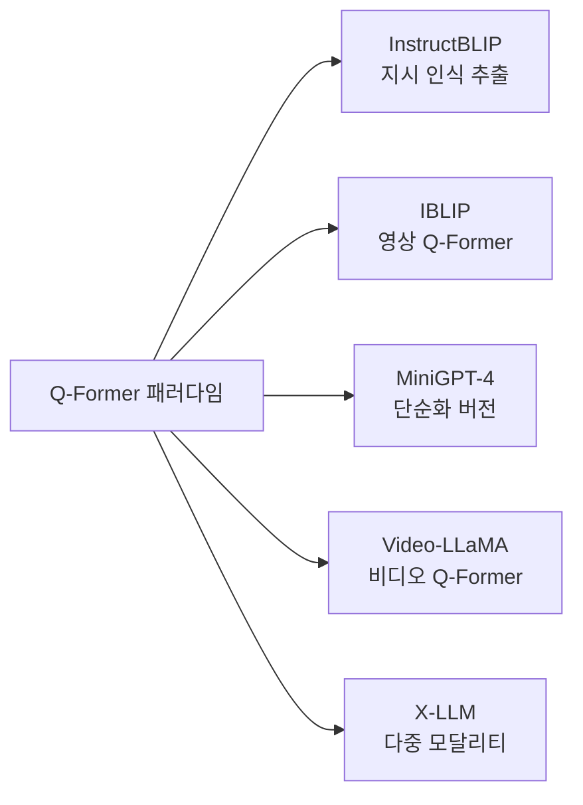
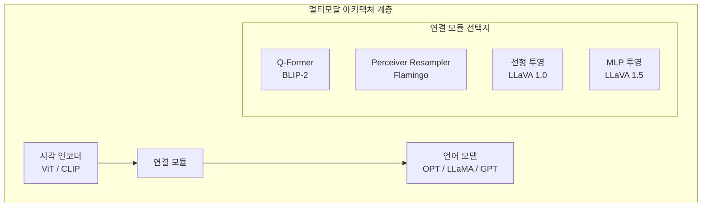

# Q-Former (Querying Transformer)

Q-Former(Querying Transformer)는 시각 인코더와 언어 모델 사이에 위치하는 경량 어댑터 모듈로, 고정된 수의 학습 가능한 쿼리 토큰을 통해 이미지 특성에서 언어 모델이 소화하기 적합한 시각 표현을 추출한다. BLIP-2(Li et al. 2023)에서 처음 도입되어 멀티모달 언어 모델 학습의 효율적 패러다임을 제시했다.

## 등장 배경

대형 시각 인코더(ViT-G 등)와 대형 언어 모델(OPT, FlanT5 등)을 직접 연결하면 두 가지 문제가 발생한다:

1. **정보 과부하**: ViT-G/14는 이미지당 257개(16x16+1) 시각 토큰을 생성. 언어 모델에 그대로 공급하면 시퀀스 길이가 폭발적으로 증가
2. **표현 불일치**: 시각 인코더는 픽셀 수준의 세밀한 특성을 인코딩하지만, 언어 모델은 의미적 추상 표현을 기대

Q-Former는 이 간격을 메우는 **정보 병목(information bottleneck)** 역할을 한다.

## 아키텍처



### 핵심 구성 요소

**학습 가능한 쿼리 (Learnable Queries)**

- 32개의 학습 가능한 임베딩 벡터 (각 768차원)
- 이미지 내용에 무관하게 고정된 수의 쿼리. 즉, 이미지 크기/해상도와 무관하게 항상 32개 출력
- 시각 인코더의 257개 토큰 -> 32개 압축 표현으로 정보 병목 형성

**이중 내부 아키텍처**

Q-Former는 하나의 트랜스포머 내에 두 가지 상호작용 경로를 가진다:

| 경로 | 어텐션 범위 | 역할 |
|------|-------------|------|
| 쿼리-이미지 상호작용 | 쿼리 ↔ 이미지 특성 (크로스 어텐션) | 시각 정보 추출 |
| 쿼리-텍스트 상호작용 | 쿼리 ↔ 텍스트 (공유 셀프 어텐션) | 언어 정렬 |

텍스트 토큰끼리는 서로 어텐션 가능하지만 쿼리 토큰을 어텐션하지는 않는다 (마스킹 조절로 구현).

## BLIP-2 사전학습 전략

Q-Former는 두 단계로 사전학습된다.

```mermaid
flowchart TD
    subgraph "1단계: 시각-언어 표현 학습"
        S1[시각 인코더 + Q-Former<br/>언어 모델 없음]
        S1 --> L1[Image-Text Contrastive<br/>ITC]
        S1 --> L2[Image-Text Matching<br/>ITM]
        S1 --> L3[Image-grounded Text Generation<br/>ITG]
    end

    subgraph "2단계: 시각-언어 생성 학습"
        S2[시각 인코더 (고정)<br/>+ Q-Former (고정)<br/>+ 선형 투영<br/>+ 언어 모델 (고정)]
        S2 --> L4[자기회귀 언어 모델링<br/>ARG]
    end

    S1 --> S2
```

### 1단계 손실 함수

**ITC (Image-Text Contrastive)**: CLIP처럼 이미지-텍스트 쌍의 코사인 유사도를 최대화. 쿼리 출력의 최대 유사도를 이미지 표현으로 사용.

**ITM (Image-Text Matching)**: 이미지-텍스트 쌍이 매칭되는지 이진 분류. Hard negative mining으로 어려운 음성 쌍 활용.

**ITG (Image-grounded Text Generation)**: 이미지에 기반해 텍스트를 자기회귀로 생성. 쿼리 토큰이 이미지를 접근하고 텍스트 생성 유도.

각 손실에서 어텐션 마스크를 다르게 설정해 같은 Q-Former가 세 가지 목표를 동시에 학습:



### 2단계: 언어 모델 연결

1단계로 학습된 Q-Former의 쿼리 출력(32 x 768)을 선형 투영으로 언어 모델의 임베딩 차원에 맞추고, 언어 모델의 입력 시퀀스 맨 앞에 soft visual prompt로 추가한다.

$$\text{LLM 입력} = [\text{시각 토큰 32개}; \text{텍스트 토큰 N개}]$$

언어 모델은 고정(frozen)되므로, **언어 모델의 지식을 보존하면서 시각 이해 능력만 추가**한다.

## InstructBLIP: 지시 따르기 확장

[[instructblip-paper]]에서 InstructBLIP은 BLIP-2를 지시 따르기(instruction tuning)로 확장한다.



**핵심 차이**: Q-Former에 지시문을 함께 입력. 지시에 따라 다른 시각 특성 추출.

예시:
- "이 이미지에 있는 텍스트를 읽어줘" -> Q-Former가 텍스트 영역에 집중
- "이미지의 분위기를 설명해줘" -> Q-Former가 색상/조명에 집중

이를 **지시 인식 시각 특성 추출(instruction-aware visual feature extraction)**이라 한다.

## BLIP-2 vs [[Perceiver Resampler]] 비교

두 모듈 모두 시각 인코더와 언어 모델 사이의 브릿지 역할을 하지만 설계 철학이 다르다:

| 항목 | Q-Former (BLIP-2) | Perceiver Resampler (Flamingo) |
|------|-------------------|-------------------------------|
| 구조 기반 | BERT 기반 트랜스포머 | 교차 어텐션 + 피드포워드 |
| 사전학습 | 별도 3가지 목표로 명시적 사전학습 | Flamingo와 함께 엔드-투-엔드 학습 |
| 텍스트 상호작용 | Q-Former 내부에서 통합 | 별도 (언어 모델이 처리) |
| 파라미터 효율 | 적음 (~188M) | 더 많음 (~200M+) |
| 유연성 | BLIP-2 파이프라인에 특화 | Flamingo에 내장 |

## 후속 모델들의 Q-Former 활용

Q-Former는 멀티모달 LLM 설계의 표준 패턴 중 하나가 되었다:



**Video-LLaMA**: Q-Former를 비디오에 적용. 프레임 간 시간 어텐션 추가.  
**X-LLM**: 이미지, 비디오, 오디오에 각각의 Q-Former를 사용하는 범용 멀티모달 프레임워크.

## [[멀티모달 LLM (Multimodal LLM)]] 맥락에서의 위치

Q-Former는 멀티모달 LLM 아키텍처에서 "연결 모듈" 계층을 대표한다:



LLaVA 시리즈는 Q-Former 대신 단순 MLP 투영으로도 강력한 성능을 달성하면서, Q-Former의 복잡한 사전학습이 반드시 필요한지 의문을 제기했다. 그러나 데이터 효율과 제한적 학습 예산 상황에서는 Q-Former 스타일이 여전히 유효하다.

## 실무 관점

### Q-Former 사용 시나리오

- **사전학습 데이터가 제한적**: Q-Former의 단계적 사전학습이 효율적
- **언어 모델을 완전 고정**: LLM의 지식 보존 중요 시
- **다양한 LLM 교체 필요**: Q-Former만 재학습하면 다른 LLM과 연결 가능

### 구현 시 주의점

1. **쿼리 수**: 기본 32개. 늘리면 용량 증가하지만 LLM 시퀀스 길이 증가
2. **1단계 사전학습 필수**: 2단계만 하면 시각-언어 정렬이 부실
3. **시각 인코더 선택**: ViT-G/14 또는 EVA-G 권장. 작은 인코더는 정보 손실

```python
# HuggingFace BLIP-2 사용 예시 (개념 참고)
from transformers import Blip2Processor, Blip2ForConditionalGeneration

processor = Blip2Processor.from_pretrained("Salesforce/blip2-opt-2.7b")
model = Blip2ForConditionalGeneration.from_pretrained("Salesforce/blip2-opt-2.7b")

inputs = processor(images=image, text="이 이미지를 설명해줘:", return_tensors="pt")
generated_ids = model.generate(**inputs, max_new_tokens=50)
```

## 관련 문서

- [[blip-2-paper]] -- BLIP-2 원 논문 (Li et al. 2023)
- [[instructblip-paper]] -- InstructBLIP 논문
- [[multimodal-llm]] -- 멀티모달 LLM 아키텍처 전반
- [[perceiver-resampler]] -- Q-Former의 대안 브릿지 모듈 (Flamingo)
- [[masked-image-modeling|마스킹 이미지 모델링 (Masked Image Modeling)]] -- 시각 인코더 사전학습
