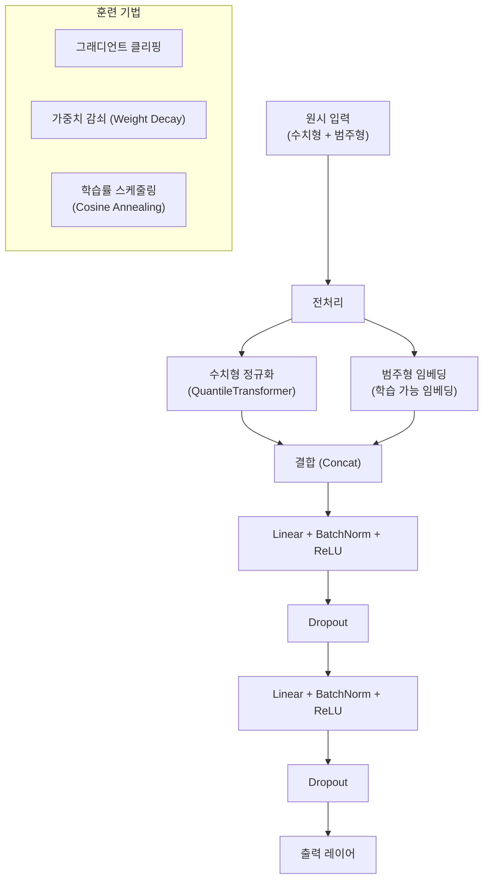
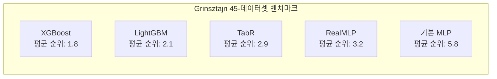

# RealMLP - 현대화된 테이블 MLP

RealMLP는 정형 데이터(tabular data)에서 MLP(Multi-Layer Perceptron)의 성능을 최대한 끌어올리기 위해 배치 정규화, 그래디언트 클리핑, 범주형 임베딩 등 현대적 훈련 기법을 체계적으로 결합한 아키텍처다. 단순한 MLP가 왜 정형 데이터에서 약했는지를 분석하고, 개별 기법들의 기여도를 검증해 최적의 조합을 찾는 실용 엔지니어링 연구에서 출발했다.

## 배경: MLP가 정형 데이터에서 약했던 이유

이미지/텍스트 도메인에서 성공한 딥러닝이 정형 데이터에서는 XGBoost, LightGBM 같은 트리 기반 모델에 지속적으로 뒤처졌다. 그 원인으로 지목된 것들:

1. **스케일 불균일**: 피처마다 값의 범위가 크게 달라 학습이 불안정
2. **범주형 변수 처리**: 원핫 인코딩은 희소하고 고차원, 임베딩은 초기화에 민감
3. **과적합 취약성**: 적은 데이터에서 트리 기반의 내재적 규제(early stopping, 깊이 제한)가 MLP보다 효과적
4. **하이퍼파라미터 민감도**: 학습률, 배치 크기, 레이어 수에 따른 성능 편차가 큼

## 핵심 개선 사항

### 1. 수치형 피처 처리

단순 표준화(mean=0, std=1) 대신 분위수 변환(Quantile Transformation)을 사용한다. 이는 이상치(outlier)의 영향을 줄이고 피처를 균일 분포 또는 정규 분포에 가깝게 만든다. 특히 skewed 분포를 가진 피처(소득, 가격 등)에서 효과적이다.

### 2. 범주형 임베딩

원핫 인코딩 대신 학습 가능한 임베딩(learnable embedding)을 사용한다. 임베딩 차원은 카디널리티(unique 값 수)의 제곱근 정도로 설정하는 경험적 규칙을 따른다. 초기화는 작은 정규분포로 하고 Weight Decay로 크기를 억제한다.

### 3. 배치 정규화 (Batch Normalization)

각 레이어 이후 Batch Normalization을 적용한다. 정형 데이터에서 Layer Normalization보다 Batch Normalization이 더 효과적이라는 경험적 발견이 있다. 배치 크기가 충분히 클 때(>256) 안정적으로 동작한다.

### 4. 그래디언트 클리핑

그래디언트 노름(gradient norm)에 상한을 두어 폭발적 그래디언트(gradient explosion)를 방지한다. 정형 데이터에서는 피처 스케일 차이로 인해 특정 방향의 그래디언트가 과도하게 커질 수 있다.

## 하이퍼파라미터 분석

RealMLP 연구의 핵심 기여 중 하나는 개별 하이퍼파라미터의 영향도를 체계적으로 실험으로 정량화한 것이다.

| 하이퍼파라미터 | 성능 영향 | 권장값 |
|---------------|---------|--------|
| 정규화 방식 | 높음 | QuantileTransformer |
| 배치 정규화 유무 | 높음 | 사용 |
| 임베딩 방식 (범주형) | 높음 | 학습 가능 임베딩 |
| 학습률 | 중간 | 1e-3 ~ 3e-3 |
| 드롭아웃 비율 | 낮음 | 0.0 ~ 0.1 |
| 레이어 수 | 낮음 | 3 ~ 5 |

## TabR, XGBoost와 성능 비교

RealMLP는 기본 MLP 대비 평균 순위를 2~3단계 향상시켜 TabR과 유사한 수준에 도달했다. 특히 TabR이 k-NN 검색의 추론 비용이 드는 반면, RealMLP는 표준 순방향 패스(forward pass)만 있어 추론 속도가 훨씬 빠르다.

## 언제 RealMLP를 선택하는가

- 추론 지연이 중요한 프로덕션 환경 (k-NN 검색 없이 빠른 추론)
- 훈련 데이터가 중간 크기 (1만~100만 샘플)
- 피처 수가 많은 경우 (수백~수천 피처)
- 트랜스퍼 러닝이나 파인튜닝을 계획 중인 경우 (신경망 기반이므로)

트리 기반 모델보다 여전히 평균적으로 약간 뒤처지지만, 신경망의 장점(GPU 병렬화, 그래디언트 기반 최적화, 딥러닝 에코시스템 통합)을 유지한다는 점이 핵심 가치다.

## 관련 문서

- [[tabr-retrieval-augmented]] - 검색 증강으로 정형 데이터 성능을 높이는 대안 접근법
- [[tabular-feature-interaction]] - 정형 데이터의 피처 간 상호작용 모델링 개요
- [[catboost-ordered-boosting]] - 정형 데이터의 트리 기반 강력한 경쟁자
