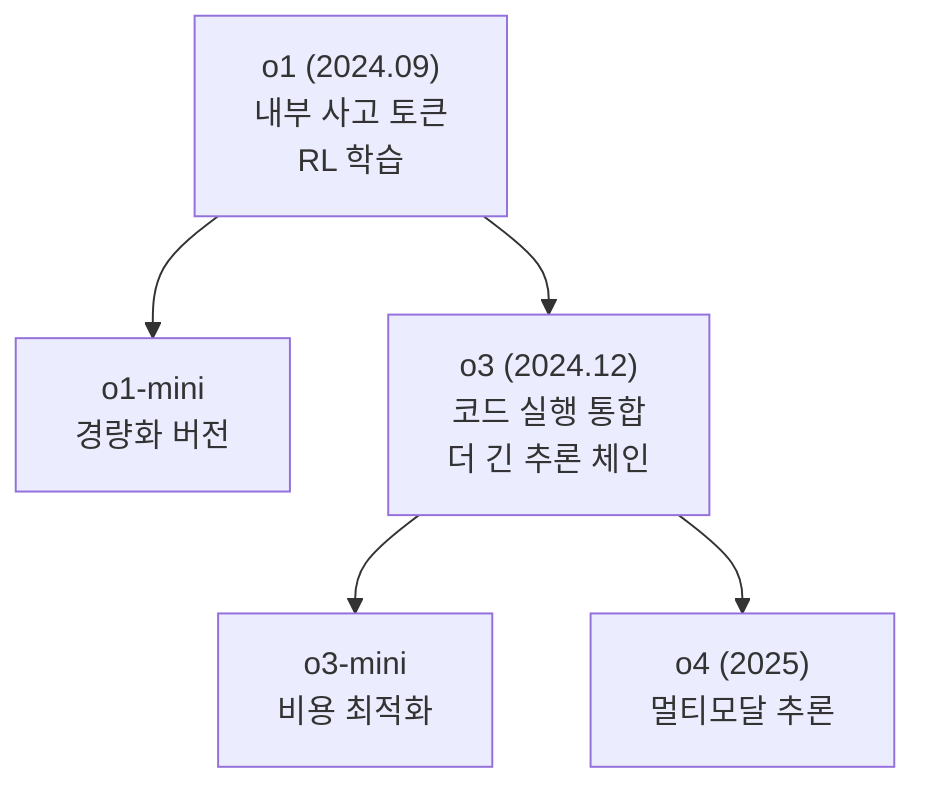
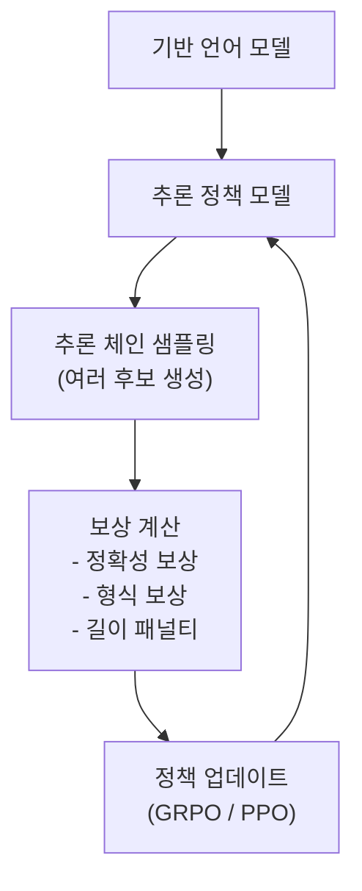
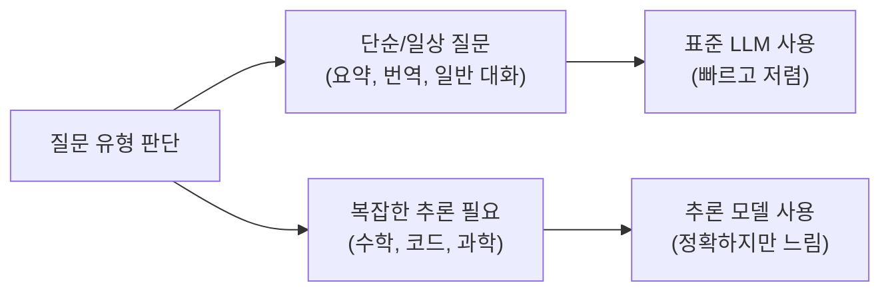

# 추론 모델 (Reasoning LLM)

## 개요

추론 모델(Reasoning LLM)은 답변을 즉시 출력하는 대신, **응답 전에 내부적으로 긴 사고 과정을 거치도록 설계된 대형 언어 모델**이다. 이 패러다임은 2024년 OpenAI의 o1 발표를 기점으로 본격화되었으며, 수학 증명, 코드 디버깅, 복잡한 논리 추론 등 전통적으로 LLM이 취약했던 영역에서 획기적인 성능 향상을 달성했다.

핵심 아이디어는 **"더 오래 생각할수록 더 좋은 답을 낸다"** 는 것이며, 이를 테스트 시간 컴퓨팅 스케일링(test-time compute scaling)이라는 이름으로 체계화했다. 기존 LLM이 학습 파라미터 수와 데이터 양으로 성능을 높였다면, 추론 모델은 **추론 시점에 소비하는 연산량**을 늘려 성능을 끌어올린다.


위 다이어그램은 추론 모델의 핵심 루프를 나타낸다. 단순 순방향 생성이 아니라 사고-검증-재사고의 반복 구조를 가진다.

---

## 배경: 왜 추론 모델이 필요한가

### 기존 LLM의 한계

표준 자동회귀(autoregressive) LLM은 토큰을 순차적으로 생성하는 과정에서 각 토큰 생성에 동일한 연산량을 사용한다. 이는 "2 + 2 = ?" 같은 단순 질문과 "페르마의 마지막 정리를 증명하라" 같은 복잡한 질문에 동일한 깊이로 처리한다는 의미다.

**System 1 vs System 2 사고**의 비유가 자주 쓰인다:
- **System 1** (빠른 사고): 직관적, 즉각적 반응 — 기존 LLM의 기본 동작 방식
- **System 2** (느린 사고): 신중하고 단계적인 추론 — 추론 모델이 구현하려는 방식

### 사고 사슬(Chain of Thought)의 한계

[[chain-of-thought]] 프롬프팅은 "단계별로 생각해봐" 지시를 통해 LLM이 중간 추론 단계를 출력하게 만들었다. 그러나:
- 사용자가 프롬프트에 명시적으로 요청해야 함
- 사고 과정이 최종 답변과 같은 출력 공간에 노출됨 (일관성 강제 어려움)
- 사고 과정 자체의 품질을 학습하는 메커니즘이 없음

추론 모델은 이를 **아키텍처와 학습 방식 수준에서** 해결한다.

---

## 핵심 개념: 테스트 시간 컴퓨팅 스케일링

[[test-time-compute-scaling]]은 추론 모델의 이론적 기반이다.

### 스케일링 법칙의 확장

기존 [[scaling-laws-overview]]는 학습 파라미터($N$)와 데이터($D$)에 초점을 맞췄다. 테스트 시간 컴퓨팅 스케일링은 **추론 시점 연산량($C_{inf}$)** 을 세 번째 축으로 추가한다.

$$\text{성능} \approx f(N, D, C_{inf})$$

실증적으로, 작은 모델에 긴 추론 시간을 주는 것이 큰 모델에 짧은 추론 시간을 주는 것보다 특정 작업에서 더 좋은 결과를 낼 수 있다.

### 탐색 전략

테스트 시간 컴퓨팅을 확장하는 방법은 크게 두 가지다:

| 전략 | 설명 | 적합한 작업 |
|------|------|------------|
| **연속적 사고 (Serial)** | 하나의 긴 추론 체인 생성 | 단계 의존적 증명 |
| **병렬 샘플링 + 검증** | 여러 후보 생성 후 최선 선택 | 답이 검증 가능한 문제 |
| **트리 탐색 (MCTS)** | 추론 과정을 트리로 탐색 | 게임, 복잡한 계획 |
| **빔 서치** | 상위 K개 경로 유지 | 중간 복잡도 작업 |

---

## 주요 모델 계보

### OpenAI o1 / o3 시리즈

2024년 9월 OpenAI가 공개한 **o1**은 추론 모델 패러다임을 대중화한 모델이다. 핵심 특징:

- **내부 사고(thinking) 토큰**: 사용자에게 보이지 않는 내부 추론 체인 생성
- **강화학습 기반 학습**: 정확한 답변을 생성하는 추론 경로에 보상을 주는 방식으로 학습
- **수학·코드·과학 특화**: AIME(미국 수학 올림피아드 예선) 등에서 인간 전문가 수준 달성

o1과 비교한 **o3**의 개선점:
- 더 긴 추론 체인 지원
- 코드 실행 통합 (추론 중 코드를 직접 실행하여 검증)
- 응용 분야 확대 (과학 연구, 장문 분석)



### DeepSeek R1

중국 DeepSeek이 2025년 1월 공개한 [[deepseek-r1]]은 오픈소스 추론 모델로 업계에 큰 충격을 주었다. 주목할 특징:

- **완전 공개**: 모델 가중치, 학습 방법론, 데이터 모두 공개
- **순수 RL 접근**: GRPO(Group Relative Policy Optimization) 알고리즘으로 추론 능력 발현
- **자기발현적 사고**: 별도 데이터 없이 RL만으로 긴 추론 체인 자연 발생
- **성능**: 수학·코드에서 o1 수준, 비용은 ~95% 절감

R1의 학습 과정에서 흥미로운 현상이 관찰되었다. 모델이 스스로 "Aha moment" — 자신의 오류를 인식하고 방향을 전환하는 순간 — 을 학습했다.

> "During training, we observed that DeepSeek-R1 spontaneously exhibited behaviors such as reflection, where the model re-examines its initial reasoning when encountering difficulties." - DeepSeek 팀

이 현상은 추론 능력이 **창발적으로 발생**함을 시사한다.

### Claude 추론 모드 (Claude 3.7+)

Anthropic은 **확장 사고(extended thinking)** 기능으로 추론 모델 기능을 도입했다. 구조적 차이:

- 사고 블록(`<thinking>` 태그)이 API 응답에 선택적으로 노출됨
- `budget_tokens` 파라미터로 사고 깊이 제어 가능
- 표준 Claude 응답과 추론 응답 간 전환 가능

```python
import anthropic

client = anthropic.Anthropic()

response = client.messages.create(
    model="claude-3-7-sonnet-20250219",
    max_tokens=16000,
    thinking={
        "type": "enabled",
        "budget_tokens": 10000  # 사고에 허용할 최대 토큰 수
    },
    messages=[{
        "role": "user",
        "content": "다음 수열의 100번째 항을 구하시오: 1, 1, 2, 3, 5, 8, ..."
    }]
)

# thinking 블록과 text 블록이 분리되어 반환됨
for block in response.content:
    if block.type == "thinking":
        print(f"[사고 과정]\n{block.thinking}")
    elif block.type == "text":
        print(f"[최종 답변]\n{block.text}")
```

---

## 추론 모델 학습 파이프라인

### 단계 1: 기반 모델 준비

추론 모델은 일반적으로 강력한 기반 언어 모델(base LLM)을 출발점으로 한다. 기반 모델의 품질이 추론 능력의 상한을 결정한다.

### 단계 2: 콜드 스타트 데이터 (선택적)

일부 접근법은 소량의 고품질 사고 사슬 데이터로 초기 파인튜닝을 수행한다. DeepSeek R1-Zero는 이 단계를 생략하고 순수 RL만으로 성공했다.

### 단계 3: 강화학습 최적화



**보상 함수 설계가 핵심이다.** 일반적으로 다음 요소를 조합한다:
- **정확성 보상**: 최종 답변이 정답인지 여부 (0/1 또는 부분 점수)
- **형식 보상**: 정해진 출력 포맷 준수 여부
- **효율성 패널티**: 불필요하게 긴 추론 체인에 패널티

### 단계 4: 증류 (Distillation)

대형 추론 모델의 사고 과정을 소형 모델에 전달하는 [[distillation-llm]] 방식으로 경량화된 추론 모델을 만들 수 있다.

---

## 성능 비교

주요 벤치마크에서의 추론 모델 성능:

| 모델 | AIME 2024 | MATH-500 | LiveCodeBench | 공개 여부 |
|------|-----------|----------|---------------|---------|
| GPT-4o | 9.3% | 74.6% | 33.4% | 비공개 |
| o1-preview | 56.7% | 85.5% | 53.6% | 비공개 |
| o3 (high) | ~90%+ | ~97%+ | ~75%+ | 비공개 |
| DeepSeek R1 | 79.8% | 97.3% | 65.9% | **공개** |
| Claude 3.7 Sonnet (extended) | 60%+ | 96%+ | ~60% | 비공개 |

*수치는 발표 당시 기준이며 벤치마크별 설정 차이 있음*

---

## 추론 모델의 특성과 트레이드오프

### 장점

1. **복잡한 문제 해결**: 수학 증명, 알고리즘 설계, 과학적 분석에서 탁월
2. **자기 수정**: 오류를 발견하면 추론 중에 스스로 수정
3. **투명성**: 사고 과정이 노출될 경우 추론 추적 가능
4. **신뢰성**: 단순 생성보다 검증된 답변 생성

### 단점 및 주의사항

1. **지연 시간(latency)**: 수십~수백 초의 추론 시간이 필요
2. **비용**: 표준 모델 대비 수배~수십 배의 토큰 소비
3. **과잉 추론**: 단순 질문에도 긴 사고 체인을 생성하는 비효율
4. **사고 신뢰성**: 노출된 사고 과정이 실제 내부 계산과 일치하지 않을 수 있음
5. **스트리밍 어려움**: 긴 사고 완료 후 출력이 시작되어 사용자 경험 저하

### 적합한 사용 사례



---

## 기술적 세부 사항

### GRPO (Group Relative Policy Optimization)

DeepSeek R1에서 사용된 강화학습 알고리즘. 기존 PPO(Proximal Policy Optimization) 대비 가치 함수(value function) 없이 그룹 내 상대적 보상으로 정책을 업데이트한다.

$$J_{GRPO}(\theta) = \mathbb{E}_{q, \{o_i\}_{i=1}^{G}}\left[\frac{1}{G}\sum_{i=1}^{G} \frac{\pi_\theta(o_i|q)}{\pi_{\theta_{old}}(o_i|q)} \hat{A}_i - \beta D_{KL}[\pi_\theta \| \pi_{ref}]\right]$$

여기서 $\hat{A}_i = \frac{r_i - \text{mean}(\{r_j\})}{\text{std}(\{r_j\})}$는 그룹 내 상대적 어드밴티지다.

### 길이-정확도 트레이드오프

추론 모델은 어려운 문제일수록 더 긴 추론 체인을 생성하는 경향이 있다. 이는 모델이 문제 난이도를 암묵적으로 평가한다는 것을 시사한다.

| 문제 유형 | 평균 사고 토큰 수 |
|---------|----------------|
| 간단한 산술 | 100-500 |
| AMC 수준 수학 | 1,000-3,000 |
| AIME 수준 수학 | 3,000-8,000 |
| 경쟁 프로그래밍 | 2,000-10,000 |
| 연구 수준 증명 | 5,000-20,000+ |

---

## 추론 모델 활용 패턴

### 패턴 1: 적응적 추론 깊이

```python
def ask_with_adaptive_reasoning(question: str, complexity_estimate: str) -> str:
    """
    문제 복잡도에 따라 추론 깊이를 동적으로 조정한다.
    """
    import anthropic

    budget_map = {
        "simple": 2000,
        "medium": 8000,
        "hard": 20000,
        "research": 50000,
    }

    client = anthropic.Anthropic()
    budget = budget_map.get(complexity_estimate, 8000)

    response = client.messages.create(
        model="claude-3-7-sonnet-20250219",
        max_tokens=budget + 4096,
        thinking={"type": "enabled", "budget_tokens": budget},
        messages=[{"role": "user", "content": question}],
    )

    return next(
        block.text for block in response.content if block.type == "text"
    )
```

### 패턴 2: 추론 결과 검증

```python
def solve_and_verify(problem: str) -> dict:
    """
    추론 모델로 풀고 동일 모델로 검증한다.
    """
    import anthropic

    client = anthropic.Anthropic()

    # 1단계: 풀기
    solve_response = client.messages.create(
        model="claude-3-7-sonnet-20250219",
        max_tokens=16000,
        thinking={"type": "enabled", "budget_tokens": 10000},
        messages=[{"role": "user", "content": f"다음 문제를 풀어라: {problem}"}],
    )
    solution = next(
        block.text for block in solve_response.content if block.type == "text"
    )

    # 2단계: 검증
    verify_response = client.messages.create(
        model="claude-3-7-sonnet-20250219",
        max_tokens=8000,
        thinking={"type": "enabled", "budget_tokens": 5000},
        messages=[{
            "role": "user",
            "content": f"다음 풀이가 올바른지 검증하라:\n문제: {problem}\n풀이: {solution}"
        }],
    )
    verification = next(
        block.text for block in verify_response.content if block.type == "text"
    )

    return {"solution": solution, "verification": verification}
```

---

## 미래 방향

### 1. 멀티모달 추론

이미지, 코드, 수식 등을 통합한 추론. o4-mini가 시각적 추론 능력을 보여주기 시작했다.

### 2. 에이전트와의 결합

추론 모델이 [[agents]] 아키텍처의 계획(planning) 모듈로 활용되는 사례가 증가하고 있다. 복잡한 다단계 작업에서 추론 모델이 계획을 세우고 표준 모델이 실행하는 구조.

### 3. 효율적 추론

긴 추론 체인의 비용 문제를 해결하기 위한 연구:
- **적응적 중단**: 충분한 확신이 생기면 일찍 멈추는 메커니즘
- **추론 캐싱**: 유사 문제의 추론 패턴 재활용
- **스펙터티브 추론**: 빠른 소형 모델로 추론 초안을 잡고 대형 모델로 검증

### 4. 추론 투명성

사고 과정이 실제 모델 내부 계산을 얼마나 반영하는지, 그리고 사고 과정의 조작 가능성에 대한 연구가 증가하고 있다.

---

## 관련 문서

- [[chain-of-thought]] - 추론 모델의 전신이 된 프롬프팅 기법
- [[test-time-compute-scaling]] - 추론 시점 컴퓨팅 확장의 이론적 기반
- [[deepseek-r1]] - 오픈소스 추론 모델의 대표 사례
- [[o1-reasoning]] - OpenAI o1의 상세 아키텍처와 학습 방법
- [[scaling-laws-overview]] - 스케일링 법칙과 테스트 시간 컴퓨팅의 관계
- [[distillation-llm]] - 추론 모델 경량화를 위한 지식 증류
- [[constitutional-ai-paper]] - Anthropic의 안전한 추론 모델 학습 접근법
