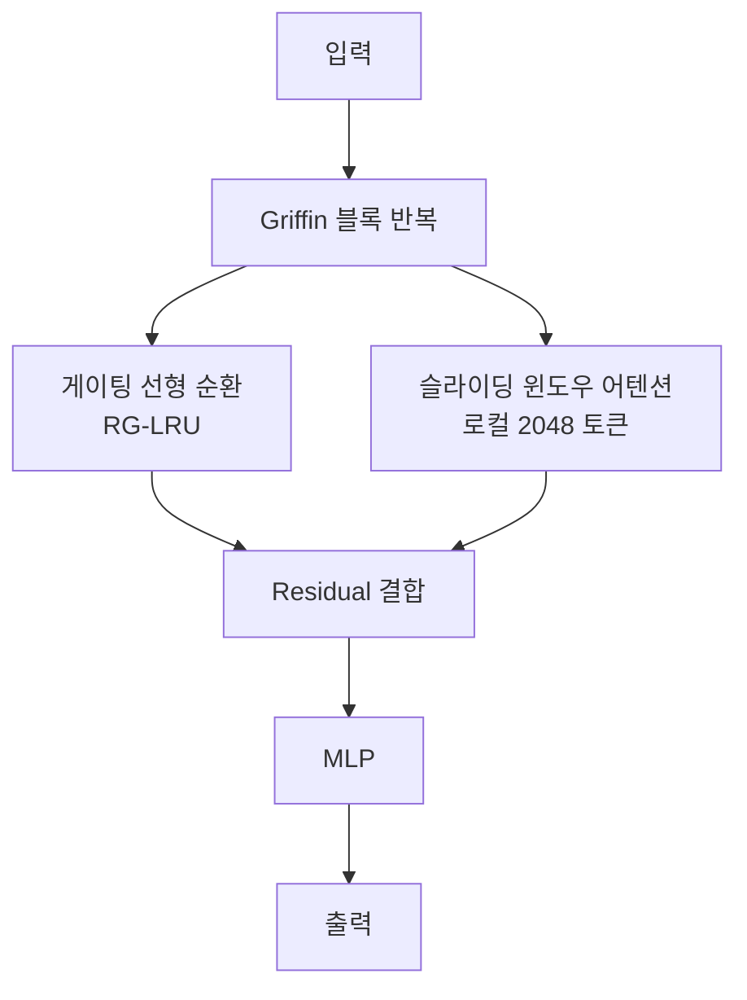

# RecurrentGemma / Griffin

Google DeepMind의 게이팅 선형 순환(Gated Linear Recurrence) + 로컬 어텐션 하이브리드 아키텍처. [[rwkv|RWKV]]와 [[mamba-3|Mamba]] 계열의 선형 RNN에 **슬라이딩 윈도우 어텐션**을 결합하여 장거리 의존성과 로컬 패턴 모두를 포착한다.

## 아키텍처

- **RG-LRU (Real-Gated Linear Recurrent Unit)**: 대각 상태 전이 + 입력/리셋 게이트. Mamba의 선택적 SSM과 유사하지만 더 단순
- **로컬 어텐션**: 2048 토큰 윈도우로 로컬 패턴 포착. 전체 어텐션 없이도 높은 성능

## 성능 위치

| 모델 | 파라미터 | 특성 |
|------|---------|------|
| Gemma 2B | 2B | 풀 어텐션 Transformer |
| RecurrentGemma 2B | 2B | Griffin (순환+로컬 어텐션) |
| Mamba 2.8B | 2.8B | 순수 SSM |

RecurrentGemma는 동일 크기 Gemma와 동등한 성능을 보이면서 **추론 시 고정 메모리**로 긴 시퀀스를 처리한다.

## 관련 문서

- [[rwkv]] -- RWKV
- [[mamba-3]] -- Mamba-3
- [[linear-recurrence-unified]] -- 선형 RNN 통합 관점
- [[gated-deltanet]] -- Gated DeltaNet
