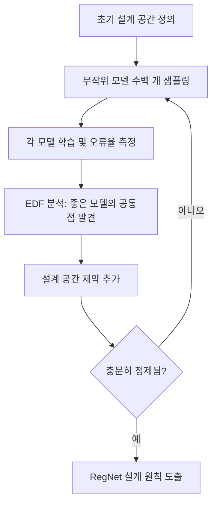

# RegNet - 설계 공간 탐색을 통한 네트워크 설계

## 배경과 문제 의식

신경망 아키텍처 설계는 크게 두 방향으로 발전해 왔다.

1. **수동 설계(Manual Design)**: 연구자가 직관과 경험으로 아키텍처를 제안하는 방식. VGG, ResNet, MobileNet 등이 이에 해당한다.
2. **신경망 아키텍처 탐색(NAS, Neural Architecture Search)**: 탐색 알고리즘이 자동으로 최적 구조를 찾는 방식. EfficientNet, NASNet 등이 대표적이다.

그런데 NAS는 강력하지만 **계산 비용이 매우 크고**, 탐색 결과가 특정 목표(예: 정확도)와 제약(예: 특정 하드웨어)에 편향되어 **일반성이 낮다**는 단점이 있다.

Facebook AI Research(FAIR)의 Radosavovic et al.(2020)은 새로운 접근법을 제안했다. NAS처럼 자동 탐색하되, 개별 모델을 찾는 대신 **설계 공간(design space) 자체를 정량적으로 분석하여 좋은 설계 원칙을 발견**하는 방식이다. 이렇게 발견한 정규화된(regularized) 설계 공간에서 도출한 모델 계열이 **RegNet(Regularized Networks)**이다.

## 설계 공간 탐색 방법론

### 설계 공간의 정의

RegNet은 단순 ResNet 블록(병목 없는 잔차 블록)을 4단계(stage)로 쌓는 구조를 기본 설계 공간으로 정의한다. 각 단계는 같은 너비(width)와 스트라이드를 갖는 블록들로 구성되며, 주요 설계 변수는 다음과 같다.

- 각 스테이지의 블록 깊이($d_i$)
- 각 스테이지의 채널 너비($w_i$)
- 각 블록의 그룹 너비($g$)
- 병목(bottleneck) 비율($b$)

### 무작위 샘플링과 통계적 분석

수백~수천 개의 모델을 무작위로 샘플링하여 학습시키고, **누적 오류 분포(EDF, Empirical Distribution Function)**를 통해 성능을 분석한다.

이 반복 과정을 통해 연구팀은 좋은 네트워크의 구조적 공통 원칙을 발견했다.

## RegNet의 핵심 설계 원칙

탐색을 통해 발견된 가장 중요한 규칙들이다.

### 1. 선형 너비 증가 (Linear Width Progression)

최적 모델들에서 각 블록의 채널 너비($w_j$)가 블록 인덱스($j$)에 따라 **선형적**으로 증가하는 패턴이 발견됐다.

$$w_j = w_0 + w_a \cdot j$$

- $w_0$: 초기 너비
- $w_a$: 증가율 (slope)
- $j$: 블록 인덱스

### 2. 깊이보다 너비 비율의 중요성

깊이($d$)와 너비($w$)를 동시에 늘릴 때 최적 비율이 존재하며, 깊은 좁은 모델보다 **적당히 깊고 넓은 모델**이 일반적으로 더 좋다.

### 3. 최적 그룹 너비

그룹 합성곱의 그룹 너비는 **8~128 정도의 고정된 값**이 일관되게 좋은 성능을 보였다. 비율 대신 절대값이 중요하다.

### 4. 병목 비율 = 1 (No Bottleneck)

전통적인 ResNet의 병목(bottleneck) 구조는 파라미터를 줄이지만, RegNet 분석에서는 **병목 비율 1(즉, 병목 없음)**이 자주 최적으로 나타났다.

## RegNet 변형: RegNetX와 RegNetY

| 변형 | 특징 |
|------|------|
| **RegNetX** | SE(Squeeze-and-Excitation) 없음. 순수한 설계 공간 탐색 원칙만 적용 |
| **RegNetY** | RegNetX + SE 블록 추가. ImageNet 정확도 향상 |

두 계열 모두 FLOPs를 기준으로 여러 크기 변형(200MF, 400MF, 800MF, ..., 32GF)이 제공된다.

## 성능 비교

RegNet의 핵심 가치는 단순히 높은 정확도가 아니라 **다양한 계산 예산에서 일관된 스케일링 효율**이다.

| 모델 | FLOPs | ImageNet Top-1 | 비고 |
|------|-------|----------------|------|
| ResNet-50 | 4.1G | 76.2% | 기준선 |
| RegNetX-4GF | 4.0G | 78.6% | ResNet 대비 +2.4% |
| EfficientNet-B0 | 0.4G | 77.1% | NAS 설계 |
| RegNetX-400MF | 0.4G | 72.7% | 유사 FLOPs |
| RegNetY-8GF | 8.0G | 81.7% | SE 추가 |

NAS 모델(EfficientNet)과 비교해 특정 FLOPs에서 비슷하거나 더 좋은 결과를 내면서, 설계 원칙의 단순함과 해석 가능성을 갖는다.

## 하드웨어 효율

RegNet은 GPU에서 높은 추론 처리량을 보인다. 주요 이유는 다음과 같다.

- **균일한 블록 구조**: 각 스테이지 내 블록이 동일하여 배치 처리가 효율적
- **적당한 그룹 너비**: GPU 텐서 코어를 효율적으로 활용
- **NAS 모델의 복잡한 비정형 구조 없음**: 컴파일러 최적화가 쉬움

Facebook 내부 연구에서 RegNetX-32GF는 같은 정확도의 EfficientNet 변형보다 **5배 빠른 추론 속도**를 GPU에서 달성했다.

## NAS와의 비교

| 측면 | NAS (EfficientNet 등) | RegNet |
|------|----------------------|--------|
| 탐색 목표 | 최적 단일 모델 | 설계 공간 원칙 발견 |
| 탐색 비용 | 매우 높음 (수천 GPU-시간) | 중간 (수백 모델 학습) |
| 일반화 | 특정 제약에 편향 | 다양한 FLOPs에 걸쳐 일관 |
| 해석 가능성 | 낮음 (블랙박스) | 높음 (설계 원칙이 명확) |
| 하드웨어 이식성 | 낮음 | 높음 |

## 실무 적용 관점

RegNet은 다음 상황에서 특히 유용하다.

**정해진 FLOPs 예산 내 최적 모델 선택**: 계산 예산(FLOP 또는 추론 시간)을 정하고 해당 예산의 RegNetX/Y 변형을 선택하면 거의 최적에 가까운 성능을 얻을 수 있다.

**프로덕션 배포**: GPU 처리량 효율이 높아 배치 추론 서빙에 적합하다.

**사전학습 백본**: DINO, MoCo 등 자기지도 비전 학습의 백본으로 자주 활용된다.

**연구 베이스라인**: 비전 아키텍처 연구에서 해석 가능한 베이스라인으로 활용된다.

## 관련 문서

- [[resnet-skip-connections]] - RegNet의 기반이 되는 잔차 연결
- [[resnext-cardinality]] - 그룹 합성곱을 사용하는 유사 계열
- [[mobilenet-efficientnet]] - NAS 기반 설계 공간 탐색의 대표 모델
- [[nfnet-normalizer-free]] - 배치 정규화 없는 고성능 CNN
- [[wide-resnet]] - 너비 확장으로 성능 향상을 추구한 접근법
- [[convnext]] - 현대적 CNN 설계 원칙의 후속 발전
