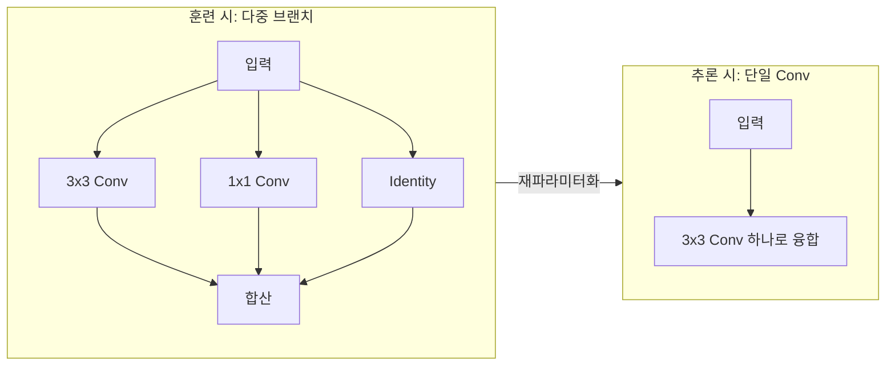

# RepVGG / Re-Parameterization

Ding et al. (2021) 제안. **훈련 시 다중 브랜치**(3x3 Conv + 1x1 Conv + Identity)로 풍부한 그래디언트 흐름을 확보하고, **추론 시 단일 VGG형 3x3 Conv**로 변환하는 구조적 재파라미터화 기법.

## 핵심 아이디어

1x1 Conv를 3x3으로 제로 패딩하고, Identity를 3x3 단위 행렬로 변환한 후, 세 커널을 **산술적으로 합산**하면 동등한 단일 3x3 Conv가 된다. BN도 선형 변환이므로 Conv에 흡수 가능.

## 실무 이점

| 측면 | 다중 브랜치 (훈련) | 단일 Conv (추론) |
|------|-----------------|----------------|
| 정확도 | 높음 (풍부한 흐름) | 동일 (수학적 동치) |
| 추론 속도 | 느림 (분기+합산) | **빠름** (단순 Conv) |
| 메모리 | 큼 (3개 브랜치) | **작음** |
| 하드웨어 활용 | 비효율 | **최적** (Winograd 등) |

## [[mobilenet-efficientnet|MobileNet]]과의 차이

MobileNet은 **아키텍처 설계**로 경량화하지만, RepVGG는 **동일 아키텍처를 재파라미터화**로 경량화한다. 두 기법은 결합 가능.

## 관련 문서

- [[cnn]] -- 합성곱 신경망
- [[mobilenet-efficientnet]] -- MobileNet/EfficientNet
- [[depthwise-separable-conv]] -- 깊이별 분리 합성곱
