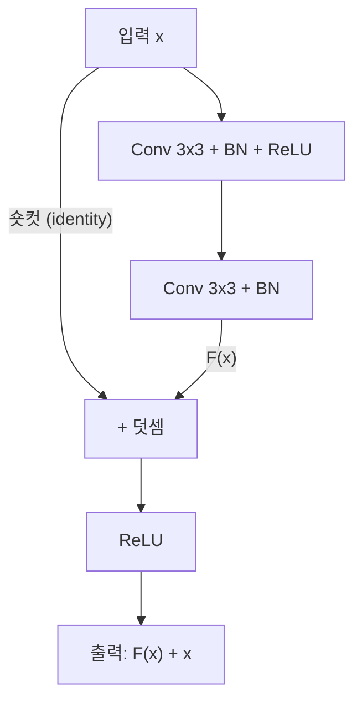

# 잔차 연결 (Residual Connection)

## 개요

잔차 연결(residual connection)은 He et al.(2015)이 "Deep Residual Learning for Image Recognition"에서 제안한 기법으로, 신경망의 한 레이어(또는 블록)의 입력을 출력에 직접 더하는 숏컷 경로(shortcut path)다. 레이어가 입력 x에서 목표 함수 H(x)를 직접 학습하는 대신, 잔차 F(x) = H(x) - x만 학습하도록 재구성한다. 출력은 F(x) + x가 된다. 이 단순한 구조 변경으로 100층 이상의 극심하게 깊은 네트워크도 안정적으로 학습할 수 있게 되었다. ResNet은 ILSVRC 2015에서 3.57% top-5 에러율로 우승했으며, 잔차 연결은 이후 [[transformer-architecture|Transformer]], [[cnn|CNN]], [[diffusion-models|확산 모델]] 등 현대 딥러닝의 거의 모든 아키텍처에 채택된 보편적 설계 원칙이 되었다.

## 문제: 깊은 네트워크의 열화 현상

### 기울기 소실 (Vanishing Gradient)

깊은 네트워크에서 역전파(backpropagation) 시 기울기는 각 레이어를 통과할 때마다 연쇄 법칙(chain rule)에 의해 곱해진다. 레이어가 수십 개를 넘으면 이 곱셈이 기울기를 극도로 작게 만들어, 초기 레이어의 가중치가 사실상 업데이트되지 않는다.

### 열화 문제 (Degradation Problem)

기울기 소실과 별도로, He et al.은 더 근본적인 관찰을 했다: **깊은 네트워크가 얕은 네트워크보다 학습 에러가 높다.** 이는 과적합이 아니다(학습 에러 자체가 높으므로). 56층 네트워크가 20층 네트워크보다 학습과 테스트 모두에서 성능이 나빴다. 이론적으로 56층 네트워크는 최소한 20층과 동일한 성능을 낼 수 있어야 한다(추가 36층이 항등 함수를 학습하면 되므로). 그러나 실제로 이 항등 매핑을 학습하는 것이 비선형 레이어에게는 어렵다는 것이 핵심 통찰이다.

## 잔차 학습 프레임워크

### 핵심 아이디어

목표 매핑 H(x)를 직접 학습하는 대신, 잔차 매핑 F(x) = H(x) - x를 학습하도록 재구성한다:

```
일반 블록:     y = F(x)         (F가 H(x) 전체를 학습)
잔차 블록:     y = F(x) + x     (F가 H(x) - x만 학습)
```

만약 최적 매핑이 항등 함수에 가깝다면(H(x) ~= x), 잔차 F(x)는 0에 가까운 값을 학습하면 된다. 0을 학습하는 것은 항등 함수를 직접 학습하는 것보다 훨씬 쉽다.

### 잔차 블록 구조



숏컷 연결은 파라미터가 없으며(identity mapping), 입력 x를 그대로 블록 출력에 더한다. 차원이 달라지는 경우에만 1x1 합성곱으로 투영(projection shortcut)한다.

### 기울기 흐름의 개선

잔차 연결이 기울기 전파를 개선하는 이유를 수학적으로 살펴보면:

```
출력: y_l = F(x_l) + x_l
L번째 레이어의 출력: x_L = x_l + sum(F(x_i), i=l to L-1)

기울기: d(loss)/d(x_l) = d(loss)/d(x_L) * (1 + d(sum F)/d(x_l))
```

핵심은 기울기 표현에 항상 **1이 포함**된다는 점이다. 숏컷 경로를 통해 기울기가 어떤 레이어도 거치지 않고 직접 전파될 수 있으므로, 아무리 깊은 네트워크라도 기울기가 완전히 사라지지 않는다.

## ResNet 아키텍처

He et al.은 잔차 블록을 쌓아 다양한 깊이의 ResNet을 구성했다:

| 모델 | 레이어 수 | 파라미터 | Top-5 에러 (ImageNet) |
|------|----------|---------|---------------------|
| ResNet-18 | 18 | 11.7M | 10.92% |
| ResNet-34 | 34 | 21.8M | 8.58% |
| ResNet-50 | 50 | 25.6M | 6.71% |
| ResNet-101 | 101 | 44.5M | 6.07% |
| ResNet-152 | 152 | 60.2M | 5.71% |

ResNet-152는 VGGNet(19층)의 8배 깊이면서도 더 낮은 연산 복잡도와 더 높은 정확도를 달성했다. 앙상블에서는 3.57% top-5 에러율로 ILSVRC 2015 우승을 차지했다.

### Bottleneck 블록

ResNet-50 이상에서는 연산 효율을 위해 bottleneck 설계를 사용한다:

```
기본 블록 (ResNet-18/34):  3x3 Conv -> 3x3 Conv
Bottleneck 블록 (ResNet-50+): 1x1 Conv(축소) -> 3x3 Conv -> 1x1 Conv(확장)
```

1x1 합성곱으로 채널을 먼저 축소한 뒤 3x3 합성곱을 수행하고, 다시 1x1로 복원한다. 3x3 합성곱의 입력/출력 채널이 줄어들어 연산량이 대폭 감소한다.

## Transformer에서의 잔차 연결

[[transformer-architecture|Transformer]]는 모든 서브레이어(self-attention, FFN) 뒤에 잔차 연결을 적용한다:

```
SubLayer 출력 = LayerNorm(x + SubLayer(x))    [Post-LN]
또는
SubLayer 출력 = x + SubLayer(LayerNorm(x))    [Pre-LN]
```

Transformer에서 잔차 연결의 역할:

- **깊은 모델 안정화**: GPT-3(96층), PaLM(118층) 등 수백 층의 모델이 잔차 연결 없이는 학습 불가능
- **항등 초기화 가능**: 새 레이어를 추가할 때 잔차 블록의 가중치를 0으로 초기화하면, 해당 블록이 항등 함수로 시작하여 기존 학습을 방해하지 않음
- **다양한 경로 제공**: N개의 잔차 블록은 2^N개의 가능한 경로를 만들어, 네트워크가 깊이를 유연하게 활용

[[diffusion-transformer|DiT]]의 adaLN-Zero도 잔차 연결 전 스케일 인자를 0으로 초기화하는 방식으로, 이 원리를 확장한 것이다.

## U-Net과 잔차 연결

[[u-net|U-Net]]의 skip connection과 잔차 연결은 유사하지만 구별되는 개념이다:

| 속성 | 잔차 연결 (ResNet) | Skip Connection (U-Net) |
|------|-------------------|------------------------|
| 연산 | 덧셈 (addition) | 연결 (concatenation) |
| 연결 방향 | 같은 경로 내 (레이어 간) | 인코더 -> 디코더 (경로 간) |
| 목적 | 기울기 흐름 개선, 항등 학습 촉진 | 공간 정보 보존 |
| 차원 | 입출력 동일 | 채널 수 증가 |

현대 확산 모델의 U-Net에서는 두 기법이 동시에 사용된다: 블록 내부에서는 잔차 연결(ResBlock), 인코더-디코더 사이에서는 skip connection.

## 변형과 확장

### Pre-Activation ResNet (He et al., 2016)

BN과 ReLU를 합성곱 이전에 배치하여 정보 전파를 개선. 1001층 네트워크에서도 안정적 학습을 입증했다.

### Stochastic Depth (Huang et al., 2016)

학습 중 잔차 블록을 확률적으로 비활성화(drop)하여, 효과적인 네트워크 깊이를 가변적으로 만든다. Dropout의 레이어 버전이라 할 수 있으며, 정규화 효과를 제공한다.

### Dense Connection (DenseNet, 2017)

잔차 연결을 확장하여 모든 이전 레이어의 출력을 현재 레이어에 연결한다. 특징 재사용을 극대화하여 파라미터 효율성을 높인다.

## 참고 자료

- He, K. et al. (2015). [Deep Residual Learning for Image Recognition](https://arxiv.org/abs/1512.03385). CVPR 2016
- [Residual neural network - Wikipedia](https://en.wikipedia.org/wiki/Residual_neural_network)
- [Intuitive Explanation of Skip Connections in Deep Learning](https://theaisummer.com/skip-connections/). AI Summer
