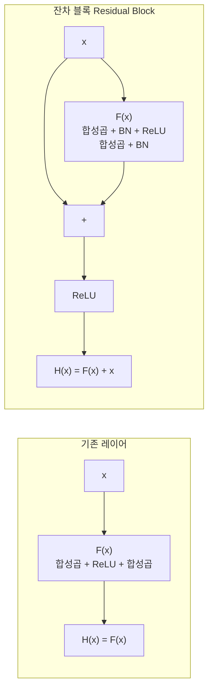
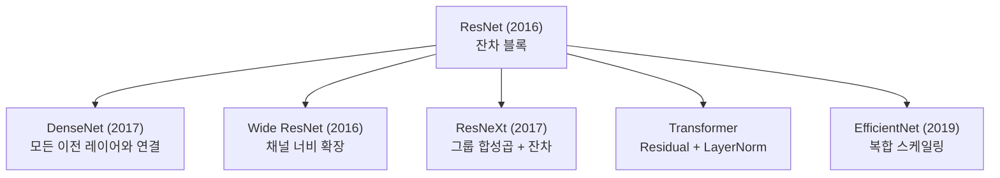

# ResNet과 스킵 연결 (Residual Networks & Skip Connections)

ResNet(He et al., CVPR 2016)은 **잔차 학습(Residual Learning)**과 **스킵 연결(Skip Connection)**을 통해 수백 층 이상의 극도로 깊은 신경망을 안정적으로 학습할 수 있게 한 아키텍처다. "Deep Residual Learning for Image Recognition"은 CVPR 2016 Best Paper로 선정되었으며, 현재까지 AI 역사상 가장 많이 인용된 논문 중 하나다.

## 문제: 왜 깊은 네트워크가 오히려 나빴나

직관적으로 네트워크가 깊을수록 표현력이 높아져야 한다. 그러나 ResNet 이전에는 **층이 많아질수록 오히려 성능이 떨어지는 현상**이 관찰됐다:

- 56층 네트워크가 20층보다 훈련 오류/테스트 오류 모두 높음
- 단순 과적합 문제가 아님 (훈련 오류도 높음)
- 원인: 깊어질수록 기울기 소실(Vanishing Gradient) 심화

## 잔차 학습의 아이디어

기존 레이어가 목표 매핑 $\mathcal{H}(x)$를 직접 학습하는 대신, **잔차(residual) $\mathcal{F}(x) = \mathcal{H}(x) - x$를 학습**하게 만든다:

$$\mathbf{y} = \mathcal{F}(\mathbf{x}, \{W_i\}) + \mathbf{x}$$

최적 변환이 항등 함수(identity)에 가까울 때, $\mathcal{F}(x) \approx 0$이 되도록 학습하는 것이 $\mathcal{H}(x) \approx x$를 학습하는 것보다 훨씬 쉽다. 스킵 연결이 이 $x$를 직접 더해주는 역할을 한다.



## ResNet 블록 구조

### 기본 블록 (BasicBlock) - ResNet-18/34

```
Conv 3x3 → BN → ReLU → Conv 3x3 → BN → (+x) → ReLU
```

### 병목 블록 (Bottleneck Block) - ResNet-50/101/152

연산량을 줄이기 위해 1x1 합성곱으로 채널을 먼저 압축한 뒤 복원:

```
Conv 1x1 (채널 압축) → BN → ReLU
→ Conv 3x3 (핵심 연산) → BN → ReLU
→ Conv 1x1 (채널 복원) → BN → (+x) → ReLU
```

$256 \to 64 \to 64 \to 256$ 채널 변환으로 3x3 합성곱 연산량을 $1/4$로 절감.

## 스킵 연결의 수학적 효과

### 기울기 흐름 개선

역전파 시 기울기는 스킵 연결을 통해 **직접 이전 레이어로 전달**된다:

$$\frac{\partial \text{loss}}{\partial \mathbf{x}} = \frac{\partial \text{loss}}{\partial \mathbf{y}} \cdot \left(1 + \frac{\partial \mathcal{F}}{\partial \mathbf{x}}\right)$$

$1$이 항상 더해지므로 $\frac{\partial \mathcal{F}}{\partial \mathbf{x}}$가 0에 가까워도 기울기가 최소 $1 \times \frac{\partial \text{loss}}{\partial \mathbf{y}}$만큼 전달된다. 기울기 소실의 구조적 해결책이다.

### 앙상블 관점

스킵 연결이 있는 네트워크는 층 수 $L$에 대해 $2^L$개의 서로 다른 경로가 존재하는 암묵적 앙상블로 볼 수 있다. 대부분의 정보 흐름은 짧은 경로를 통해 이동한다.

## ResNet 변형과 모델별 성능

| 모델 | 파라미터 수 | Top-1 정확도 (ImageNet) |
|------|------------|------------------------|
| ResNet-18 | 11.7M | 69.8% |
| ResNet-34 | 21.8M | 73.3% |
| ResNet-50 | 25.6M | 76.1% |
| ResNet-101 | 44.5M | 77.4% |
| ResNet-152 | 60.2M | 78.3% |

## 후속 아키텍처에 미친 영향



특히 [[transformer-architecture]]의 각 서브레이어(Self-Attention, FFN)에도 잔차 연결과 레이어 정규화가 그대로 채용되어, ResNet의 아이디어가 NLP 도메인에도 전파됐다.

## 실무 적용 팁

### 차원 불일치 처리 (Projection Shortcut)

입력 $x$와 $\mathcal{F}(x)$의 채널 수나 해상도가 다를 때, 스킵 연결에 1x1 합성곱(스트라이드 2)을 추가하여 차원을 맞춘다:

$$\mathbf{y} = \mathcal{F}(\mathbf{x}) + W_s \mathbf{x}$$

### Pre-Activation ResNet (Identity Mappings, He et al. 2016b)

BN → ReLU를 합성곱 **앞에** 배치하면 항등 스킵 연결이 더 순수하게 유지되어 매우 깊은 네트워크(1000층+)에서도 안정적으로 학습된다.

### 전이 학습

ImageNet 사전학습된 ResNet-50을 백본으로 사용하는 것이 많은 태스크에서 기본값이다. [[gradient-descent-backpropagation]]의 기울기 소실 문제가 해결된 덕분에, 초기 레이어까지 안정적으로 파인튜닝 가능하다.

## 관련 문서

- [[cnn]] - 합성곱 신경망의 기본 구조와 작동 원리
- [[gradient-descent-backpropagation]] - 기울기 소실 문제와 역전파 상세
- [[vgg-deep-nets]] - ResNet 이전의 심층 네트워크 VGGNet
- [[inception-modules]] - 병렬 다중 스케일 합성곱 아키텍처
