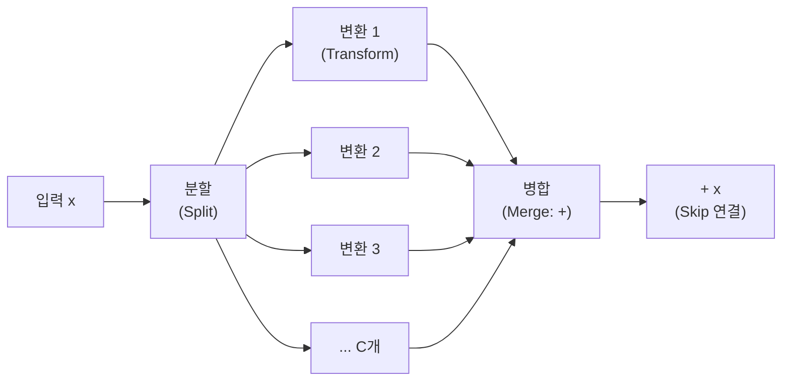
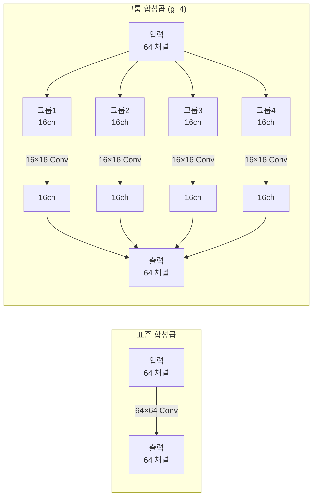
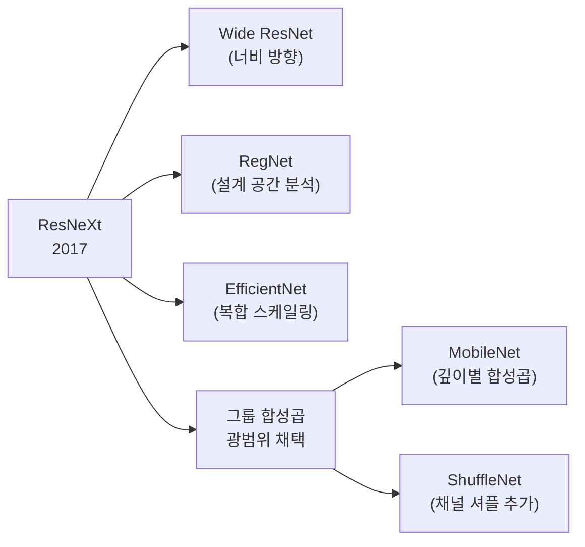

# ResNeXt - 카디널리티와 그룹 합성곱

## 한 줄 요약

ResNeXt (Xie et al., 2017)는 네트워크를 넓게(채널 수) 또는 깊게(레이어 수) 확장하는 것보다, **카디널리티(cardinality)** - 변환 경로의 수 - 를 늘리는 것이 더 효율적인 세 번째 차원임을 보인 아키텍처. 그룹 합성곱(group convolution)으로 구현한다.

## 핵심 개념: 카디널리티 (Cardinality)

네트워크 아키텍처의 세 가지 확장 차원:

| 차원 | 방법 | 예시 |
|------|------|------|
| **깊이(Depth)** | 레이어 수 증가 | ResNet-50 → ResNet-101 |
| **너비(Width)** | 채널 수 증가 | Wide ResNet |
| **카디널리티(Cardinality)** | 변환 경로 수 증가 | ResNet → ResNeXt |

ResNeXt의 핵심 주장: **같은 파라미터 수와 계산량에서, 카디널리티를 늘리는 것이 깊이나 너비를 늘리는 것보다 더 효과적이다.**

## 분할-변환-병합 (Split-Transform-Merge)

ResNeXt 블록의 구조:



각 변환 경로는 동일한 구조의 병렬 브랜치이며, 출력을 합산(aggregation)한다:

$$y = x + \sum_{i=1}^{C} \mathcal{T}_i(x)$$

여기서 $C$는 카디널리티(분기 수), $\mathcal{T}_i$는 $i$번째 변환 경로.

## 세 가지 등가 구현

Xie et al.은 다음 세 구현이 수학적으로 등가임을 증명:

### 구현 A: 다중 브랜치 (설명용)

$C$개의 병렬 브랜치를 명시적으로 구현. 직관적이지만 코드 중복.

### 구현 B: 채널 연결 후 그룹 합성곱 (실용적)

브랜치 출력을 채널 방향으로 연결한 뒤 $1 \times 1$ Conv로 집계.

### 구현 C: 그룹 합성곱 (가장 간결, 실제 사용)

$3 \times 3$ Conv에서 **그룹 합성곱(grouped convolution)**을 사용:

```python
import torch.nn as nn

class ResNeXtBottleneck(nn.Module):
    """ResNeXt Bottleneck 블록 (구현 C: 그룹 합성곱)."""

    expansion = 2  # ResNeXt는 보통 expansion=2 또는 4

    def __init__(
        self,
        in_channels: int,
        width: int,
        cardinality: int,  # 그룹 수 C
        stride: int = 1,
    ) -> None:
        super().__init__()
        mid_channels = width * cardinality  # 중간 채널 = 너비 × 카디널리티

        self.conv1 = nn.Sequential(
            nn.Conv2d(in_channels, mid_channels, kernel_size=1, bias=False),
            nn.BatchNorm2d(mid_channels),
            nn.ReLU(inplace=True),
        )
        # 핵심: groups=cardinality 로 그룹 합성곱
        self.conv2 = nn.Sequential(
            nn.Conv2d(mid_channels, mid_channels, kernel_size=3, stride=stride,
                      padding=1, groups=cardinality, bias=False),
            nn.BatchNorm2d(mid_channels),
            nn.ReLU(inplace=True),
        )
        self.conv3 = nn.Sequential(
            nn.Conv2d(mid_channels, in_channels * self.expansion, kernel_size=1, bias=False),
            nn.BatchNorm2d(in_channels * self.expansion),
        )
        self.relu = nn.ReLU(inplace=True)
        # Shortcut: 차원이 다를 때
        self.shortcut = nn.Identity()
        if stride != 1 or in_channels != in_channels * self.expansion:
            self.shortcut = nn.Sequential(
                nn.Conv2d(in_channels, in_channels * self.expansion, kernel_size=1,
                          stride=stride, bias=False),
                nn.BatchNorm2d(in_channels * self.expansion),
            )

    def forward(self, x):
        identity = self.shortcut(x)
        out = self.conv3(self.conv2(self.conv1(x)))
        return self.relu(out + identity)
```

## 그룹 합성곱 (Grouped Convolution)

그룹 합성곱은 입력 채널을 $g$개의 그룹으로 분리하여 각 그룹 내에서만 합성곱을 수행한다:

- 입력: $C_{in}$ 채널 → $g$개 그룹, 각 $C_{in}/g$ 채널
- 출력: $C_{out}$ 채널 → $g$개 그룹, 각 $C_{out}/g$ 채널
- 파라미터 수: 표준 Conv의 $1/g$배
- 연산량: 표준 Conv의 $1/g$배



**특수 케이스**:
- $g = 1$: 표준 합성곱
- $g = C_{in} = C_{out}$: 깊이별 분리 합성곱(Depthwise Convolution) = [[mobilenet-efficientnet]]의 핵심

## ResNet vs ResNeXt 파라미터 비교

**같은 파라미터 수에서의 비교** (ResNet-50 기준):

| 모델 | 카디널리티 C | 너비 d | 파라미터 | ImageNet Top-1 |
|------|------------|-------|---------|--------------|
| ResNet-50 | 1 | 64 | 25M | 75.3% |
| ResNeXt-50 (32×4d) | 32 | 4 | 25M | 77.8% |
| ResNeXt-50 (16×8d) | 16 | 8 | 25M | ~77.6% |
| ResNeXt-50 (8×16d) | 8 | 16 | 25M | ~77.3% |

카디널리티 32, 너비 4(32×4d)가 같은 파라미터 수의 ResNet-50 대비 약 2.5% 개선.

## 카디널리티 vs 너비 확장 비교

Xie et al.의 실험 결과:

| 확장 방식 | 변경 내용 | 연산량 | 정확도 향상 |
|---------|---------|-------|-----------|
| 깊이 증가 | ResNet-50 → ResNet-101 | 2배 | +1.6% |
| 너비 증가 | 채널 수 1.4배 | 2배 | +1.2% |
| 카디널리티 증가 | C: 1 → 32 | 같음 | +2.5% |

**결론**: 동일 계산량에서 카디널리티 확장이 가장 효율적.

## Aggregated Residual Transformations

ResNeXt의 공식 명칭은 "Aggregated Residual Transformations". 핵심은 **집계된 변환(aggregated transformations)**:

$$\mathcal{F}(x) = \sum_{i=1}^{C} \mathcal{T}_i(x)$$

각 $\mathcal{T}_i$가 동일한 위상(topology)을 가질 때, 이를 **균일 집계(homogeneous aggregation)**라 한다. 균일 집계는 그룹 합성곱으로 간결하게 구현된다.

## Inception과의 비교

Inception 모듈도 병렬 경로를 사용하지만:

| 특성 | Inception | ResNeXt |
|------|---------|---------|
| 경로 구조 | 이질적 (1×1, 3×3, 5×5 혼합) | 균일 (동일한 위상) |
| 경로 수 결정 | 수동 설계 | 단일 하이퍼파라미터 C |
| 스킵 연결 | 없음 | 있음 (ResNet 방식) |
| 설계 복잡도 | 높음 | 낮음 |

ResNeXt는 Inception의 "병렬 경로" 아이디어를 균일화하고 ResNet의 잔차 학습과 결합한 것으로 볼 수 있다.

## 후속 영향



- **RegNet**: ResNeXt 설계 공간을 체계적으로 분석, 설계 원칙 정량화
- **EfficientNet**: 깊이·너비·해상도의 복합 스케일링 (카디널리티는 고정)
- **ShuffleNet**: 그룹 합성곱에 채널 셔플을 추가하여 그룹 간 정보 교환 해결

## 실용적 선택 가이드

ResNeXt를 사용할 때 **32×4d** 설정(카디널리티 32, 너비 4)이 표준 기준점:
- 카디널리티 늘리고 너비 줄이면: 파라미터 유지, 계산량 유지, 정확도 향상
- 일반적으로 $C \in \{8, 16, 32\}$, $d = 64/C$ 배율 조정

하드웨어 고려: GPU에서 그룹 합성곱은 $g$가 너무 작거나 크면 비효율적. $g = 32$ 정도가 현대 GPU에서 효율적.

## 왜 중요한가

- **카디널리티 개념의 정립**: 깊이·너비 외 제3의 확장 차원을 명시적으로 정의하고 실증
- **그룹 합성곱의 재조명**: AlexNet에서 메모리 제약으로 쓰였던 그룹 합성곱이 정확도 향상 도구로 재발견
- **모델 설계 원칙**: "균일 구조 + 단일 하이퍼파라미터"라는 설계 철학이 이후 아키텍처 탐색에 영향

## 관련 문서

- [[resnet-skip-connections]] - ResNeXt의 직접 전신
- [[densenet-dense-connections]] - 연결성 관점에서 다른 방향 탐구
- [[mobilenet-efficientnet]] - 그룹 합성곱의 극단적 활용 (깊이별 분리)
- [[convnext]] - 현대적 순수 CNN 아키텍처
- [[cnn]] - 합성곱 신경망 기초
- [[vgg-deep-nets]] - 단순 깊이 확장의 한계를 보인 선구자
