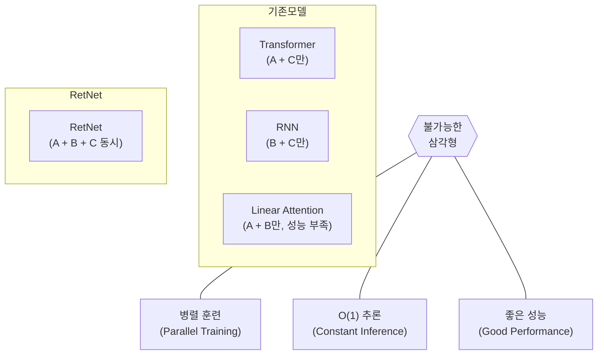
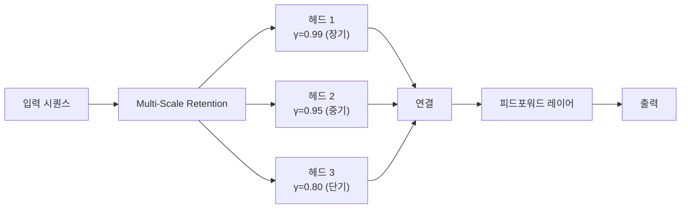

# 리텐티브 네트워크 (RetNet)

리텐티브 네트워크(Retentive Network, RetNet)는 2023년 마이크로소프트 연구팀이 제안한 시퀀스 모델 아키텍처다. Transformer의 학습 병렬성과 RNN의 $O(1)$ 추론 효율을 동시에 달성하는 것을 목표로 하며, "불가능한 삼각형(Impossible Triangle)"이라 불리던 세 가지 목표를 동시에 충족한다고 주장한다.

## 불가능한 삼각형

기존 아키텍처들은 세 가지 특성 중 두 가지만 달성할 수 있었다:

- **Transformer**: 병렬 훈련 + 우수한 성능, but $O(n^2)$ 추론 비용
- **RNN**: $O(1)$ 추론 + 나쁘지 않은 성능, but 순차 훈련
- **Linear Attention**: 병렬 훈련 + $O(1)$ 추론, but 성능 열위
- **RetNet**: 세 가지 모두 달성 (주장)

## Retention 메커니즘

RetNet의 핵심은 **Retention** 연산으로, Attention을 세 가지 동등한 형태로 표현할 수 있다:

### 1. 병렬 형태 (훈련 시)

$$\text{Ret}(X) = (QK^\top \odot D) V$$

여기서 $D_{nm} = \gamma^{n-m}$ (지수 감쇠 마스크, $n \geq m$일 때). [[transformer-architecture]]의 Softmax Attention과 유사하나 Softmax 없이 지수 감쇠 가중치를 사용한다.

### 2. 순환 형태 (추론 시)

$$s_n = \gamma s_{n-1} + k_n^\top v_n, \quad \text{Ret}(x_n) = q_n s_n$$

RNN처럼 이전 상태 $s_{n-1}$에서 현재 상태로 업데이트 - $O(1)$ 메모리, $O(1)$ 계산.

### 3. 청크 순환 형태 (장문 추론 시)

시퀀스를 청크 단위로 나눠 청크 내부는 병렬, 청크 간은 순환 처리.

## Multi-Scale Retention

[[transformer-architecture]]의 Multi-Head Attention처럼, RetNet은 **Multi-Scale Retention**을 사용한다. 헤드마다 서로 다른 감쇠율 $\gamma$를 부여하여 다양한 시간 스케일의 의존성을 포착한다:

## RWKV와의 비교

[[rwkv]]도 비슷한 목표(병렬 훈련 + 순환 추론)를 추구하나 접근법이 다르다:

| 특성 | RetNet | RWKV |
|------|--------|------|
| 핵심 메커니즘 | 지수 감쇠 Retention | 시간 혼합 + 채널 혼합 |
| 위치 인코딩 | xPos (감쇠에 내장) | 없음 (순서 내장) |
| 훈련 안정성 | 표준 | LayerNorm 중요 |
| 모델 크기 | 7B+ 실험 | 14B 오픈소스 존재 |

## 성능과 효율

RetNet 논문의 주요 실험 결과:

- **훈련**: Transformer 대비 25-50% GPU 메모리 감소, 처리량 증가
- **추론**: 시퀀스 길이에 무관한 $O(1)$ 메모리, Transformer의 $O(n)$ 대비
- **언어 모델링**: GPT 수준의 perplexity 달성 (7B 파라미터 수준)
- **디코딩 속도**: 8배 이상 빠른 토큰 생성 (긴 컨텍스트에서)

## 한계와 현황

- 지수 감쇠 특성상 **매우 먼 거리 의존성** 포착 능력이 이론상 제한될 수 있다.
- Transformer 대비 성능이 동등한지에 대한 논쟁 지속 중.
- 2024-2025년 기준 Mamba, RWKV 등과 함께 "Post-Transformer" 후보로 연구 중이나, 대규모 상용 모델 채택 사례는 아직 적다.

## 관련 문서

- [[transformer-architecture]] - Attention 메커니즘의 기원
- [[rwkv]] - 같은 목표를 추구하는 대안 아키텍처
- [[state-space-models-general]] - Mamba 등 SSM 계열
- [[linear-attention]] - RetNet의 이론적 선조
- [[rnn-lstm-gru]] - 순환 추론의 기원
