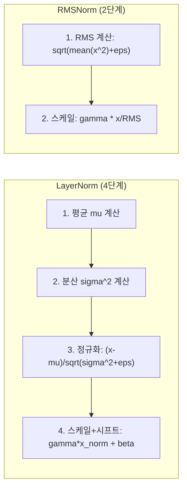
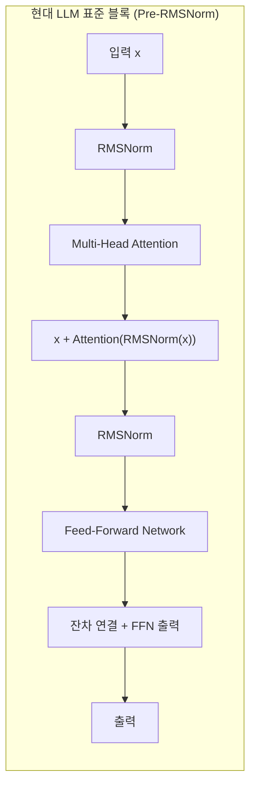

# RMSNorm (Root Mean Square Layer Normalization)

## 개요

RMSNorm(Root Mean Square Layer Normalization)은 Zhang & Sennrich(2019)가 "Root Mean Square Layer Normalization" 논문에서 제안한 정규화 기법이다. 기존 LayerNorm에서 평균 빼기(re-centering)와 편향(bias) 파라미터를 제거하고, RMS(Root Mean Square)로만 정규화한다. 이 단순화로 연산량을 약 10-15% 줄이면서 LayerNorm과 동등한 성능을 유지한다. LLaMA, DeepSeek, Qwen, Mistral, Gemma 등 2025-2026년 현재 거의 모든 주요 LLM이 채택한 사실상의 표준 정규화 기법이다.

## LayerNorm에서 RMSNorm으로

### LayerNorm 복습

[[batch-norm-layer-norm]]에서 다룬 LayerNorm은 단일 샘플의 특성 차원을 따라 정규화한다:

```
LayerNorm(x) = gamma * (x - mu) / sqrt(sigma^2 + epsilon) + beta
```

여기서:
- mu = (1/n) * SUM(x_i) -- 평균 (re-centering)
- sigma^2 = (1/n) * SUM((x_i - mu)^2) -- 분산 (re-scaling)
- gamma, beta -- 학습 가능 파라미터 (스케일, 시프트)

LayerNorm은 두 가지 연산을 수행한다:
1. **Re-centering**: 평균을 빼서 분포를 원점으로 이동
2. **Re-scaling**: 분산으로 나누어 스케일을 정규화

### RMSNorm의 핵심 통찰

Zhang & Sennrich의 핵심 가설은 **LayerNorm의 성공이 re-scaling(스케일 정규화)에 기인하며, re-centering(평균 이동)은 불필요하다**는 것이다. 실험을 통해 이 가설을 검증하고, 평균 계산과 빼기를 완전히 제거한 RMSNorm을 제안했다.

```
RMSNorm(x) = gamma * x / RMS(x)
RMS(x) = sqrt((1/n) * SUM(x_i^2) + epsilon)
```

beta(편향) 파라미터도 제거되어, 학습 가능 파라미터는 gamma(스케일)만 남는다.

### 연산 비교



| 항목 | LayerNorm | RMSNorm |
|------|-----------|---------|
| 평균 계산 | 필요 (O(n)) | 불필요 |
| 정규화 | (x - mu) / sqrt(var + eps) | x / sqrt(mean(x^2) + eps) |
| 학습 파라미터 | gamma + beta (2n) | gamma만 (n) |
| 연산량 비교 | 기준 | 약 10-15% 절감 |
| 성능 | 기준 | 동등 (논문 실험 검증) |

## 왜 re-centering을 제거해도 되는가

Zhang & Sennrich의 실험에서 LayerNorm의 re-centering 연산을 제거해도 여러 태스크에서 성능 저하가 관찰되지 않았다. 이에 대한 직관적 설명:

1. **활성화 분포의 대칭성**: Transformer 내부의 활성화 값은 학습이 진행되면서 대략 0 근처에 분포하는 경향이 있어, 명시적 평균 제거의 효과가 미미하다
2. **후속 선형 변환의 흡수**: 정규화 이후의 선형 변환(어텐션 프로젝션, FFN)이 평균 이동 효과를 학습으로 흡수할 수 있다
3. **스케일 정규화의 지배적 역할**: 학습 안정성에 가장 중요한 것은 활성화의 스케일(크기)을 일정하게 유지하는 것이며, 이는 re-scaling만으로 충분하다

## 학습 안정성에서의 역할

RMSNorm은 [[pre-ln-vs-post-ln]]의 Pre-LN 배치와 결합되어 현대 LLM 학습 안정성의 핵심 구성 요소다.



Pre-RMSNorm 배치에서 잔차 경로는 정규화를 거치지 않고 직접 연결되므로, 기울기가 변조 없이 전파된다. 이 구조가 수십 ~ 수백 레이어의 깊은 LLM에서도 안정적 학습을 가능하게 한다.

### QK-Norm과의 결합

일부 모델(Gemma 2, DeepSeek-V3 등)은 어텐션 내부에서 Q, K 벡터에 추가 RMSNorm을 적용하는 QK-Norm을 채택한다. 어텐션 로짓의 스케일을 제어하여 loss spike를 방지하며, [[flash-attention-fundamentals]]의 수치 안정성과도 상보적으로 작용한다.

## 주요 모델별 채택 현황

| 모델 | 정규화 | 배치 | 비고 |
|------|--------|------|------|
| 원본 Transformer (2017) | LayerNorm | Post-LN | -- |
| BERT (2018) | LayerNorm | Post-LN | -- |
| GPT-2/3 | LayerNorm | Pre-LN | -- |
| LLaMA 1/2/3 (2023-2024) | **RMSNorm** | Pre-LN | 현대 LLM 표준 확립 |
| Mistral/Mixtral (2023-2024) | **RMSNorm** | Pre-LN | LLaMA 설계 계승 |
| DeepSeek-V2/V3 (2024-2025) | **RMSNorm** | Pre-LN | + QK-Norm |
| Qwen 2.5 (2024) | **RMSNorm** | Pre-LN | -- |
| Gemma 2/3 (2024-2025) | **RMSNorm** | Pre+Post-LN | 하이브리드 배치 |

LLaMA(2023)가 RMSNorm + Pre-LN 조합을 대규모 모델에서 검증한 이후, 이 설계가 후속 모델들의 사실상 표준이 되었다.

## 구현 고려사항

### GPU 효율

RMSNorm은 LayerNorm 대비 연산이 단순하여 GPU 커널 최적화가 용이하다. 특히:

- 평균 계산을 위한 별도 리덕션 패스가 불필요
- beta 파라미터가 없어 메모리 절약 (모델 전체에서 수백 MB 차이 가능)
- Triton 등 커스텀 커널에서 LayerNorm보다 구현이 간단

### 수치 안정성

epsilon 값은 일반적으로 1e-5 ~ 1e-6을 사용한다. BF16/FP16 혼합 정밀도 학습에서 RMS 계산 시 x^2 합산이 오버플로하지 않도록, 내부 계산을 FP32로 수행하는 것이 일반적이다.

## LayerNorm vs RMSNorm: 선택 기준

| 상황 | 권장 |
|------|------|
| 새로운 LLM 사전학습 | RMSNorm (현대 표준) |
| BERT 계열 인코더 모델 | LayerNorm (호환성) |
| 기존 모델 파인튜닝 | 원본 모델의 정규화 유지 |
| 추론 최적화 중시 | RMSNorm (커널 단순) |

새로운 [[transformer-architecture]] 기반 모델을 설계한다면, Pre-RMSNorm이 2026년 현재 가장 검증된 선택이다.

## 대표 자료

- [Zhang & Sennrich, "Root Mean Square Layer Normalization" (arXiv:1910.07467)](https://arxiv.org/abs/1910.07467)
- [Touvron et al., "LLaMA: Open and Efficient Foundation Language Models" (arXiv:2302.13971)](https://arxiv.org/abs/2302.13971) -- LLaMA에서의 RMSNorm 채택
- [Xiong et al., "On Layer Normalization in the Transformer Architecture" (arXiv:2002.04745)](https://arxiv.org/abs/2002.04745) -- Pre-LN 분석

## 관련 문서

- [[batch-norm-layer-norm]] -- BatchNorm/LayerNorm/RMSNorm 비교 전체 개관
- [[pre-ln-vs-post-ln]] -- 정규화 배치 위치에 따른 학습 안정성 분석
- [[transformer-architecture]] -- RMSNorm이 적용되는 전체 모델 구조
- [[flash-attention-fundamentals]] -- QK-Norm과 결합되는 효율적 어텐션
- [[multi-head-latent-attention]] -- DeepSeek MLA에서의 RMSNorm 활용
- [[gqa-mqa]] -- GQA 구조에서의 정규화 적용
