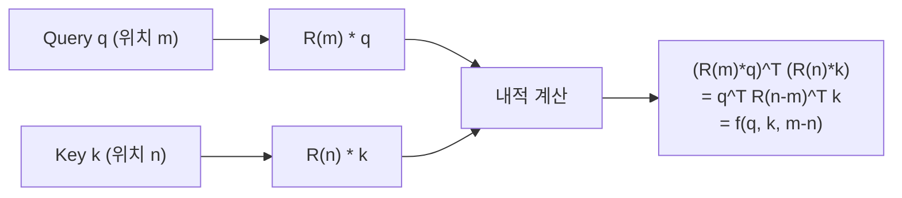
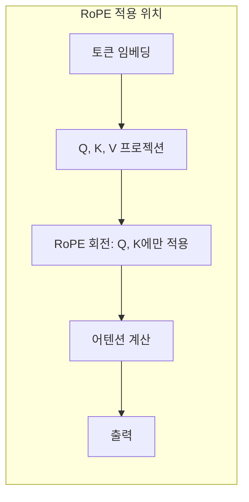
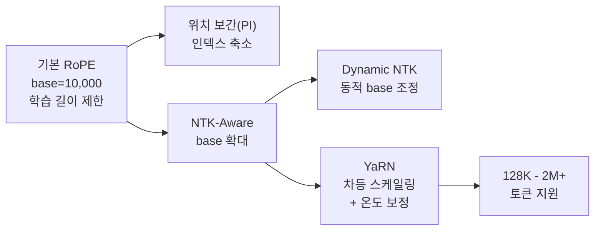

# RoPE (Rotary Position Embedding)

## 개요

RoPE(Rotary Position Embedding)는 Su et al.(2021)이 "RoFormer: Enhanced Transformer with Rotary Position Embedding" 논문에서 제안한 위치 인코딩 기법이다. Query와 Key 벡터를 위치에 비례하는 각도로 회전시켜, 두 토큰의 내적이 자연스럽게 상대적 위치(relative position)에만 의존하도록 설계했다. 추가 학습 파라미터 없이 상대 위치 인코딩을 구현하며, theta base 조정을 통한 컨텍스트 길이 외삽이 가능하다는 장점 덕분에 LLaMA, DeepSeek, Qwen, Mistral, Gemma 등 2025-2026년 현재 사실상 모든 주요 LLM이 채택하는 위치 인코딩의 표준이다.

## 핵심 원리

### 기존 위치 인코딩의 한계

[[positional-encoding]]의 기존 방식들은 각각 한계가 있었다:

| 방식 | 한계 |
|------|------|
| 사인/코사인 (Vaswani 2017) | 절대 위치 인코딩, 학습 길이 초과 시 성능 급락 |
| 학습 가능 임베딩 (BERT, GPT-2) | 최대 위치 고정, 길이 외삽 불가 |
| 상대 위치 (Shaw 2018, T5) | 어텐션 계산에 추가 항 필요, 구현 복잡 |

RoPE는 "절대 위치를 인코딩하되 내적 결과는 상대 위치에만 의존하게 만드는" 우아한 해법을 제시했다.

### 회전 행렬의 수학적 구조

RoPE의 핵심 아이디어는 d차원 벡터를 d/2개의 2차원 쌍으로 분할하고, 각 쌍을 위치 m에 비례하는 각도로 회전시키는 것이다.

i번째 2차원 쌍에 대한 회전 각도:

```
theta_i = m * base^(-2i/d)
```

여기서 base는 기본값 10,000이다. 위치 m에서의 회전 행렬 R(m)을 Query q에 적용하면:

```
R(m) * q = [q_0 cos(m*theta_0) - q_1 sin(m*theta_0),
            q_0 sin(m*theta_0) + q_1 cos(m*theta_0),
            q_2 cos(m*theta_1) - q_3 sin(m*theta_1),
            ...]
```

### 상대 위치가 나타나는 원리



회전 행렬의 직교성(orthogonality)으로 인해 R(m)^T R(n) = R(n-m)이 성립한다. 따라서 회전된 Q와 K의 내적은 절대 위치 m, n이 아닌 상대 위치 (m-n)에만 의존한다. 이것이 RoPE의 핵심 성질이다.

### 장거리 감쇠 (Long-Range Decay)

Su et al.은 RoPE 적용 후 두 토큰 사이의 내적이 상대 거리가 멀어질수록 자연스럽게 감소하는 경향이 있음을 보였다. 이는 별도의 거리 편향(ALiBi 등)을 추가하지 않아도 모델이 가까운 토큰에 더 높은 어텐션을 부여하도록 유도하는 암묵적 유도 편향(inductive bias)이다.

## 구현

RoPE는 Q와 K에만 적용하고 V에는 적용하지 않는다. 실제 구현에서는 전체 회전 행렬을 명시적으로 곱하지 않고, 복소수 곱셈 또는 삼각함수 쌍 연산으로 효율적으로 계산한다.



[[flash-attention-fundamentals]]와의 호환성도 중요한 장점이다. RoPE는 어텐션 연산 전에 Q, K를 독립적으로 변환하므로, FlashAttention의 메모리 효율적 커널과 자연스럽게 결합된다.

## 컨텍스트 길이 확장 기법

RoPE의 가장 큰 실용적 장점은 theta base 조정만으로 학습 길이를 넘어 컨텍스트를 확장할 수 있다는 것이다. 이 특성이 [[long-context-scaling]]의 핵심 기술적 기반이다.

### 주요 확장 기법

| 기법 | 제안 시기 | 핵심 아이디어 | 특징 |
|------|-----------|---------------|------|
| 위치 보간 (PI) | Chen et al. 2023 | 위치 인덱스를 (학습 길이/목표 길이) 비율로 축소 | 단순하지만 고주파 정보 손실 |
| NTK-Aware Scaling | bloc97, 2023 | theta base를 alpha배 확대 (예: 10K -> 10M) | 고주파 보존, 파인튜닝 없이 적용 가능 |
| Dynamic NTK | 2023 | 추론 시 현재 시퀀스 길이에 따라 theta를 동적 조정 | 짧은 컨텍스트 성능 유지 |
| YaRN | Peng et al. 2023 | NTK + 차원별 차등 스케일링 + 온도 보정 | 가장 정교한 확장, 소량 파인튜닝 권장 |
| 듀얼 base | Gemma 3, 2025 | 로컬 어텐션(theta=10K) + 글로벌 어텐션(theta=1M) | 슬라이딩 윈도우와 결합 |



### 확장 원리: 주파수 관점

RoPE의 각 차원 쌍은 서로 다른 주파수(wavelength)를 가진다. 낮은 차원은 고주파(짧은 파장), 높은 차원은 저주파(긴 파장)이다.

- **PI**: 모든 주파수를 균일하게 압축 -- 고주파(근거리 위치 정보)가 왜곡됨
- **NTK-Aware**: base를 키워 저주파 쪽으로 전체 스펙트럼을 이동 -- 고주파 정보 보존
- **YaRN**: 고주파는 거의 유지, 저주파만 선택적으로 압축 -- 최적 트레이드오프

## 주요 모델별 RoPE 설정

| 모델 | Base theta | 최대 컨텍스트 | 확장 기법 |
|------|-----------|---------------|-----------|
| LLaMA 2 | 10,000 | 4,096 | 기본 |
| LLaMA 3.1 | 500,000 | 128K | base 확대 + 파인튜닝 |
| DeepSeek-V3 | 10,000 | 128K | YaRN |
| Qwen 2.5 | 1,000,000 | 128K | base 확대 |
| Mistral 7B | 10,000 | 32K | NTK 변형 |
| Gemma 3 | 10K/1M (듀얼) | 128K | 하이브리드 로컬/글로벌 |

[[gqa-mqa]]와 RoPE의 조합에서, GQA(Grouped-Query Attention) 사용 시 Key 그룹에 동일한 RoPE가 적용되므로 KV 캐시 효율과 위치 인코딩이 자연스럽게 양립한다. [[multi-head-latent-attention]]의 DeepSeek MLA에서는 RoPE가 적용되는 별도의 decoupled key를 두어, 잠재 KV 압축과 위치 인코딩을 분리하는 설계를 채택했다.

## RoPE의 한계와 대안

- **외삽의 한계**: base 조정만으로는 무한 확장이 불가능하며, 일정 비율 이상에서는 파인튜닝이 필요하다
- **차원 효율**: d/2개의 2차원 쌍으로 분할하므로 홀수 차원을 지원하지 않는다
- **대안 탐색**: NoPE(위치 인코딩 없음) 레이어와의 교대 배치(Command R7B), [[attention-sink]] 기반 스트리밍 등이 연구되고 있다

## 대표 자료

- [Su et al., "RoFormer: Enhanced Transformer with Rotary Position Embedding" (arXiv:2104.09864)](https://arxiv.org/abs/2104.09864)
- [Chen et al., "Extending Context Window of Large Language Models via Positional Interpolation" (arXiv:2306.15595)](https://arxiv.org/abs/2306.15595)
- [Peng et al., "YaRN: Efficient Context Window Extension of Large Language Models" (arXiv:2309.00071)](https://arxiv.org/abs/2309.00071)

## 관련 문서

- [[positional-encoding]] -- RoPE를 포함한 위치 인코딩 전체 개관
- [[long-context-scaling]] -- RoPE 기반 컨텍스트 확장 기술
- [[flash-attention-fundamentals]] -- RoPE와 결합되는 효율적 어텐션 구현
- [[gqa-mqa]] -- GQA/MQA에서의 RoPE 적용
- [[multi-head-latent-attention]] -- DeepSeek MLA의 decoupled RoPE 설계
- [[self-attention-mechanism]] -- RoPE가 적용되는 핵심 어텐션 연산
- [[transformer-architecture]] -- RoPE가 사용되는 전체 모델 구조
