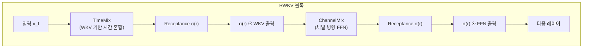

# RWKV (Receptance Weighted Key Value)

RWKV는 Bo Peng이 주도하는 오픈소스 커뮤니티 프로젝트로, **RNN의 효율적 추론**과 **Transformer의 병렬 학습**을 결합한 선형 RNN 언어 모델이다. WKV(Weighted Key-Value) 메커니즘으로 시간 감쇠 가중합(time-decay weighted sum)을 구현해, 어텐션 없이도 Transformer에 필적하는 언어 모델링 성능을 달성한다. GPT 호환 API를 제공해 기존 생태계에서 직접 사용 가능하다.

## WKV 메커니즘

RWKV의 핵심은 WKV(Weighted Key-Value) 연산이다. 표준 어텐션의 $\text{softmax}(QK^T)V$ 대신 시간 감쇠를 적용한 가중합을 사용한다.

위치 $t$에서의 출력:

$$\text{wkv}_t = \frac{\sum_{i=1}^{t-1} e^{-(t-1-i)w + k_i} v_i + e^{u + k_t} v_t}{\sum_{i=1}^{t-1} e^{-(t-1-i)w + k_i} + e^{u + k_t}}$$

- $w$: 채널별 시간 감쇠(time decay) 파라미터 (음수, 학습됨)
- $u$: 현재 토큰 가중치 보너스
- $k_i, v_i$: 위치 $i$의 키, 값

과거 토큰일수록 $e^{-(t-1-i)w}$가 작아져 영향력이 감소한다.

## TimeMix / ChannelMix 블록

**TimeMix**: 현재 토큰과 이전 토큰을 선형 보간한 후 WKV 연산 수행. Transformer의 어텐션 레이어에 대응.

**ChannelMix**: 채널 방향 비선형 변환. Transformer의 FFN에 대응. Receptance 게이팅으로 망각(forgetting) 기능 구현.

## RNN 추론 + Transformer 학습

RWKV의 핵심 매력은 **이중 동작 모드**다:

| 모드 | 복잡도 | 사용 시점 |
|------|-------|---------|
| 학습 (병렬) | $O(n \log n)$ | 배치 훈련 — WKV를 행렬 연산으로 벡터화 |
| 추론 (재귀) | $O(1)$ 스텝당 | 자동회귀 생성 — RNN처럼 상태만 업데이트 |

추론 시 KV 캐시가 불필요하다. 상태 크기가 시퀀스 길이에 독립적으로 고정된다.

## RWKV 버전 진화

| 버전 | 코드명 | 주요 변경 |
|------|--------|---------|
| RWKV-4 | 기준선 | WKV 공식 확립 |
| RWKV-5 | Eagle | 다중 헤드(multi-head) WKV |
| RWKV-6 | Finch | 데이터 의존 시간 감쇠(동적 $w$) |
| RWKV-7 | Goose | 상태 갱신 규칙 개선, SSD와의 수렴 |

RWKV-6/7은 Mamba의 선택적 SSM 개념을 흡수해 입력 의존 게이팅을 강화했다.

## GPT 호환성

RWKV는 표준 GPT 토크나이저(BPE)와 동일한 인터페이스를 유지한다. Hugging Face Transformers 통합으로 기존 GPT 기반 파이프라인에서 모델만 교체해 사용할 수 있다.

## 오픈소스 생태계

- 학습 코드, 모델 가중치(1.5B~14B) 모두 공개 (Apache 2.0)
- ChatRWKV: RWKV 기반 대화 시스템
- RWKV.cpp: CPU 추론 최적화
- 커뮤니티 파인튜닝 및 다국어 모델 다수

## Transformer/Mamba와의 비교

| 항목 | Transformer | Mamba | RWKV |
|------|------------|-------|------|
| 추론 메모리 | $O(n)$ KV캐시 | $O(d^2)$ 상태 | $O(d)$ 상태 |
| 병렬 학습 | $O(n^2)$ | $O(n \log n)$ | $O(n \log n)$ |
| 오픈소스 | 다양 | 공개 | 완전 공개 |
| 콘텐츠 적응 | 강함(어텐션) | 선택적SSM | 감쇠 기반(약함) |

## 관련 문서
- [[state-space-models-general|SSM 일반]]
- [[linear-attention|선형 어텐션]]
- [[mamba-3|Mamba-3]]
- [[xlstm|xLSTM]]
- [[gated-deltanet|Gated DeltaNet]]
