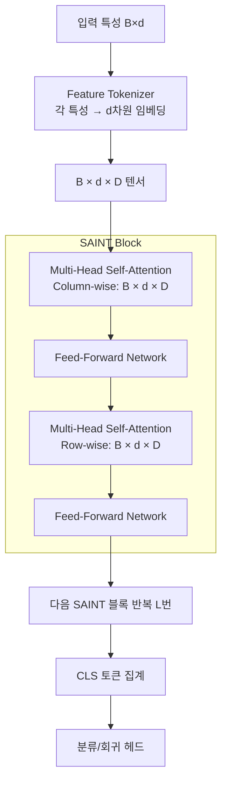

# SAINT - 셀프어텐션 테이블 데이터 학습

SAINT(Self-Attention and Intersample Attention Transformer, Somepalli et al., 2021)는 [[ft-transformer-tabular]] 의 특성 간 어텐션(열 방향)에 더해 **샘플 간 어텐션(행 방향)** 을 추가한 테이블 특화 Transformer다. 행/열 양방향 어텐션으로 기존 모델이 포착하지 못한 패턴을 학습한다.

## 핵심 혁신: Intersample Attention

기존 테이블 딥러닝 모델은 각 샘플을 독립적으로 처리한다. SAINT는 **배치 내 여러 샘플 간의 어텐션**을 계산하는 intersample attention을 도입한다.

```mermaid
flowchart TD
    subgraph 입력 배치 [배치: B개 샘플 × d개 특성]
        S1[샘플 1: x1,1 x1,2 ... x1,d]
        S2[샘플 2: x2,1 x2,2 ... x2,d]
        SB[샘플 B: ...]
    end

    subgraph Column-wise Attention (특성 간)
        CA["각 샘플 내 특성 토큰 간 어텐션\n→ 특성 교호작용 포착"]
    end

    subgraph Row-wise Attention (샘플 간)
        RA["배치 내 B개 샘플 간 어텐션\n→ 유사 샘플 정보 참조"]
    end

    S1 & S2 & SB --> CA
    CA --> RA
    RA --> Output[예측값]
```

**Column-wise (특성 간) 어텐션**: [[ft-transformer-tabular]] 와 동일한 방식으로 각 샘플 내 특성 토큰들 간 어텐션을 계산한다.

**Row-wise (샘플 간) 어텐션**: 동일한 특성 위치($j$번째 특성)를 가진 B개 샘플들 간에 어텐션을 계산한다. 샘플 $i$가 유사한 다른 샘플들을 참조하여 예측에 활용한다.

## 아키텍처 세부 구조



각 SAINT 블록은 Column-wise → Row-wise 어텐션을 순서대로 적용한다. 블록 수 $L$은 하이퍼파라미터다.

## 대조 학습 기반 사전학습

SAINT는 레이블 없는 테이블 데이터로 자기지도 사전학습을 지원한다. 두 가지 증강(augmentation) 전략:

1. **CutMix**: 두 샘플의 행을 혼합하여 새로운 가상 샘플 생성
2. **Mixup**: 두 샘플의 특성값을 선형 보간

```mermaid
flowchart LR
    X["원본 샘플 x"] --> Aug1["증강 뷰 x'_1\n(CutMix)"]
    X --> Aug2["증강 뷰 x'_2\n(Mixup)"]
    Aug1 --> Enc1[SAINT 인코더]
    Aug2 --> Enc2[SAINT 인코더\n(가중치 공유)"]
    Enc1 & Enc2 --> CL["대조 손실\nSimCLR 스타일"]
```

대조 학습(contrastive learning)으로 동일 샘플의 다른 증강 뷰는 가깝게, 다른 샘플은 멀게 임베딩 공간을 형성한다.

## [[ft-transformer-tabular]] 와의 비교

| 측면 | FT-Transformer | SAINT |
|------|----------------|-------|
| 특성 간 어텐션 | 있음 | 있음 |
| 샘플 간 어텐션 | 없음 | **있음** |
| 사전학습 | 없음 | 대조 학습 지원 |
| 배치 크기 의존성 | 없음 | 있음 (row-attention) |
| 추론 속도 | 빠름 | 느림 (추론 시에도 배치 필요) |
| 메모리 | $O(d^2)$ | $O(d^2 + B^2)$ |

## Intersample Attention의 직관

샘플 간 어텐션의 직관은 **k-NN(k-Nearest Neighbors)** 과 유사하다. 예측 시 유사한 훈련 샘플들을 암묵적으로 참조한다. 이는 트리 모델이 지역적 분할로 유사 샘플을 묶는 방식과 다른, 어텐션 기반 연성(soft) 유사도 참조다.

단점은 **추론 시 배치가 필요**하다는 것 - 단일 샘플 예측 시 다른 샘플들(훈련 데이터 일부)을 함께 배치에 포함해야 한다. 실시간 추론 환경에서 제약이 된다.

## [[tabular-ml]] 벤치마크 위치

SAINT는 발표 당시 여러 테이블 벤치마크에서 GBDT와 경쟁하는 결과를 보였다. 특히:
- **범주형 특성 많은 데이터**: 임베딩 기반 처리로 강점
- **샘플 수 많은 경우**: 배치 내 다양한 이웃 정보 활용
- **레이블 부족**: 대조 학습 사전학습으로 성능 향상

그러나 [[tabular-ml]] 의 메타 분석들은 XGBoost/LightGBM이 여전히 소규모-중규모 테이블에서 강력하다는 것을 보여준다.

## 한계 및 실무 고려사항

- **추론 복잡도**: 실시간 서비스 적용 시 배치 어텐션 오버헤드
- **하이퍼파라미터 민감도**: 블록 수, 헤드 수, 학습률 등 튜닝 필요
- **메모리**: $B^2$ 어텐션 행렬로 배치 크기 제한
- **해석 가능성**: Row-wise 어텐션으로 어떤 샘플이 참조되었는지 시각화 가능

## 관련 문서

- [[tabular-ml]] - 테이블 데이터 ML 전반
- [[ft-transformer-tabular]] - SAINT의 기반이 된 Feature Tokenizer + Transformer
- [[transformer-architecture]] - 셀프어텐션 메커니즘 기초
- [[tabnet-architecture]] - 대안적 어텐션 기반 테이블 모델 (특성 선택 마스킹)
- [[tabular-feature-interaction]] - 어텐션이 포착하는 특성 교호작용 개념
