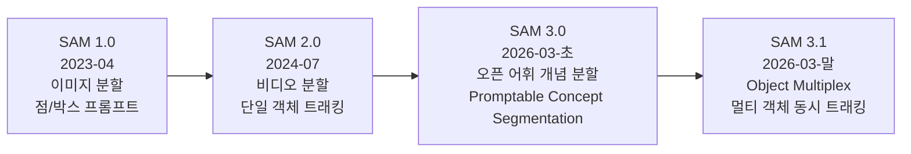
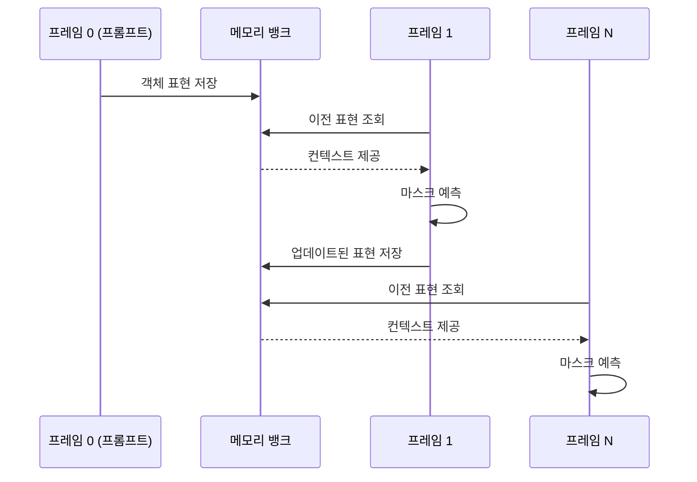
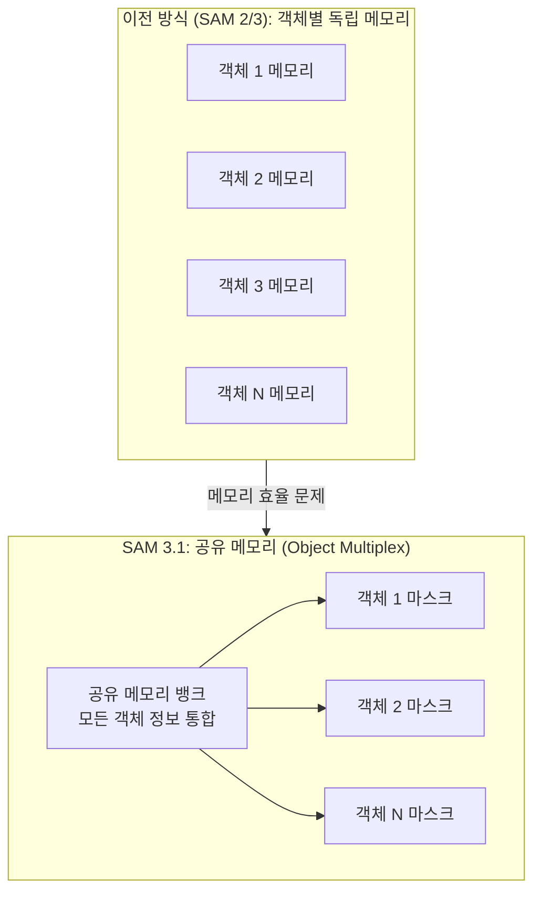
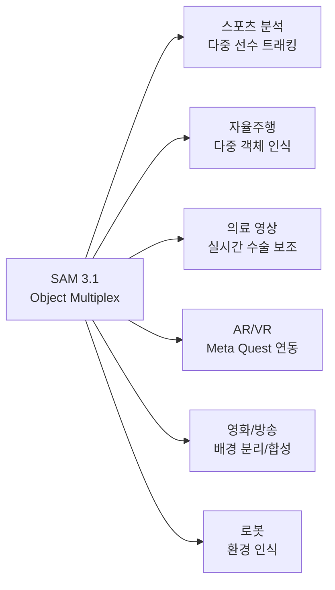

# Meta SAM 3.1 - 실시간 멀티 오브젝트 비디오 트래킹

## 개요

Meta가 2026년 3월 출시한 SAM 3.1(Segment Anything Model 3.1)은 비디오에서 여러 객체를 동시에 실시간으로 추적하고 분할하는 모델이다. SAM 3(기반 모델)에서 추가된 핵심 기능은 **공유 메모리 기반 Object Multiplex** 아키텍처로, 단일 H100 GPU에서 초당 32프레임(32 FPS), 한 번에 최대 16개 객체를 동시 트래킹한다. 이는 SAM 3 대비 2배 빠른 속도다.

## SAM 시리즈 진화



SAM 1에서 SAM 3.1까지의 핵심 진화는 크게 두 방향이다:
1. **공간 확장**: 이미지 -> 비디오 (시간 차원 추가)
2. **의미 확장**: 기하학적 분할 -> 개념 기반 오픈 어휘 분할

## SAM 3: 기반 기능

SAM 3.1을 이해하려면 먼저 SAM 3의 핵심 혁신인 **Promptable Concept Segmentation(프롬프트 가능 개념 분할)**을 이해해야 한다.

### Promptable Concept Segmentation

기존 분할(segmentation)은 경계를 찾는 기하학 문제였다면, SAM 3는 "무엇을"에 해당하는 의미적 개념으로 분할 대상을 정의한다.

```mermaid
flowchart TD
    A[입력: 이미지/비디오] --> B{프롬프트 유형}
    B --> C[텍스트 프롬프트\n"빨간 자동차를 분할해줘"]
    B --> D[이미지 예시 프롬프트\n고양이 사진 -> 모든 고양이 찾기]
    B --> E[기존 방식\n점/박스 좌표]

    C --> F[개념 기반 분할]
    D --> F
    E --> G[기하학적 분할]

    F --> H[오픈 어휘\n400만 고유 개념 학습]
    G --> H
    H --> I[분할 마스크 출력]
```

**학습 데이터:**
- 400만 개 고유 개념으로 학습된 최대 규모 데이터셋
- 이전 SA-1B(약 600K 이미지) 대비 다양성 대폭 향상

### 비디오 메모리 메커니즘

SAM 2에서 도입된 비디오 처리의 핵심은 과거 프레임의 정보를 저장해 다음 프레임에서 객체를 추적하는 **메모리 뱅크** 구조다.



## SAM 3.1: Object Multiplex 아키텍처

SAM 3.1의 핵심 혁신은 **공유 메모리(Shared Memory)**를 통한 멀티 객체 동시 처리다.

### 이전 방식의 한계

SAM 2/3에서 여러 객체를 트래킹하려면 각 객체마다 별도의 메모리 뱅크를 운용했다. N개 객체 = N배 메모리 및 계산 비용.

### Object Multiplex 해결책



**공유 메모리의 이점:**
- 메모리 사용량: N 객체에 대해 N배가 아닌 상수(constant) 또는 아선형(sub-linear) 증가
- 객체 간 컨텍스트 공유: 하나의 객체 이동이 다른 객체 추적에 도움
- 가속 처리: SAM 3 대비 2배 FPS (32 vs 16 FPS on H100)

### 성능 지표

| 지표 | SAM 3 | SAM 3.1 |
|------|-------|---------|
| FPS (H100) | ~16 | 32 |
| 동시 트래킹 객체 | 제한 있음 | 최대 16개 |
| 메모리 방식 | 객체별 독립 | 공유 메모리 |
| 오픈 어휘 | 지원 | 지원 |

## 응용 분야

[[video-understanding]] 에서 다루는 비디오 이해 시스템의 핵심 구성 요소로 활용된다.

### 스포츠 분석

- 여러 선수를 동시에 트래킹하여 전술 패턴 분석
- 공, 선수, 심판을 구분해 실시간 포지션 데이터 생성
- 방송 제작: 특정 선수 자동 강조, 경기 하이라이트 자동 생성

### 자율주행

- 보행자, 차량, 자전거 등 여러 객체 동시 추적
- 복잡한 교차로에서 수십 개 객체를 32FPS로 처리
- SAM 3.1 + 깊이 추정 결합 시 3D 장면 이해 가능

### 의료 영상

- 수술 영상에서 기구, 조직, 장기 동시 추적
- 내시경 영상에서 폴립, 혈관 실시간 분할
- 세포 생물학: 시간 경과 영상에서 세포 분열 추적

### AR/VR

- Meta Quest 플랫폼에서 실제 공간의 객체를 실시간 인식/분할
- 혼합 현실(Mixed Reality)에서 가상 객체와 실제 물체의 자연스러운 상호작용



## 기술 기반: [[image-classification]] 연계

SAM 계열은 전통적인 [[image-classification]] 패러다임을 넘어서지만, 핵심 기술 요소를 공유한다:

- **비전 트랜스포머(ViT)**: SAM의 이미지 인코더는 ViT 기반
- **어텐션 메커니즘**: 마스크 디코더에서 크로스-어텐션으로 프롬프트와 이미지 특징을 결합
- **전이 학습**: SA-1B 대규모 데이터셋으로 사전학습 후 다운스트림 태스크에 파인튜닝 가능

## 오픈소스 공개

Meta는 SAM 3/3.1을 오픈소스로 공개했다:
- **GitHub**: `facebookresearch/sam3`
- **라이선스**: Apache 2.0 (상업적 활용 허용)
- **모델 가중치**: Hugging Face Hub에서 다운로드 가능

오픈소스 공개는 연구 커뮤니티가 SAM 3.1을 다양한 도메인 특화 파인튜닝에 활용할 수 있게 한다. SAM-Med3D(의료), SurgicalSAM(수술) 등 도메인 특화 버전이 등장할 것으로 예상된다.

## 한계 및 과제

1. **폐색(Occlusion)**: 객체가 서로 겹칠 때 추적 정확도 저하
2. **빠른 움직임**: 급격한 모션 블러가 있는 프레임에서 추적 손실
3. **개념 경계 모호성**: "테이블 위의 물건들"처럼 집합 개념 분할은 여전히 어려움
4. **16개 객체 한계**: 실시간 동시 트래킹 상한선이 존재

## 관련 문서

- [[image-classification]] - 이미지 분류/인식 기반 기술
- [[video-understanding]] - 비디오 이해 시스템 전반
- [[sam2-video-segmentation]] - SAM 2 이전 버전 상세
