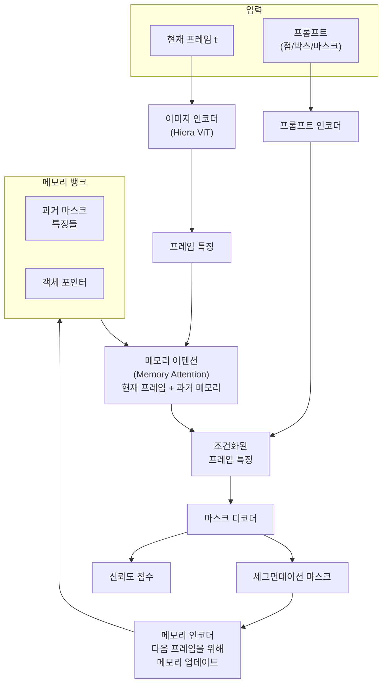
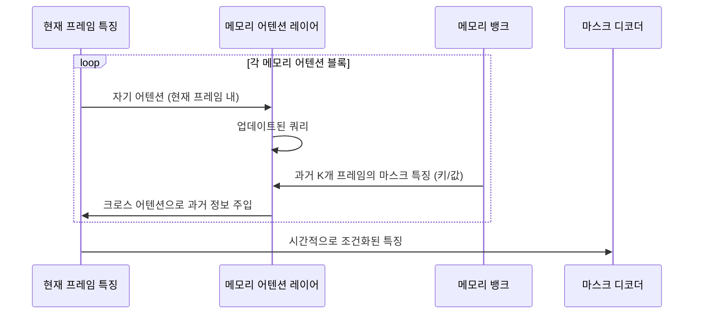
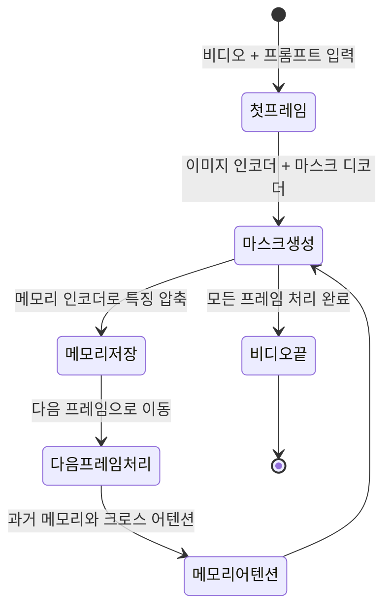

# SAM 2 - 비디오 세그먼테이션과 메모리 어텐션

## 개요

SAM 2(Segment Anything Model 2, Meta AI, 2024)는 [[segment-anything]](SAM 1)을 이미지에서 **비디오로 확장**한 범용 세그먼테이션 모델이다. 단일 프레임의 점/박스/마스크 프롬프트로부터 전체 비디오에 걸쳐 지정한 객체를 추적하고 분할한다. 핵심 혁신은 **메모리 어텐션(Memory Attention)** 모듈로, 이전 프레임의 세그먼테이션 결과를 메모리로 활용해 시간적 일관성을 유지한다.

## SAM 1과의 차이

| 항목 | SAM 1 | SAM 2 |
|------|-------|-------|
| 입력 | 단일 이미지 | 이미지 + 비디오 |
| 추적 | 없음 | 전체 비디오 객체 추적 |
| 메모리 | 없음 | 메모리 어텐션 모듈 |
| 프롬프트 | 점/박스/마스크 | 점/박스/마스크 + 시간 지속 |
| 이미지 성능 | 기준 | SAM 1보다 향상됨 |
| 속도 | - | SAM 1 대비 6배 빠름 |

SAM 2는 이미지 모드에서도 SAM 1보다 성능이 높고, 비디오 모드에서는 프레임별 독립 추론보다 월등히 높은 시간적 일관성을 달성한다.

## 아키텍처

### 전체 구조

### 메모리 어텐션 (Memory Attention)

메모리 어텐션은 SAM 2의 핵심 혁신이다. 현재 프레임 특징을 쿼리로, 과거 프레임의 마스크 특징을 키/값으로 [[cross-attention]]을 수행한다.

메모리 뱅크는 **N개의 최근 프레임** + **첫 프레임(고품질 참조)**으로 구성된다. 객체 포인터(Object Pointer)는 각 프레임의 마스크 토큰으로부터 추출한 경량 임베딩으로, 객체 정체성을 추적한다.

## Hiera - 계층적 비전 인코더

SAM 2는 이미지 인코더로 **Hiera(Hierarchical ViT)**를 사용한다. 일반 ViT가 단일 해상도 특징만 생성하는 것과 달리 Hiera는 다중 스케일 특징을 제공해 작은 객체와 큰 객체 모두 정밀하게 처리한다.

- 마스크 디코더는 Hiera의 다중 스케일 특징을 FPN 스타일로 결합
- 256x256 최종 마스크까지 업샘플링

## 비디오 처리 파이프라인

사용자가 한 프레임에서 프롬프트를 제공하면, 앞뒤 방향 모두로 전파(propagate)되어 전체 비디오의 세그먼테이션을 완성한다.

## [[segment-anything]]과의 관계

[[segment-anything]](SAM 1)의 주요 설계를 계승하면서 비디오 확장에 필요한 요소를 추가했다.

- **프롬프트 인코더**: SAM 1과 동일한 구조 (점, 박스, 마스크)
- **마스크 디코더**: 경량 2-레이어 transformer 디코더 (유사한 구조)
- **신규**: 메모리 어텐션, 메모리 인코더, 메모리 뱅크

## [[cross-attention]]의 역할

SAM 2에서 [[cross-attention]]은 두 위치에서 사용된다.

1. **메모리 어텐션**: 현재 프레임(쿼리) → 과거 프레임 메모리(키/값) 크로스 어텐션
2. **마스크 디코더**: 마스크 토큰(쿼리) → 이미지 특징(키/값) 크로스 어텐션

## SA-V 데이터셋

SAM 2 학습에는 **SA-V(Segment Anything Video)** 데이터셋을 사용했다.

- 5만+ 비디오, 640만+ 마스크 어노테이션
- SAM 1로 자동 레이블링 + 인간 검수 파이프라인
- SA-1B(이미지 1B 마스크)와 함께 학습

## 성능

- **DAVIS, UVO, MOSE** 비디오 세그먼테이션 벤치마크에서 SOTA
- 실시간 처리: GPU에서 ~40 FPS (SAM 1은 이미지만 처리)
- 이미지 세그먼테이션: SAM 1 대비 23 AP 향상 (LVIS 기준)

## 실무 활용

- **비디오 편집**: 특정 객체를 선택해 배경 교체, 색상 변경, 제거
- **데이터 라벨링**: 비디오 어노테이션 자동화 (반자동 워크플로)
- **의료 영상**: 초음파/내시경 비디오에서 조직/기관 추적
- **스포츠 분석**: 선수 추적, 볼 추적
- **AR/VR**: 실시간 객체 마스킹 및 증강

## 관련 문서

- [[segment-anything]] - SAM 1의 원본 아키텍처와 철학
- [[cross-attention]] - 메모리 어텐션의 핵심 연산
- [[vision-transformer]] - Hiera ViT의 기반 아키텍처
- [[grounding-dino]] - 텍스트 프롬프트 기반 검출 모델 (SAM 2와 파이프라인 결합 가능)
