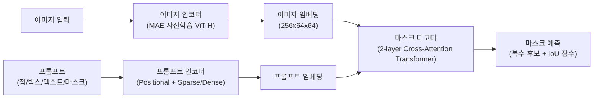
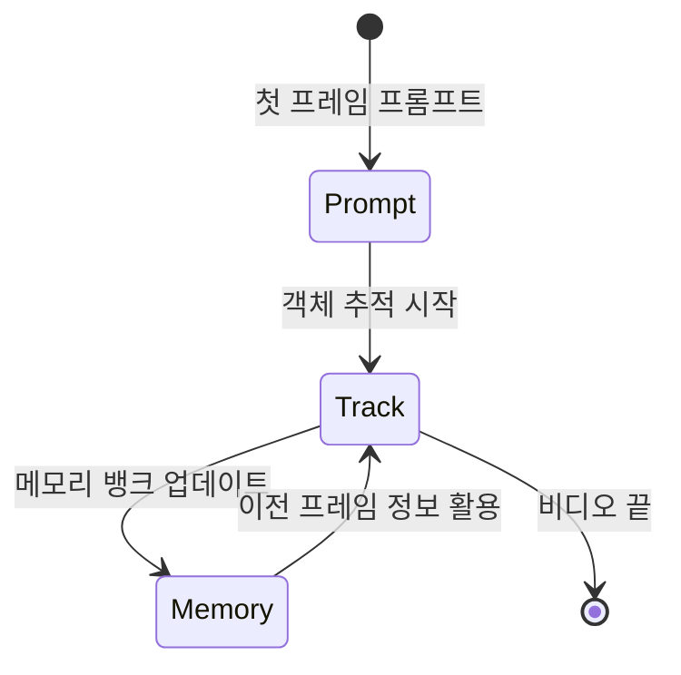

# SAM (Segment Anything Model)

SAM(Segment Anything Model)은 2023년 Meta AI Research가 발표한 범용 이미지 세그먼테이션 모델이다. "임의의 모든 것을 분할한다"는 이름에 걸맞게, **점, 박스, 텍스트, 마스크 등 다양한 프롬프트를 입력받아 이미지의 임의 영역을 세그먼트**할 수 있다. 1,100만 장의 이미지에서 11억 개의 마스크로 구성된 SA-1B 데이터셋으로 훈련되었다.

## 아키텍처 개요

세 가지 주요 컴포넌트:

| 컴포넌트 | 역할 | 특징 |
|----------|------|------|
| 이미지 인코더 | 이미지 임베딩 추출 | MAE 사전학습 ViT-H, 한 번만 실행 |
| 프롬프트 인코더 | 점/박스/마스크 인코딩 | Sparse(점,박스) + Dense(마스크) |
| 마스크 디코더 | 최종 마스크 생성 | [[cross-attention]] 2레이어, 경량 |

## 이미지 인코더: 사전학습된 ViT

이미지 인코더는 [[swin-transformer]] 계열의 ViT(Vision Transformer) 아키텍처를 사용하며, MAE(Masked Autoencoder)로 사전학습된 ViT-H 백본을 채택한다. 이미지당 한 번만 실행되며 $16 \times 16$ 패치로 이미지를 처리하여 $64 \times 64$ 해상도의 임베딩을 생성한다.

## 프롬프트 인코더

다양한 프롬프트 유형을 통합 처리:

- **점(Points)**: 포지셔널 인코딩 + 전경/배경 구분 학습 임베딩
- **박스(Boxes)**: 두 코너점의 포지셔널 인코딩
- **텍스트(Text)**: CLIP의 텍스트 인코더 활용
- **마스크(Masks)**: 컨볼루션으로 Dense 임베딩 생성 후 이미지 임베딩과 결합

## 마스크 디코더: 경량 Cross-Attention

마스크 디코더는 단 2개의 [[cross-attention]] 레이어로 구성되어 있어 CPU에서도 50ms 이내로 실행된다. 동작 방식:

1. 이미지 임베딩과 프롬프트 임베딩을 교차 어텐션
2. 복수의 마스크 후보 생성 (모호성 해소를 위해 3개)
3. 각 마스크의 품질(IoU) 점수 예측

복수 마스크를 출력하는 이유: 하나의 점이 "나무"인지 "나뭇잎"인지 모호할 때, 여러 해석을 동시에 제공하고 사용자가 선택하도록 한다.

## SA-1B 데이터셋

SAM의 경쟁력 원천은 **SA-1B** 데이터셋이다:

- 1,100만 장의 다양한 이미지
- 11억 개의 마스크 (이미지당 평균 100개)
- 데이터 엔진(Data Engine)으로 자동 생성: 모델 보조 어노테이션 → 완전 자동

이 규모는 이전 최대 세그먼테이션 데이터셋 대비 400배 크다.

## SAM 2: 비디오로 확장

2024년 Meta는 SAM 2를 발표하며 비디오 세그먼테이션으로 확장했다:

SAM 2 개선점:
- 스트리밍 메모리 아키텍처 (Memory Bank)
- 비디오 전체에서 객체 추적 + 세그먼테이션
- 이미지 세그먼테이션도 SAM 대비 성능 향상
- 실시간에 가까운 추론 속도

## 실용적 활용 사례

SAM의 프롬프트 기반 설계는 다양한 응용을 열었다:

- **자동 레이블링 파이프라인**: Grounding DINO + SAM 조합으로 텍스트 설명만으로 세그먼트 생성
- **의료 영상**: 최소한의 프롬프트(점 하나)로 장기/병변 세그먼테이션
- **위성 영상**: 건물, 도로, 식생 자동 분할
- **AR/VR**: 실시간 객체 분리 및 배경 교체

## 관련 문서

- [[swin-transformer]] - 이미지 인코더의 기반 아키텍처 계열
- [[cross-attention]] - 마스크 디코더의 핵심 메커니즘
- [[vision-transformer]] - ViT 아키텍처 개요
- [[masked-autoencoder-mae]] - 이미지 인코더의 사전학습 방식
- [[dinov2]] - Meta의 또 다른 범용 비전 표현 모델
