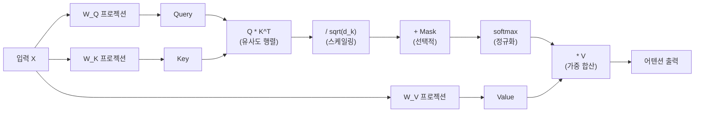

## 개요

셀프 어텐션(Self-Attention)은 시퀀스 내의 각 위치가 같은 시퀀스의 모든 다른 위치와의 관련성을 계산하는 메커니즘이다. [[transformer-architecture]]의 핵심 연산으로, 입력을 Query(Q), Key(K), Value(V) 세 벡터로 변환한 뒤 Scaled Dot-Product Attention을 수행한다. [[rnn-lstm-gru|RNN]]의 순차 처리와 달리 모든 위치 쌍을 병렬로 계산하여 장거리 의존성을 직접 포착하며, 이것이 Transformer가 순환/합성곱을 대체할 수 있었던 핵심 원리다.

## Scaled Dot-Product Attention

### 수식

```
Attention(Q, K, V) = softmax(Q * K^T / sqrt(d_k)) * V
```

### 단계별 분해



1. **프로젝션**: 입력 X를 학습 가능한 가중치 행렬 W_Q, W_K, W_V로 변환하여 Q, K, V 생성
2. **유사도 계산**: Q와 K의 내적(dot product)으로 모든 위치 쌍의 유사도 행렬 계산 -- O(n^2)
3. **스케일링**: sqrt(d_k)로 나누어 내적 값의 분산을 안정화
4. **마스킹** (선택적): 인과 마스크(causal mask) 또는 패딩 마스크 적용
5. **소프트맥스**: 유사도를 확률 분포로 정규화 -- 각 행의 합이 1
6. **가중 합산**: 정규화된 가중치로 V를 합산하여 최종 출력 생성

### Q, K, V의 직관

- **Query**: "나는 어떤 정보를 찾고 있는가?" -- 현재 위치의 질의
- **Key**: "나는 어떤 정보를 제공할 수 있는가?" -- 각 위치의 색인
- **Value**: "내가 실제로 전달할 내용" -- 각 위치의 콘텐츠

Q와 K의 내적이 높으면 해당 위치의 V가 출력에 더 크게 기여한다. 이 구조는 정보 검색(information retrieval)의 쿼리-키-값 패러다임과 동일하다.

## 스케일링의 필요성

d_k 차원의 두 벡터 내적의 분산은 d_k에 비례한다. d_k가 크면 내적 값의 절대 크기가 커져 소프트맥스가 극단적 값(거의 0 또는 1)을 출력하게 되고, 이 영역에서 기울기가 매우 작아진다(기울기 소실). sqrt(d_k)로 나누면 분산이 1로 정규화되어 소프트맥스가 안정적으로 동작한다.

원본 Transformer에서 d_k = 64이므로 sqrt(d_k) = 8로 나눈다.

## 어텐션의 종류

### 셀프 어텐션 (Self-Attention)

Q, K, V가 모두 같은 시퀀스에서 유래한다. 시퀀스 내부의 관계를 모델링한다.

### 교차 어텐션 (Cross-Attention)

Q는 한 시퀀스(디코더)에서, K와 V는 다른 시퀀스(인코더)에서 유래한다. [[encoder-decoder-architectures|인코더-디코더]] 구조에서 인코더 출력을 디코더가 참조할 때 사용된다. [[diffusion-models]]의 텍스트 조건 주입에도 동일 패턴이 적용된다.

### 인과 셀프 어텐션 (Causal Self-Attention)

미래 위치를 참조하지 못하도록 상삼각 마스크를 적용한다. GPT, LLaMA 등 자기회귀(autoregressive) 모델의 표준이다:

```
마스크된 위치의 점수 = -무한대  (softmax 후 0이 됨)
```

## 어텐션 행렬의 해석

n x n 어텐션 행렬의 각 원소 (i, j)는 "위치 i가 위치 j에 얼마나 주목하는가"를 나타낸다. 이 행렬을 시각화하면 모델이 학습한 언어적 패턴을 관찰할 수 있다:

- 대각선 패턴: 자기 자신에 주목
- 인접 패턴: 로컬 문맥 참조
- 특정 토큰 집중: 구분자, [CLS] 등에 집중 (attention sink)

[[gated-attention]]은 이 attention sink 문제를 시그모이드 게이트로 완화한다.

## 계산 복잡도와 효율화

시간 복잡도 O(n^2 * d), 공간 복잡도 O(n^2)는 긴 시퀀스에서 병목이 된다:

| 시퀀스 길이 | 어텐션 행렬 크기 | FP16 메모리 |
|------------|-----------------|------------|
| 1K | 1M | 2 MB |
| 8K | 64M | 128 MB |
| 128K | 16.4B | 32 GB |

효율화 접근:

- **FlashAttention**: 타일링으로 HBM 접근을 줄여 실질적 가속 (복잡도는 동일)
- **Sparse Attention**: 고정 패턴으로 O(n * sqrt(n)) 또는 O(n)
- **[[multi-head-latent-attention]]**: KV 캐시 저랭크 압축
- **선형 어텐션**: [[gated-deltanet]], [[mamba-3]] 등 O(n) 대안

## 대표 자료

- [Vaswani et al., "Attention Is All You Need" (arXiv:1706.03762)](https://arxiv.org/abs/1706.03762)
- [The Illustrated Transformer (Jay Alammar)](https://jalammar.github.io/illustrated-transformer/)
- [Phuong & Hutter, "Formal Algorithms for Transformers" (arXiv:2207.09238)](https://arxiv.org/abs/2207.09238)

## 관련 문서

- [[transformer-architecture]] -- 셀프 어텐션을 핵심 연산으로 사용하는 전체 구조
- [[multi-head-attention]] -- 셀프 어텐션을 다중 헤드로 병렬 수행
- [[positional-encoding]] -- 어텐션에 순서 정보를 주입하는 방법
- [[gated-attention]] -- SDPA 출력에 시그모이드 게이트 적용
- [[multi-head-latent-attention]] -- KV를 저랭크 잠재 벡터로 압축
- [[encoder-decoder-architectures]] -- 교차 어텐션의 활용 맥락
- [[rnn-lstm-gru]] -- 셀프 어텐션 이전의 시퀀스 의존성 모델링
