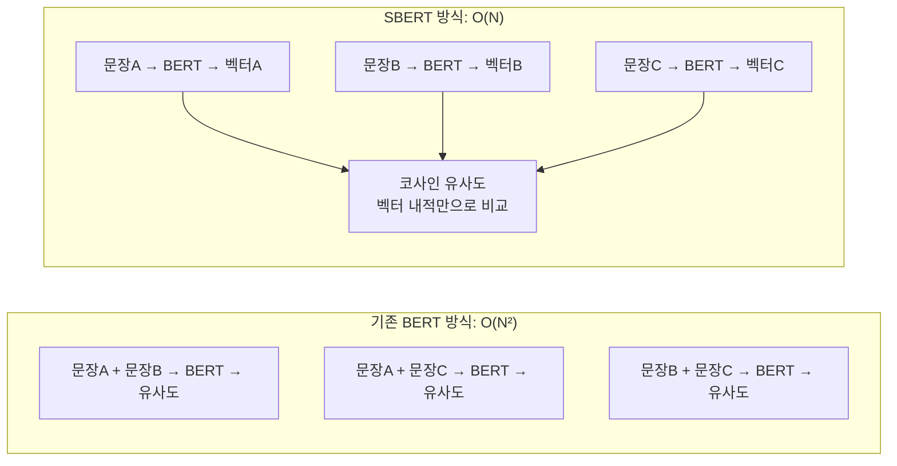
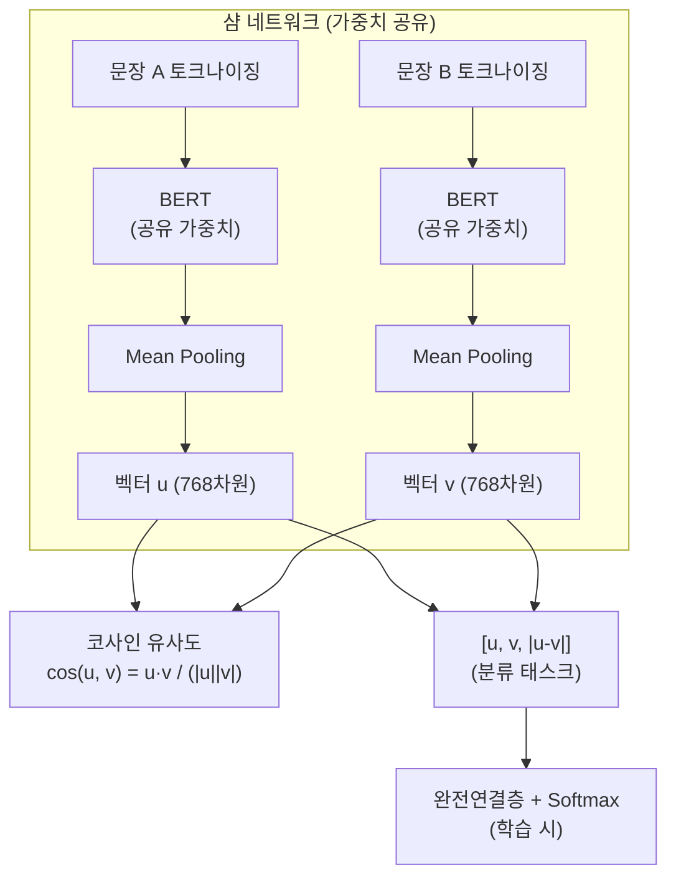
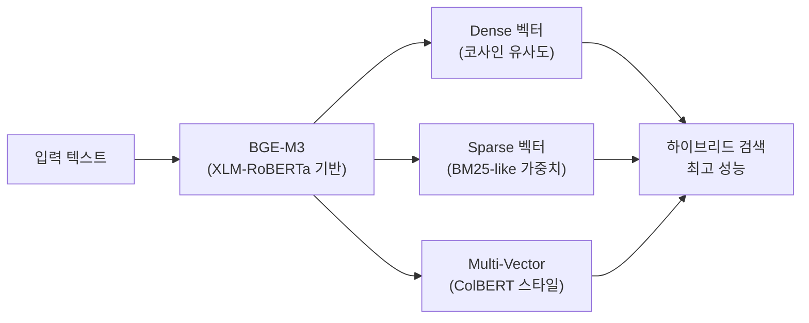
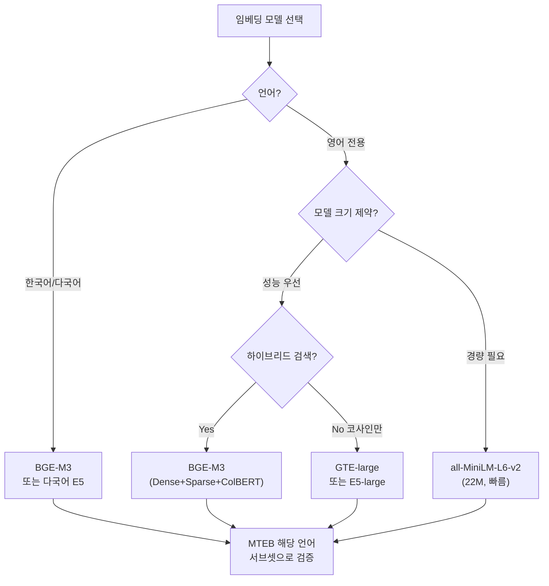

# Sentence Transformer (SBERT)

Sentence Transformer(SBERT)는 문장·단락 수준의 의미론적 임베딩(semantic embedding)을 생성하는 아키텍처다. Reimers & Gurevych (2019)가 제안한 이후 RAG(Retrieval-Augmented Generation), 의미 검색(semantic search), 텍스트 분류, 문서 클러스터링 등에서 표준 임베딩 라이브러리로 자리 잡았다. 기존 BERT가 단일 문장 분류에 최적화된 것과 달리, SBERT는 두 문장의 의미적 유사도를 효율적으로 계산하도록 설계되었다.

## 왜 SBERT가 필요한가

### BERT의 한계

원래 BERT는 두 문장의 유사도를 계산하기 위해 입력을 `[CLS] 문장A [SEP] 문장B [SEP]` 형태로 쌍으로 묶어 처리한다.

**문제**: N개 문장 중에서 가장 유사한 쌍을 찾으려면 $O(N^2)$ 번의 전방 패스(forward pass)가 필요하다.

- 10,000개 문장의 경우: 49,995,000번의 추론 필요
- BERT base 기준 약 65시간 소요

**SBERT의 해결**: 각 문장을 개별적으로 인코딩해 고정 크기 벡터로 변환하면, 유사도 계산이 단순 코사인 유사도 연산($O(N)$)으로 줄어든다.



## SBERT 아키텍처: 샴 네트워크 (Siamese Network)

SBERT의 핵심은 가중치를 공유하는 두 BERT 인코더가 각각의 문장을 처리하는 샴(Siamese) 구조다.



### Mean Pooling

BERT의 출력은 각 토큰에 대한 벡터 시퀀스다. 문장 전체를 대표하는 단일 벡터를 만들기 위해 attention mask를 고려한 가중 평균(mean pooling)을 사용한다.

```python
import torch
from transformers import AutoTokenizer, AutoModel

def mean_pooling(model_output, attention_mask):
    """
    BERT 출력의 Mean Pooling.
    attention_mask로 패딩 토큰 제외.
    """
    token_embeddings = model_output.last_hidden_state  # (batch, seq_len, hidden)
    
    # attention_mask를 hidden 차원으로 확장
    input_mask_expanded = attention_mask.unsqueeze(-1).expand(
        token_embeddings.size()
    ).float()
    
    # 마스크된 평균
    sum_embeddings = torch.sum(token_embeddings * input_mask_expanded, 1)
    sum_mask = torch.clamp(input_mask_expanded.sum(1), min=1e-9)
    
    return sum_embeddings / sum_mask
```

**왜 [CLS] 토큰이 아닌 Mean Pooling인가?**

BERT의 `[CLS]` 토큰은 문장 분류를 위해 파인튜닝되지 않은 경우 의미 있는 문장 표현을 담지 않는다. Reimers & Gurevych는 실험에서 Mean Pooling이 [CLS] 대비 일관되게 높은 성능을 보임을 확인했다.

## 학습 방법

### Natural Language Inference (NLI) 파인튜닝

SNLI + MultiNLI 데이터를 활용한 분류 방식:

- 입력: 전제-가설 문장 쌍
- 레이블: 함의(entailment) / 중립(neutral) / 모순(contradiction)
- 목적함수: Softmax Cross-Entropy

```python
# 분류 헤드: [u, v, |u-v|] → 3 클래스
concat = torch.cat([u, v, torch.abs(u - v)], dim=1)  # 768*3 = 2304
logits = classifier(concat)  # 2304 → 3
```

### Semantic Textual Similarity (STS) 파인튜닝

STS-B 같은 코사인 유사도 레이블 데이터 활용:

$$\mathcal{L}_{STS} = \text{MSE}(\cos(u, v), \text{label})$$

### 대조 학습 (Contrastive Learning)

최신 버전에서 활용하는 다중 네거티브 랭킹 손실(Multiple Negatives Ranking Loss):

$$\mathcal{L}_{MNR} = -\log \frac{e^{\cos(u, v^+) / \tau}}{\sum_j e^{\cos(u, v_j) / \tau}}$$

배치 내의 다른 쌍을 자동으로 네거티브 샘플로 활용해 데이터 효율성 향상.

## sentence-transformers 라이브러리

[[sentence-transformers-library]] 참조.

Reimers가 직접 개발하고 유지 관리하는 공식 Python 라이브러리. Hugging Face 허브와 통합되어 수백 개의 사전학습 모델을 제공한다.

```python
from sentence_transformers import SentenceTransformer
import numpy as np

# 모델 로드
model = SentenceTransformer("sentence-transformers/all-MiniLM-L6-v2")

# 문장 임베딩 생성
sentences = [
    "AI는 인류의 미래를 바꿀 것이다.",
    "인공지능이 세상을 변혁하고 있다.",
    "오늘 날씨가 매우 좋다.",
]
embeddings = model.encode(sentences, normalize_embeddings=True)
# embeddings.shape: (3, 384)

# 코사인 유사도 계산
similarity_matrix = np.dot(embeddings, embeddings.T)
print(similarity_matrix)
# [[1.00, 0.89, 0.12],
#  [0.89, 1.00, 0.10],
#  [0.12, 0.10, 1.00]]

# 시맨틱 검색 예시
from sentence_transformers import util

query = "AI의 미래"
query_emb = model.encode(query, normalize_embeddings=True)
scores = util.cos_sim(query_emb, embeddings)
top_k = scores.topk(2)
```

## MTEB (Massive Text Embedding Benchmark)

[[mteb]] 참조.

MTEB는 임베딩 모델을 56개 데이터셋, 8개 태스크 유형에 걸쳐 평가하는 종합 벤치마크다. 2022년 Muennighoff et al.이 제안했으며, 현재 임베딩 모델의 사실상 표준 평가 지표다.

### MTEB 8가지 태스크 유형

| 태스크 | 설명 | 예시 데이터셋 |
|--------|------|------------|
| 분류 (Classification) | 텍스트 → 카테고리 | Banking77, EmotionClassification |
| 클러스터링 (Clustering) | 유사 텍스트 그룹화 | ArXivClustering |
| 쌍 분류 (Pair Classification) | 두 문장 관계 | SprintDuplicateQuestions |
| 재순위화 (Reranking) | 후보 목록 재정렬 | MindSmallReranking |
| 검색 (Retrieval) | 쿼리 → 관련 문서 | MSMARCO, NFCorpus |
| STS (Semantic Textual Similarity) | 유사도 점수 | STS12-STS22 |
| 요약 (Summarization) | 요약 품질 평가 | SummEval |
| 이중언어 채굴 (Bitext Mining) | 번역 쌍 탐색 | BUCC, Tatoeba |

### MTEB 리더보드 주요 모델 (2026 기준)

| 모델 | 크기 | 평균 MTEB | 특징 |
|------|------|---------|------|
| [[bge-m3-embedding]] | 568M | ~66 | 다국어, 멀티-기능성 |
| [[e5-text-embeddings]] | 335M~7B | ~65 | Microsoft, 명령어 기반 |
| [[gte-text-embeddings]] | 1.5B | ~67 | Alibaba, 긴 컨텍스트 |
| text-embedding-3-large | - | ~64 | OpenAI, API |
| all-MiniLM-L6-v2 | 22M | ~57 | 경량, 빠름 |

## 주요 후계 모델들

### BGE-M3 (BAAI General Embedding)

[[bge-m3-embedding]] 참조.

- **멀티 기능성**: Dense, Sparse, ColBERT 스타일 벡터를 동시에 출력
- **멀티 언어성**: 100개 이상 언어 지원
- **멀티 세밀도**: 문장에서 단락까지 다양한 길이 처리



### E5 (EmbEddings from bidirEctional Encoder rEpresentations)

[[e5-text-embeddings]] 참조.

Microsoft Research의 임베딩 모델. 쿼리와 패시지에 각각 `query: ` 와 `passage: ` 접두사를 붙이는 명령어 기반(instruction-tuned) 방식이 특징.

```python
# E5 사용 예시
query = "query: 머신러닝이란 무엇인가?"
passage = "passage: 머신러닝은 데이터로부터 패턴을 학습하는 AI의 한 분야다."
```

E5-mistral-7b-instruct처럼 LLM 기반 대형 임베딩 모델도 등장.

### GTE (General Text Embeddings)

[[gte-text-embeddings]] 참조.

Alibaba의 임베딩 모델. GTE-Qwen2-7B-instruct가 1.5B 이상 컨텍스트 윈도우와 높은 MTEB 점수로 주목받음.

## RAG에서의 활용

Sentence Transformer는 RAG 파이프라인의 인덱싱과 검색 단계에서 핵심적으로 사용된다.

```python
from sentence_transformers import SentenceTransformer
import faiss
import numpy as np

model = SentenceTransformer("BAAI/bge-m3")

# 문서 인덱싱
documents = ["문서1 내용...", "문서2 내용...", "문서3 내용..."]
doc_embeddings = model.encode(
    documents,
    normalize_embeddings=True,
    batch_size=32,
    show_progress_bar=True,
)

# FAISS 인덱스 구축
dimension = doc_embeddings.shape[1]
index = faiss.IndexFlatIP(dimension)  # 내적 (정규화된 벡터 = 코사인)
index.add(doc_embeddings.astype("float32"))

# 검색
def retrieve(query: str, top_k: int = 5) -> list[str]:
    query_emb = model.encode([query], normalize_embeddings=True)
    scores, indices = index.search(query_emb.astype("float32"), top_k)
    return [documents[i] for i in indices[0]]
```

## 모델 선택 가이드



## 한국어 임베딩 현황

공개 한국어 임베딩 모델:

| 모델 | 기반 | 특징 |
|------|------|------|
| BGE-M3 | XLM-RoBERTa | 한국어 포함 100개 언어 |
| KoSimCSE | KLUE-RoBERTa | 한국어 특화 SimCSE |
| ko-sroberta-multitask | KoELECTRA | 국내 개발 멀티태스크 |
| multilingual-e5-large | mBERT | Microsoft, 다국어 |

MTEB의 한국어 서브셋(MIRACL, MrTidy-ko 등)에서 BGE-M3가 일관되게 상위권을 차지한다.

## 관련 문서

- [[sentence-transformers-library]] - sentence-transformers 라이브러리 사용 가이드
- [[bge-m3-embedding]] - BGE-M3 멀티 기능성 임베딩
- [[gte-text-embeddings]] - GTE 임베딩 모델
- [[e5-text-embeddings]] - Microsoft E5 임베딩
- [[mteb]] - Massive Text Embedding Benchmark
- [[contextual-embeddings]] - BERT 기반 문맥 임베딩 개요
- [[bert]] - BERT 기반 아키텍처
- [[advanced-rag-patterns]] - RAG에서의 임베딩 활용 패턴
