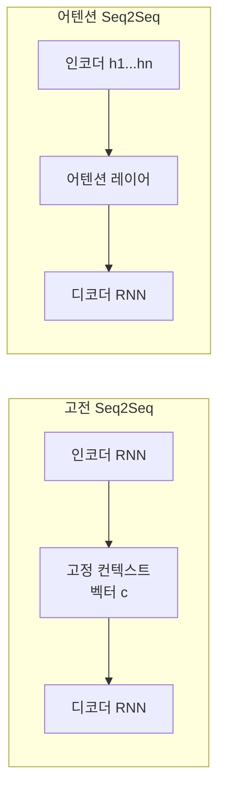

# Seq2Seq + Attention (Bahdanau/Luong)

Seq2Seq(Sequence-to-Sequence) 모델은 가변 길이 시퀀스를 가변 길이 시퀀스로 변환하는 아키텍처다. RNN 기반 인코더-디코더 구조의 치명적 한계인 **정보 병목(information bottleneck)**을 해결하기 위해 어텐션(attention) 메커니즘이 도입되었다. 이 접근법은 Transformer 어텐션의 직접적 전조다.

## 정보 병목 문제

고전적 Seq2Seq에서 인코더는 전체 소스 시퀀스를 **단일 고정 크기 벡터(context vector)**로 압축한다. 디코더는 이 벡터 하나에만 의존해 전체 타깃 시퀀스를 생성한다. 소스가 길어질수록 정보 손실이 심해진다.

어텐션은 매 디코딩 스텝마다 소스 전체 은닉 상태(hidden states)를 동적으로 참조해 이 병목을 제거한다.

## Bahdanau Attention (Additive)

Bahdanau et al. (2015)가 제안한 **덧셈형(additive)** 어텐션이다.

1. **정렬 점수(alignment score)** 계산:
   $$e_{ij} = v_a^T \tanh(W_a s_{i-1} + U_a h_j)$$
   - $s_{i-1}$: 디코더 이전 은닉 상태
   - $h_j$: 인코더 $j$번째 은닉 상태
   - $W_a, U_a, v_a$: 학습 파라미터

2. **어텐션 가중치** 정규화:
   $$\alpha_{ij} = \frac{\exp(e_{ij})}{\sum_k \exp(e_{ik})}$$

3. **컨텍스트 벡터** 합산:
   $$c_i = \sum_j \alpha_{ij} h_j$$

## Luong Attention (Multiplicative/Dot-product)

Luong et al. (2015)는 계산 효율을 높인 **곱셈형(multiplicative)** 어텐션을 제안했다.

| 변형 | 점수 함수 |
|------|---------|
| dot | $s^T h$ |
| general | $s^T W_a h$ |
| concat (Bahdanau와 동일) | $v^T \tanh(W_a [s; h])$ |

Luong은 어텐션 결과를 현재 디코더 출력 **이후**에 결합(input feeding)하는 방식도 제안했다.

## Bahdanau vs Luong 비교

| 항목 | Bahdanau | Luong |
|------|----------|-------|
| 점수 함수 | 덧셈(additive) | 점곱(dot/general) |
| 디코더 상태 | $s_{i-1}$ (이전) | $s_i$ (현재) |
| 계산 비용 | 높음 (MLP) | 낮음 (행렬곱) |
| 적용 위치 | 인코더 출력 직접 | input feeding 가능 |

## 정렬 행렬 (Alignment Matrix) 시각화

정렬 행렬 $A$의 각 셀 $\alpha_{ij}$는 "타깃 위치 $i$ 생성 시 소스 위치 $j$에 얼마나 집중하는가"를 나타낸다. 기계 번역에서 언어 간 단어 정렬을 자동으로 학습한다는 점이 인상적이었다.

## Transformer와의 관계

Transformer는 Bahdanau 어텐션의 아이디어를 계승하되 세 가지 핵심 변화를 도입했다:
1. RNN 제거 → 병렬 처리 가능
2. Self-attention으로 소스-타깃뿐 아니라 내부 관계도 모델링
3. Multi-head로 다양한 표현 공간 동시 포착

## 관련 문서
- [[encoder-decoder-architectures|인코더-디코더 아키텍처]]
- [[transformer-architecture|Transformer 아키텍처]]
- [[self-attention-mechanism|어텐션 메커니즘 개요]]
- [[cross-attention|크로스 어텐션]]
- [[multi-head-attention|멀티 헤드 어텐션]]
