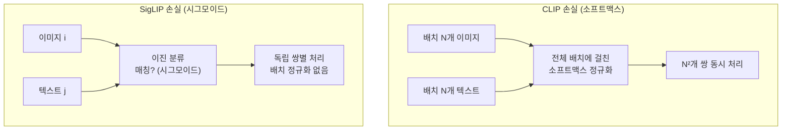
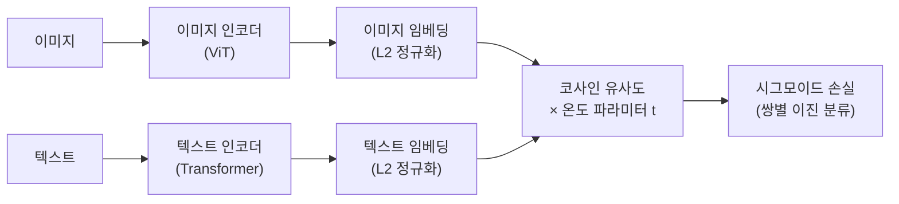

# SigLIP (Sigmoid Loss for Language-Image Pre-Training)

SigLIP(Sigmoid Loss for Language-Image Pre-Training)은 2023년 Google Brain이 제안한 비전-언어 사전학습 방법이다. [[clip]]의 소프트맥스 기반 대조 손실을 **시그모이드(sigmoid) 이진 손실**로 교체함으로써, 배치 크기에 독립적인 훈련을 가능하게 한다. Gemini, PaliGemma 등 Google의 최신 멀티모달 모델에서 비전 인코더로 채택되었다.

## CLIP의 한계: 배치 의존성

[[clip]]은 이미지-텍스트 쌍을 대조 학습으로 훈련한다. 핵심 손실은 **InfoNCE**로, 배치 내 모든 이미지-텍스트 조합에 대해 소프트맥스를 계산한다:

$$\mathcal{L}_{CLIP} = -\frac{1}{N} \sum_{i} \log \frac{\exp(s_{ii}/\tau)}{\sum_{j} \exp(s_{ij}/\tau)}$$

이 방식의 문제:

- **음성 쌍(negative pairs)**: 배치 내 나머지 $N-1$쌍을 음성 샘플로 사용
- **배치 크기 의존**: 더 많은 음성 쌍 = 더 어렵고 정보량 많은 학습 신호 = 배치를 크게 해야 함
- **분산 학습 오버헤드**: 배치 전체 임베딩을 모든 GPU에 공유해야 함 (대규모 클러스터 필수)

## SigLIP의 핵심: 시그모이드 이진 손실

SigLIP은 소프트맥스를 **이진 분류** 문제로 대체한다. 각 이미지-텍스트 쌍을 독립적으로 "매칭/불매칭"으로 분류:

$$\mathcal{L}_{SigLIP} = -\frac{1}{N} \sum_{i,j} \log \sigma(z_{ij} \cdot y_{ij})$$

여기서:
- $z_{ij} = t \cdot \langle f_i, g_j \rangle + b$: 스케일 $t$, 바이어스 $b$ 포함 유사도
- $y_{ij} = +1$ (매칭 쌍), $y_{ij} = -1$ (비매칭 쌍)
- $\sigma$: 시그모이드 함수

## 배치 독립성의 의미

시그모이드 손실은 각 이미지-텍스트 쌍을 독립적으로 처리하므로:

- 소프트맥스처럼 배치 전체를 분모로 사용하지 않음
- **작은 배치에서도 안정적인 훈련** 가능
- 분산 학습 시 GPU 간 임베딩 공유 불필요 (통신 오버헤드 감소)

SigLIP 논문은 배치 크기 32k에서 512k까지 다양하게 실험하여, 시그모이드 손실이 CLIP 대비 소규모 배치에서 훨씬 강건함을 보였다.

## CLIP과의 성능 비교

| 모델 | 학습 배치 | ImageNet ZS | COCO 검색 |
|------|-----------|-------------|-----------|
| CLIP | 32k | 75.3% | 48.5% |
| SigLIP | 32k | 76.1% | 50.5% |
| SigLIP | 1k | 73.9% | 47.2% |

동일 배치 크기에서 SigLIP이 CLIP을 소폭 상회하며, 배치가 작아져도 성능 하락이 적다.

## 아키텍처 상세

[[contrastive-learning]]의 표준 온도 파라미터를 학습 가능한 스케일 $t$와 바이어스 $b$로 대체하여 수치 안정성을 높였다.

## SigLIP 2와 발전

2024년 Google은 SigLIP 2를 발표하며 개선사항을 추가했다:

- **캡션 기반 사전학습**: 짧은 ALT 텍스트 대신 상세 이미지 캡션 활용
- **마스킹 사전학습 통합**: SigLIP + MAE 스타일의 자기지도 학습 결합
- **다중 해상도 지원**: 가변 해상도 이미지 처리 능력 강화

## 멀티모달 모델에서의 역할

SigLIP은 독립 모델이라기보다 더 큰 VLM(Vision-Language Model)의 비전 인코더로 활용된다:

- **PaliGemma**: SigLIP-ViT + Gemma 2B LLM
- **Gemini**: 내부적으로 SigLIP 계열 비전 인코더 사용
- **InternVL**: SigLIP + 대형 LLM 결합

[[clip]]이 DALL-E, Stable Diffusion 등 이미지 생성 모델의 인코더로 광범위하게 사용되는 것처럼, SigLIP은 VLM 분야에서 실용적인 표준으로 자리잡고 있다.

## 관련 문서

- [[clip]] - SigLIP이 개선하려는 원본 비전-언어 대조 모델
- [[contrastive-learning]] - 대조 학습의 이론적 기반
- [[vision-transformer]] - SigLIP의 이미지 인코더 백본
- [[vision-language-model-architectures]] - SigLIP이 구성 요소로 쓰이는 VLM 전반
- [[masked-autoencoder-mae]] - SigLIP 2에서 결합된 자기지도 학습
