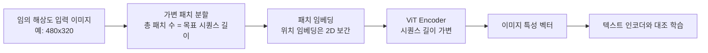
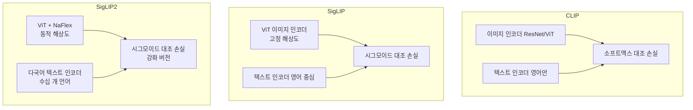
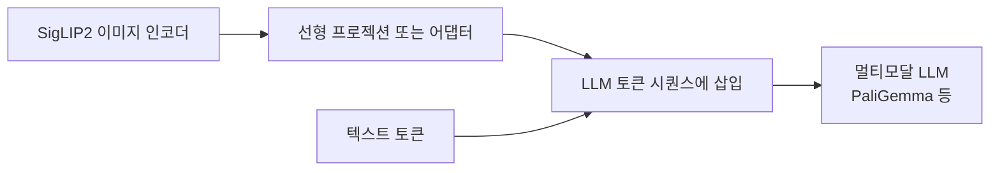

# SigLIP2 - 다국어 비전-언어 모델

## 개요

SigLIP2는 Google이 [[siglip]](Sigmoid Loss for Language-Image Pre-Training)의 후속으로 개발한 비전-언어 사전학습 모델이다. [[clip]] 계열의 대조 학습 패러다임을 계승하면서, 세 가지 핵심 개선을 더했다: **(1) 다국어 지원**, **(2) NaFlex를 통한 동적 해상도 처리**, **(3) 강화된 텍스트-이미지 정렬 품질**.

기존 [[siglip]]이 영어 중심 단일 해상도 학습이었다면, SigLIP2는 수십 개 언어에서 동등한 품질의 이미지-텍스트 검색을 제공하고, 가변 해상도 이미지를 패딩 없이 처리할 수 있다.

## 핵심 기술 요소

### 1. Sigmoid Loss (SigLIP에서 계승)

[[clip]]의 소프트맥스 대조 손실 대신 시그모이드 기반 이진 분류 손실을 사용한다. 배치 내 모든 이미지-텍스트 쌍을 독립적인 이진 분류 문제로 처리하여, 소프트맥스처럼 전체 배치 분모를 계산할 필요가 없다.

$$L_{SigLIP} = -\frac{1}{N^2} \sum_{i,j} \log \sigma(z_{ij} \cdot y_{ij})$$

이 특성 덕분에 분산 학습 시 배치 크기 확장이 더 용이하다.

### 2. NaFlex - 동적 해상도 처리

기존 ViT 기반 모델은 고정 해상도(예: 224x224)에 이미지를 리사이즈해야 했다. NaFlex(Native Resolution Flexible)는 다음 방식으로 이 제약을 해제한다.

핵심은 **패치 크기를 고정하고 패치 수를 동적으로 조정**하는 것이다. 목표 시퀀스 길이(예: 256토큰)를 유지하면서도 이미지 종횡비를 보존하여 왜곡 없이 처리한다.

### 3. 다국어 사전학습

SigLIP2의 텍스트 인코더는 영어 외에 수십 개 언어의 캡션으로 함께 학습된다.

| 지원 언어 범주 | 예시 |
|-------------|------|
| 유럽어 | 영어, 독일어, 프랑스어, 스페인어, 이탈리아어 |
| 아시아어 | 중국어, 일본어, 한국어, 힌디어 |
| 기타 | 아랍어, 러시아어, 포르투갈어 |

학습 데이터는 다국어 이미지-텍스트 쌍을 균형 있게 구성했으며, 언어별 성능 격차를 줄이기 위해 도메인 가중치 조정을 적용한다.

## 아키텍처 비교

## 성능 특성

- **제로샷 분류**: ImageNet에서 [[clip]]의 ViT-L/14 대비 유사 또는 소폭 우위
- **다국어 검색**: XTD, Multi30K 등 다국어 검색 벤치마크에서 기존 SigLIP 대비 현저한 개선
- **고해상도 이미지**: NaFlex 덕분에 문서, 의료 영상 등 고해상도가 중요한 도메인에서 이점

## 다운스트림 활용

SigLIP2의 이미지 인코더는 멀티모달 LLM의 비전 백본으로 활용된다. Google의 Gemini 시리즈, PaliGemma 등이 SigLIP 계열을 비전 인코더로 채택한 대표 사례다.

이 패턴에서 SigLIP2는 frozen 또는 fine-tuned 상태로 사용되며, 강력한 다국어 시각-언어 정렬 덕분에 비영어권 VQA(Visual Question Answering) 태스크에서 특히 유리하다.

## 한계

- 동적 해상도 처리는 시퀀스 길이가 늘어날 수 있어 메모리 사용량이 증가
- 다국어 학습 데이터의 언어 간 균형이 맞지 않으면 저자원 언어 성능이 여전히 영어 대비 낮을 수 있음
- NaFlex는 배치 내 이미지 크기가 달라 패딩 없이 처리하려면 추가 엔지니어링 필요

## 관련 문서

- [[siglip]] - SigLIP2의 전작. 시그모이드 손실 도입 원점
- [[clip]] - 비전-언어 대조 학습의 기초
- [[vision-transformer-vit]] - 이미지 인코더 기반 아키텍처
- [[vit-patch-embedding]] - NaFlex와 연관된 패치 임베딩 설계
