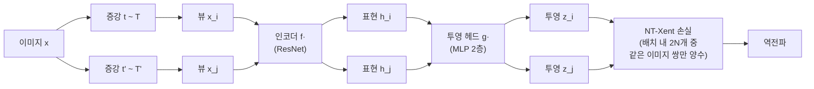

# SimCLR 강한 증강 대조 학습 (Simple Framework for Contrastive Learning)

## 동기와 배경

2020년 Google Research의 Geoffrey Hinton 팀이 발표한 SimCLR은 자기지도 시각 표현 학습을 단순하고 체계적으로 정리한 프레임워크다. 특수한 아키텍처(메모리 뱅크, 동적 큐)나 복잡한 설계 없이, **강한 데이터 증강 + 큰 배치 + 투영 헤드(projection head)** 세 가지 요소만으로 당시 자기지도 SOTA를 크게 경신했다.

SimCLR의 중요한 기여는 기술적 혁신보다 **무엇이 대조 학습에 중요한지 체계적으로 밝혀낸 절제 연구(ablation study)**에 있다.

## 핵심 메커니즘

### 전체 파이프라인



### 배치 구성

배치 크기 $N$에 대해 각 이미지에 두 개의 증강을 적용해 $2N$개 뷰를 생성한다. 배치 내 $2N$개 중 같은 원본 이미지에서 온 쌍 $(x_i, x_j)$만 positive, 나머지 $2(N-1)$개는 모두 negative다.

### 증강 전략

SimCLR 절제 연구의 핵심 발견: **색상 왜곡(color distortion)과 랜덤 크롭의 조합이 가장 중요**하다.

효과적인 증강 파이프라인:

1. **랜덤 크롭 + 리사이즈**: 원본 면적의 8%-100% 랜덤 크롭
2. **색상 지터링**: 밝기, 대비, 채도, 색조를 강하게 랜덤 변화 (강도 1.0)
3. **그레이스케일 변환**: 20% 확률로 그레이스케일 적용
4. **가우시안 블러**: SimCLR v2에서 추가, 50% 확률로 블러 적용
5. **수평 뒤집기**: 50% 확률

색상 왜곡이 중요한 이유: 색상 단서 없이 구조적/의미적 특징에 집중하도록 강제한다.

### 손실 함수 (NT-Xent)

Normalized Temperature-scaled Cross Entropy Loss:

$$\mathcal{L}_{i,j} = -\log \frac{\exp(\text{sim}(z_i, z_j) / \tau)}{\sum_{k=1}^{2N} \mathbf{1}_{[k \neq i]} \exp(\text{sim}(z_i, z_k) / \tau)}$$

$$\text{sim}(u, v) = \frac{u^\top v}{\|u\| \cdot \|v\|}$$

- $\tau = 0.5$: 온도 파라미터
- 최종 손실은 모든 $(i,j)$, $(j,i)$ 쌍에 대한 평균

### 투영 헤드 (Projection Head)

인코더 출력 $h$(표현)를 투영 헤드 $g(\cdot)$로 변환한 $z$에 대조 손실을 적용한다.

```
h = f(x_aug)         # 인코더 표현 (2048차원)
z = g(h) = W_2 · σ(W_1 · h)   # 투영 (128차원)
```

다운스트림 태스크에는 $z$가 아닌 **$h$(인코더 표현)를 사용**한다.

이 설계의 이유: 투영 헤드가 증강 불변성(augmentation invariance)에 필요한 정보 손실을 흡수해, 인코더 $h$는 더 풍부한 정보를 보존할 수 있다.

## 핵심 설계 결정과 절제 연구

### 1. 투영 헤드 유무

| 투영 헤드 | Top-1 정확도 |
|---------|------------|
| 없음 (h에 직접 손실) | 64.3% |
| 선형 | 68.4% |
| 2층 MLP | 70.0% |

비선형 MLP 투영 헤드가 선형보다 1.6%p 향상.

### 2. 증강 조합

단일 증강만 사용할 때의 한계:

| 증강 조합 | Top-1 |
|---------|-------|
| 크롭만 | 60.0% |
| 색상 왜곡만 | 52.8% |
| 크롭 + 색상 왜곡 | 70.0% |

크롭과 색상 왜곡의 조합이 시너지 효과를 낸다.

### 3. 배치 크기와 에폭

| 배치 크기 | 100 에폭 | 1000 에폭 |
|---------|--------|--------|
| 256 | 61.9% | 68.4% |
| 4096 | 66.6% | 70.0% |

배치 크기가 클수록 더 많은 음수 샘플 → 성능 향상. 단, 큰 배치를 지원하기 위해 큰 메모리 또는 분산 학습 필요.

## 성능

ImageNet 선형 프로빙 (ResNet-50):

| 방법 | 에폭 | Top-1 |
|------|-----|-------|
| SimCLR v1 | 1000 | 69.3% |
| SimCLR v2 | 800 | 71.7% |

ImageNet 파인튜닝 (1% 레이블만 사용):

| 방법 | Top-5 |
|------|-------|
| SimCLR v2 (ResNet-152) | 80.9% |

## SimCLR v2

2020년 중반 발표된 v2의 개선점:

- **더 큰 인코더**: ResNet-50 → ResNet-152 (3배 더 큼)
- **3층 MLP 투영 헤드**
- **준지도 학습(semi-supervised learning)**: 레이블된 데이터로 파인튜닝 후 지식 증류로 작은 모델 학습

## 후속 영향

- **대조 학습 설계 원칙 정립**: 투영 헤드, 강한 증강, 큰 배치가 핵심임을 실험으로 확립
- **MoCo v2**: SimCLR의 MLP 헤드와 증강을 MoCo에 도입
- **BYOL**: SimCLR의 증강 파이프라인을 채택하면서 음수 샘플 필요성 제거
- **SwAV, DINO**: 더 복잡한 프로토타입/클러스터링 목표를 SimCLR 증강 파이프라인 위에 구축
- **큰 배치 학습 표준**: LARS(Layer-wise Adaptive Rate Scaling) 옵티마이저로 배치 4096 학습 가능

## 한계

- **큰 배치 필요성**: 배치 크기 256에서는 성능이 크게 떨어짐. 실용적 적용에 제약
- **음수 샘플 품질 의존**: 큰 배치로 음수를 많이 확보하는 방식 → MoCo v2 이후 개선
- **훈련 시간**: 1000 에폭 학습이 필요해 계산 비용이 높음

## 관련 문서

- [[self-supervised-learning]]
- [[contrastive-learning]]
- [[moco-momentum-contrast]]
- [[byol-bootstrap]]
- [[dino-self-distillation]]
- [[swav-clustering-features]]
- [[representation-learning-theory]]
