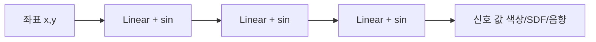

# SIREN

Sitzmann et al. (2020)이 제안한 **주기적 사인 활성화 함수**를 사용하는 [[implicit-neural-representations|암묵적 신경 표현(INR)]]. $\phi(x) = \sin(\omega_0 \cdot Wx + b)$로, ReLU INR이 고주파를 학습하지 못하는 문제를 해결한다.

## ReLU vs SIREN

| 측면 | ReLU INR | SIREN |
|------|---------|-------|
| 고주파 학습 | 어려움 (스펙트럼 편향) | 자연스러움 |
| 미분 | 구간 상수 | **연속 미분** |
| PDE 풀기 | 제한적 | 미분 조건 직접 부과 가능 |
| 초기화 | He/Xavier | **특수 초기화** ($\omega_0$ 의존) |

SIREN의 미분이 여전히 사인파이므로 **라플라시안, 그래디언트 조건**을 손실에 직접 넣어 [[physics-informed-neural-networks|PINNs]] 방식으로 PDE를 풀 수 있다.

## 응용

- **NeRF**: 3D 장면의 밀도/색상 표현
- **이미지 압축**: 좌표->RGB 매핑으로 이미지 인코딩
- **오디오 합성**: 시간->파형 연속 표현

## 관련 문서

- [[implicit-neural-representations]] -- INR 일반
- [[physics-informed-neural-networks]] -- PINNs
- [[neural-ode]] -- Neural ODE
