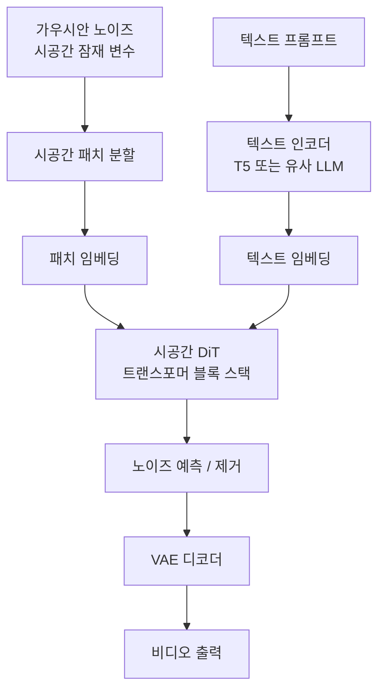

# Sora - OpenAI 비디오 생성 모델

> **공개 정보 한정 안내**: Sora의 아키텍처는 2024년 2월 OpenAI 기술 보고서("Video generation models as world simulators")를 통해 일부 공개됐으나, 모델 크기·훈련 세부 사항·정확한 아키텍처 구성은 비공개 상태다. 이 페이지는 공개된 기술 보고서와 연구 커뮤니티의 분석에 근거하며, 추정이 포함된 부분은 명시한다.

## 개요

Sora는 OpenAI가 2024년 2월 공개한 대규모 텍스트-비디오 생성 모델이다. 최대 1분 길이의 1080p 해상도 비디오를 생성하며, 기존 비디오 생성 모델 대비 시간적 일관성과 현실적인 물리 표현에서 큰 도약을 보였다. OpenAI는 Sora를 단순한 비디오 생성 도구를 넘어 "세계 시뮬레이터(world simulator)"의 초기 형태로 제시했다.

## 공개된 핵심 아이디어

### 시공간 패치 (Spacetime Patches)

Sora의 가장 명확히 공개된 기여는 **시공간 패치(spacetime patch)** 기반 시각 토큰화다.

이미지 패치([[dit-diffusion-transformer|ViT의 2D 패치]])를 시간 축으로 확장해 3D 패치(공간 $h \times w$ + 시간 $t$)를 만든다. 이 시공간 패치를 1D 토큰 시퀀스로 펼쳐 트랜스포머에 입력한다.

**이 접근의 장점:**
- 가변 해상도·가변 길이·가변 종횡비를 단일 모델로 처리 가능
- 9:16(세로), 16:9(가로), 1:1(정방형) 등 다양한 종횡비 지원
- 기존 방법(고정 크기 프레임 + 별도 시간 모듈)의 제약 탈피

### 확산 트랜스포머 (DiT) 백본

Sora는 [[dit-diffusion-transformer|DiT(Diffusion Transformer)]] 아키텍처를 비디오로 확장한 것으로 보고서에서 시사한다. U-Net 대신 순수 트랜스포머 구조를 사용해 스케일 확장이 용이하다.

*주의: 정확한 DiT 변형(STDiT, SpaceTime DiT 등)과 세부 아키텍처는 공개되지 않음.*

### 텍스트 조건화

DALL-E 3처럼 자세한 캡션 재작성(caption recaptioning) 전략을 사용하는 것으로 보고서에서 언급된다. 짧은 사용자 프롬프트를 훈련된 LLM으로 길고 상세한 캡션으로 변환하여 일관성을 높인다.

## 주요 특성

### 가변 해상도·길이·종횡비

기존 비디오 모델들은 고정된 해상도와 길이로 훈련됐다. Sora는 시공간 패치 덕분에:

| 속성 | 범위 |
|------|------|
| 해상도 | 최대 1080p |
| 길이 | 수 초 ~ 60초 |
| 종횡비 | 가로형·세로형·정방형 모두 |

### 세계 시뮬레이터 측면

OpenAI 보고서는 Sora가 단순 비디오 생성을 넘어 3D 일관성, 객체 영속성(object permanence), 장거리 시간 의존성 등 세계 모델링 능력을 일부 보인다고 주장한다:

- 카메라가 이동해도 장면 3D 구조 유지
- 가려졌던 객체가 재등장할 때 일관성 유지
- 물리적 상호작용(유리 깨짐, 파도 움직임) 근사

*단, 보고서 자체에서 이 능력이 완전하지 않음을 인정한다.*

## 추정 아키텍처 (연구 커뮤니티 분석 기반)

아래 내용은 OpenAI 공식 발표가 아닌 연구 커뮤니티의 분석에 근거한다. [교차검증 필요]

## 제품 현황 (2026-04-27 기준)

- 2024년 2월: 기술 보고서 공개, 데모 영상 공개
- 2024년 12월: 일부 사용자 대상 제한 출시 (Sora Turbo)
- ChatGPT Plus/Pro 구독자에게 접근 제공
- API 접근은 제한적

## 한계 (공식 보고서 인정)

- 복잡한 물리 시뮬레이션 오류 (유리가 깨지지 않음, 중력 방향 혼란)
- 공간 세부사항 혼동 (왼쪽/오른쪽 구분 오류)
- 인과 관계 이해 한계 (사건 순서 혼동)
- 장시간 영상에서의 드리프트

## 경쟁 모델과의 비교

| 모델 | 조직 | 공개 여부 | 최대 길이 | 특징 |
|------|------|-----------|-----------|------|
| Sora | OpenAI | 비공개 | 60초 | 시공간 패치, 세계 시뮬레이터 |
| [[veo-google-video\|Veo]] | Google DeepMind | 비공개 | 60초+ | 1080p, 영화 제작 도구 |
| [[cogvideox-architecture\|CogVideoX]] | 智谱AI | 오픈소스 | 6초 | 3D 인과 VAE, Expert MMDiT |
| Runway Gen-3 | Runway | 비공개 API | 10초 | 창작 도구 특화 |
| Kling | Kuaishou | 비공개 | 60초 | 고충실도 인물 |

## 관련 문서

- [[dit-diffusion-transformer]] - Sora의 추정 백본 아키텍처
- [[video-generation-architecture]] - 비디오 생성 모델 전반
- [[veo-google-video]] - Google의 경쟁 비디오 모델
- [[cogvideox-architecture]] - 공개된 대안 비디오 생성 모델
- [[animatediff-motion-modules]] - 확산 기반 비디오 생성 접근법
- [[flow-matching]] - 현대 생성 모델 훈련 기법
- [[vae]] - 시각 토큰화의 기반
