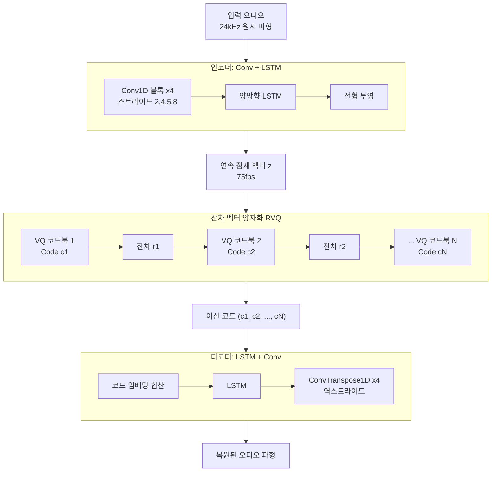
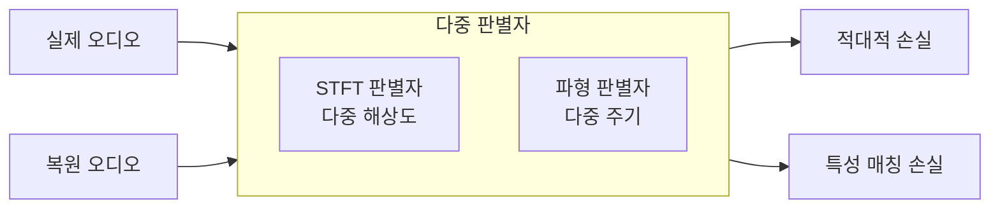

# SoundStream 신경 코덱

## 개요

SoundStream은 Google Research가 2022년 발표한 신경 오디오 코덱으로, [[rvq-residual-vector-quantization]] 기반 이산 오디오 압축의 선구적 모델이다. 기존 Opus, EVS 같은 전통 코덱과 비교해 훨씬 낮은 비트레이트에서도 높은 음질을 달성하며, 실시간 스트리밍에 적합하도록 지연 시간(latency)을 최소화하도록 설계되었다. [[audiolm-framework]]의 음향 토크나이저로 채택되어 유명해졌다.

## 전체 아키텍처

## 실시간 처리를 위한 설계

SoundStream의 차별화된 특징 중 하나는 **실시간(streaming) 처리** 지원이다.

- **인과적 컨볼루션(causal convolution)**: 미래 시점 정보를 참조하지 않아 스트리밍 처리 가능
- **저지연 설계**: 인코더 스트라이드 합계 = 320배 (24kHz 기준 약 13ms 프레임)
- **가변 비트레이트**: 코드북 수를 런타임에 조절해 3~18kbps 범위에서 유연한 품질 제어

## [[vq-vae]]와의 차이점

SoundStream은 [[vq-vae]]의 아이디어에서 출발하지만 몇 가지 중요한 차이가 있다.

| 비교 항목 | VQ-VAE | SoundStream |
|----------|--------|-------------|
| 도메인 | 이미지 주 | 오디오 특화 |
| 코드북 수 | 단일 | 다중 (RVQ) |
| 판별자 | 없음 | 다중 해상도 STFT + 파형 GAN |
| 지연 시간 | 제약 없음 | 실시간 최적화 |
| 용도 | 생성 모델 | 압축 코덱 + 생성 토크나이저 |

## 다중 해상도 판별자 훈련

SoundStream의 음질이 뛰어난 이유 중 하나는 정교한 GAN 기반 훈련 방식이다.

- **다중 해상도 STFT 판별자**: 다양한 윈도우 크기로 주파수-시간 특성 평가
- **다중 주기 파형 판별자**: 오디오 파형의 주기적 구조 평가
- **특성 매칭 손실(feature matching loss)**: 판별자 중간 레이어 출력 차이 최소화

## [[encodec-audio-tokenizer]]와 비교

두 모델은 거의 동일한 시기에 독립적으로 개발되어 핵심 아이디어가 매우 유사하다.

| 특징 | SoundStream | EnCodec |
|------|-------------|---------|
| 최초 발표 | 2021년 10월 | 2022년 10월 |
| 공개 여부 | 코드 비공개 | 오픈소스 (MIT) |
| 지원 Hz | 24kHz | 24kHz / 48kHz |
| AudioLM 사용 | 원논문에서 사용 | 후속 연구에서 대체 채택 |

SoundStream이 먼저 개발되었으나 오픈소스가 아닌 탓에, 실제 연구 생태계에서는 오픈소스인 [[encodec-audio-tokenizer]]가 더 널리 채택되었다.

## AudioLM에서의 역할

[[audiolm-framework]] 원논문에서 SoundStream은 음향 토크나이저로 사용된다.

- 1번 RVQ 코드북 → coarse 음향 토큰 (화자 특성, 음조 등)
- 2-12번 RVQ 코드북 → fine 음향 토큰 (음질 세부사항)

w2v-BERT의 시맨틱 토큰과 함께 AudioLM의 계층적 생성 파이프라인을 구성하는 핵심 요소다.

## 실무 관점

SoundStream은 신경 코덱이 전통 코덱을 능가할 수 있음을 처음으로 명확히 보여준 모델이다. 특히 3kbps라는 극저 비트레이트에서도 높은 MOS를 달성해 음성 통신 분야에 큰 충격을 주었다. 직접 사용하기보다는 [[encodec-audio-tokenizer]] 같은 오픈소스 대안을 통해 이 기술의 혜택을 누리는 것이 현실적이다.

## 관련 문서

- [[rvq-residual-vector-quantization]] - SoundStream의 핵심 양자화 기법
- [[vq-vae]] - SoundStream이 발전시킨 벡터 양자화 기반 기술
- [[encodec-audio-tokenizer]] - Meta의 동일 계열 오픈소스 신경 코덱
- [[audiolm-framework]] - SoundStream을 음향 토크나이저로 활용하는 모델
