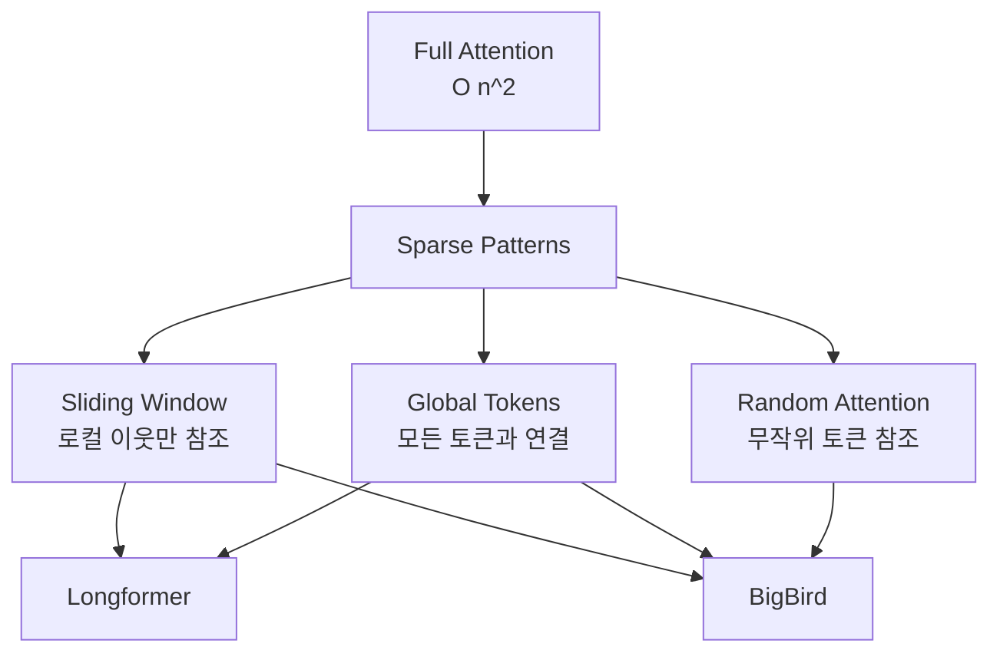

# Sparse Attention Patterns

## 개요

Sparse Attention은 표준 Transformer의 셀프 어텐션이 가진 O(n^2) 복잡도를 O(n)으로 줄이는 어텐션 패턴 설계 기법이다. 모든 토큰 쌍 간 어텐션을 계산하는 대신, 사전에 정의된 희소 패턴에 따라 일부 토큰 쌍만 어텐션을 수행한다. Longformer와 BigBird가 대표적이며, 두 모델 모두 **로컬 윈도우 + 글로벌 토큰** 조합을 핵심으로 삼되 세부 전략이 다르다.

## 왜 필요한가

표준 셀프 어텐션에서 시퀀스 길이 n에 대해 어텐션 행렬은 n x n 크기를 가진다. 시퀀스가 길어지면 메모리와 연산이 제곱으로 증가하여 수천 토큰 이상의 입력을 처리하기 어렵다. 문서 요약, 긴 대화, 코드 분석 같은 태스크에서는 수만 토큰을 다뤄야 하므로 어텐션 복잡도 자체를 줄여야 한다.

| 시퀀스 길이 | Full Attention | Sparse Attention | 속도 향상 |
|---|---|---|---|
| 512 | 기준 T | T | 1x |
| 1024 | 4T | 2T | 2x |
| 4096 | 64T | 8T | 8x |

## 핵심 패턴 분류

### 슬라이딩 윈도우 어텐션

각 토큰이 좌우 w개의 이웃 토큰에만 어텐션을 수행한다. 복잡도는 O(w x n)이며, w가 상수이므로 전체 복잡도는 O(n)이다. 자연어에서 인접 토큰 간 의존성이 가장 강하다는 관찰에 기반한다. 다층 Transformer에서 윈도우를 쌓으면 수용 영역(receptive field)이 레이어 수에 비례하여 넓어진다.

### 글로벌 어텐션

특정 토큰(CLS 토큰, 문장 시작/끝 등)을 글로벌 토큰으로 지정하여 시퀀스의 모든 토큰과 양방향으로 어텐션한다. 장거리 의존성을 포착하는 핵심 메커니즘이며, 글로벌 토큰 수 g가 상수이면 복잡도는 O(g x n) = O(n)이다.

### 랜덤 어텐션

BigBird에서 도입된 패턴으로, 각 쿼리 토큰이 시퀀스 전체에서 무작위로 선택된 r개의 토큰에 어텐션한다. 그래프 이론 관점에서 random edges를 추가하면 임의의 두 노드 간 최단 경로가 대폭 줄어들어(small-world 효과) 정보 흐름이 빨라진다.

## Longformer

Beltagy et al. (2020)이 제안한 모델로, 슬라이딩 윈도우 + 태스크별 글로벌 토큰 조합을 사용한다.

**구조:**
- 모든 레이어에서 고정 크기 슬라이딩 윈도우 적용
- 분류 태스크에서는 CLS 토큰을, QA에서는 질문 토큰을 글로벌로 지정
- 상위 레이어에서 윈도우 크기를 확대하는 dilated sliding window 변형도 제안

**특징:** 4096 토큰 이상 시퀀스에서 BERT 대비 메모리 사용량을 선형으로 줄이면서 긴 문서 태스크(TriviaQA, WikiHop)에서 SOTA를 달성했다.

## BigBird

Zaheer et al. (2020, NeurIPS)이 제안한 모델로, Longformer의 로컬 + 글로벌에 **랜덤 어텐션**을 추가한 3종 조합이다.

**ITC (Internal Transformer Construction):**
- 첫 번째와 마지막 블록만 글로벌
- 나머지 블록은 슬라이딩 윈도우 + 랜덤 블록
- 일반적 용도에 적합

**ETC (Extended Transformer Construction):**
- 추가 토큰(예: QA의 질문 전체)을 글로벌로 지정
- 더 많은 글로벌 연결로 장거리 이해 강화
- random attention 없이도 충분한 정보 경로 확보

**이론적 의의:** BigBird는 sparse attention이 full attention의 범용 근사기(universal approximator)이며 **튜링 완전(Turing complete)**함을 증명했다. 즉 이론적으로 full attention과 동일한 표현력을 유지하면서 선형 복잡도를 달성한다.

## 블록 단위 구현

실제 GPU에서 토큰 단위 희소 패턴은 불규칙한 메모리 접근으로 비효율적이다. BigBird는 시퀀스를 고정 크기 **블록**(기본 64 토큰)으로 나누어 블록 단위로 어텐션 패턴을 적용한다. 블록 수준의 정규적 접근 패턴은 GPU 메모리 계층 구조에 훨씬 친화적이다.

## 후속 발전과 현재 위치

Sparse attention 패턴은 [[flashattention-4|FlashAttention]] 계열의 IO-aware 최적화, [[deepseek-sparse-attention|DeepSeek Sparse Attention(DSA)]]의 학습 가능한 희소 패턴, 그리고 [[multi-head-latent-attention|MLA]]의 저랭크 압축 등 다양한 방향으로 진화했다. 현재 LLM 추론에서는 단순한 정적 패턴보다 데이터 의존적(data-dependent)한 동적 희소 어텐션이 주류로 이동하고 있으며, [[kv-cache|KV 캐시]] 최적화와 밀접하게 연결된다.

## 관련 문서
- [[longformer-bigbird]] -- Longformer / BigBird - 슬라이딩 윈도우 희소 어텐션
- [[mixture-of-experts]]

- [[kv-cache]] -- sparse attention으로 줄어드는 어텐션 범위가 KV 캐시 크기에 직접 영향
- [[flashattention-4]] -- IO-aware 최적화로 dense attention을 가속하는 다른 접근
- [[multi-head-latent-attention]] -- 저랭크 분해로 KV 캐시를 줄이는 어텐션 변형
- [[deepseek-sparse-attention]] -- 학습 가능한 동적 sparse attention의 최신 사례
- [[gqa-mqa]] -- 어텐션 헤드 공유로 메모리를 줄이는 또 다른 효율화 축

## 참고 자료

- [Big Bird: Transformers for Longer Sequences (NeurIPS 2020)](https://arxiv.org/abs/2007.14062)
- [Understanding BigBird's Block Sparse Attention (Hugging Face Blog)](https://huggingface.co/blog/big-bird)
- [Longformer: The Long-Document Transformer (arXiv)](https://arxiv.org/abs/2004.05150)
