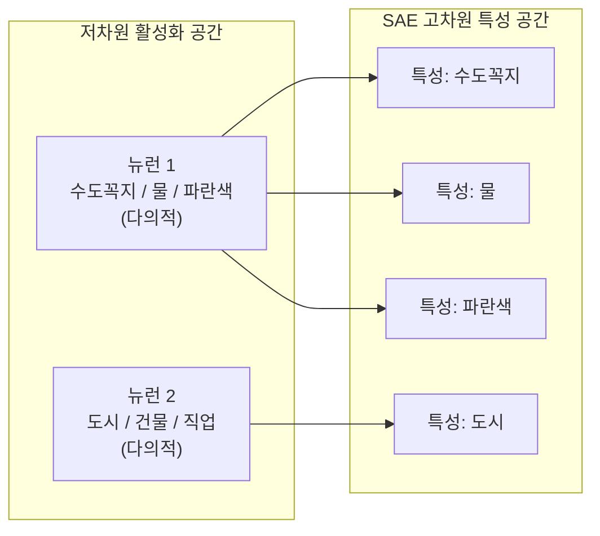
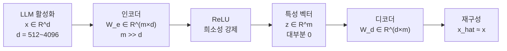
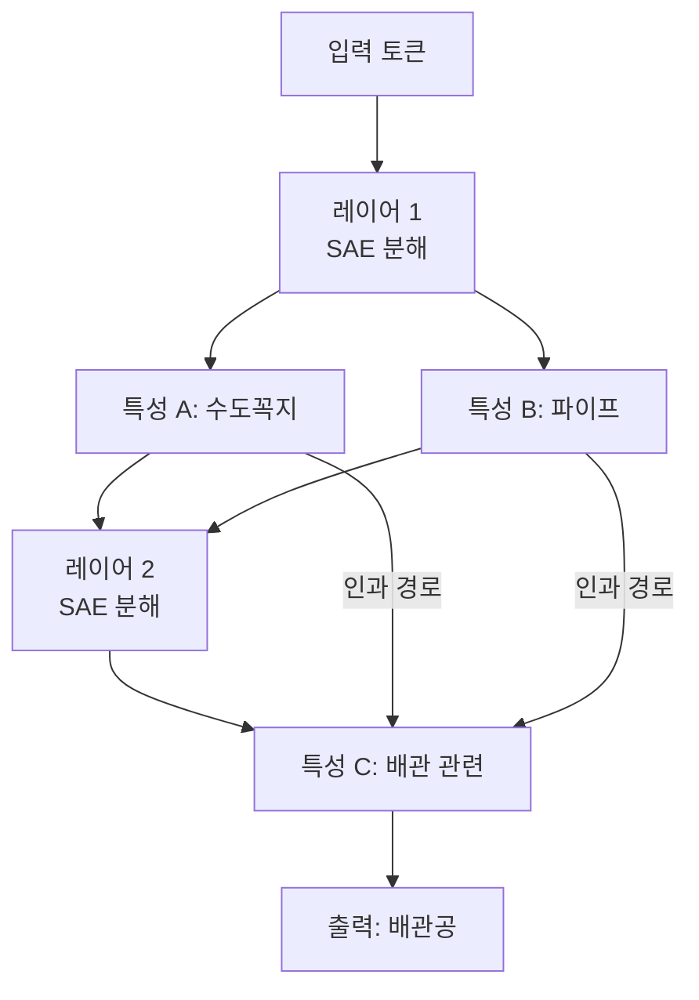

# 희소 오토인코더 (SAE) - 다의성 해소와 회로 해석

## 개요

희소 오토인코더(Sparse Autoencoder, SAE)는 신경망 내부 활성화에서 **인간이 해석 가능한 특성(feature)**을 추출하는 해석 가능성(interpretability) 도구다. LLM의 내부 표현은 다의성(polysemanticity) - 하나의 뉴런이 여러 개념을 동시에 인코딩하는 현상 - 때문에 직접 해석하기 어렵다. SAE는 이 다의적 표현을 **과완전 희소 기저(overcomplete sparse basis)**로 분해하여, 각 특성이 단일 의미를 갖도록 변환한다.

SAE는 [[mechanistic-interpretability-2026]] 연구의 핵심 방법론으로, Anthropic이 Claude의 내부 회로를 분석하는 데 적극 활용하고 있다.

## 다의성 문제와 중첩 가설

**중첩 가설(Superposition Hypothesis)**: 신경망은 n차원 활성화 공간에 n개보다 훨씬 많은 특성을 동시에 저장한다. 이는 희소성 덕분에 가능하다 - 한 번에 활성화되는 특성은 소수이므로, 간섭 없이 더 많은 특성을 중첩시킬 수 있다.

## SAE 아키텍처

SAE는 인코더와 디코더로 구성된 단순한 1레이어 네트워크다.

$$z = \text{ReLU}(W_e \cdot x + b_e), \quad \hat{x} = W_d \cdot z + b_d$$

- $x \in \mathbb{R}^d$: 원본 활성화 (LLM의 레이어 출력)
- $z \in \mathbb{R}^m$: 희소 특성 벡터 ($m \gg d$, 과완전)
- $\hat{x}$: 재구성된 활성화

## 학습 목표

SAE는 두 가지 목표를 동시에 최적화한다.

$$\mathcal{L} = \underbrace{\|x - \hat{x}\|^2}_{\text{재구성 손실}} + \lambda \underbrace{\|z\|_1}_{\text{L1 희소성 페널티}}$$

- **재구성 손실**: 원본 활성화를 충실히 복원
- **L1 희소성**: 각 입력에 대해 소수의 특성만 활성화하도록 강제

$\lambda$는 재구성 정확도와 희소도 사이의 트레이드오프를 조절한다.

## 특성의 성질

잘 학습된 SAE에서 각 특성은 다음 특성을 보인다.

| 특성 속성 | 설명 | 예시 |
|-----------|------|------|
| 단일의미성 (Monosemanticity) | 하나의 개념/패턴에만 반응 | "영어 소유격 's'" |
| 해석 가능성 | 인간이 특성의 의미를 명명 가능 | "DNA 서열", "성경 구절" |
| 활성화 희소성 | 전체 토큰의 1% 미만에서 활성화 | - |
| 방향 안정성 | 디코더 벡터 방향으로 의미 표현 | - |

Anthropic의 Claude-3 Sonnet SAE 분석에서 1600만 개 특성이 발견됐으며, "Golden Gate Bridge", "안전 지침", "내면의 갈등" 같은 추상적 개념에 해당하는 특성들이 발견됐다.

## 회로 해석 (Circuit Analysis)

SAE 특성은 [[mechanistic-interpretability-2026]]의 회로 분석에 활용된다.

회로 분석 절차:
1. 관심 태스크에서 중요한 SAE 특성 식별 (activation patching)
2. 특성 간 인과적 경로 매핑
3. 특정 특성을 개입(intervention)하여 모델 행동 변화 관찰

## 실무 적용 사례

**Anthropic Sparse Autoencoder 연구 (2024):**
- Claude Sonnet 중간 레이어에 SAE 적용, 1600만 특성 추출
- "Golden Gate Bridge" 특성을 지속 활성화시키자 모델이 해당 개념에 집착하는 행동 변화
- 다중언어 특성 발견: 같은 의미를 여러 언어에서 동일 특성이 처리

**안전성 연구:**
- 유해 콘텐츠, 탈옥(jailbreak) 관련 특성 식별
- 특정 특성 억제로 행동 수정 가능성 탐색

## 최신 발전 방향

- **TopK SAE**: L1 대신 상위 k개 특성만 활성화 (더 예측 가능한 희소도)
- **JumpReLU SAE**: 작은 활성화를 0으로 처리하는 계단 함수 도입
- **MoE SAE**: 전문가 혼합으로 더 큰 특성 공간을 효율적으로 커버
- **트랜스코더(Transcoder)**: 어텐션 레이어 입-출력 간 특성 매핑으로 회로 분석 정밀화

## 한계

- **평가 어려움**: "이 특성이 정말 단일의미인가"를 객관적으로 검증하기 어려움
- **스케일 문제**: 수백만 특성을 사람이 일일이 해석하기 불가능
- **인과성 불명확**: 특성 간 상관관계와 인과관계 구분이 어려움
- [[polysemanticity-superposition]] 문제를 SAE가 완전히 해결한다는 보장은 없음

## 관련 문서

- [[mechanistic-interpretability-2026]] - SAE를 활용하는 해석 가능성 연구의 전반적 흐름
- [[polysemanticity-superposition]] - SAE가 해결하려는 다의성·중첩 현상
- [[autoencoders-vae]] - SAE의 기반이 되는 일반 오토인코더 아키텍처
