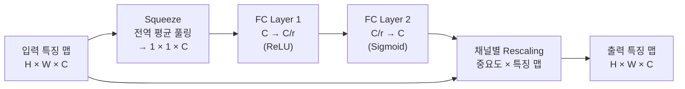
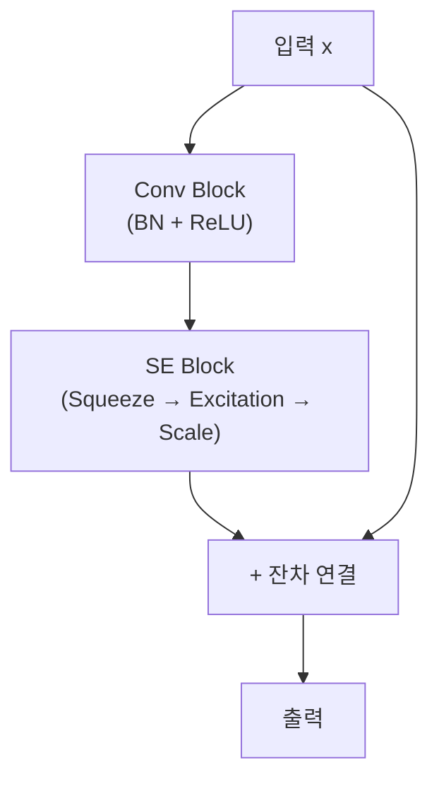

# SE-Net (Squeeze-and-Excitation Networks)

## 개요

SE-Net은 2018년 CVPR에서 Hu 등이 제안한 채널 어텐션 메커니즘이다. 핵심 아이디어는 "어떤 채널이 중요한가"를 네트워크가 스스로 학습하게 하는 것이다. Squeeze 단계에서 공간 정보를 압축하고, Excitation 단계에서 채널별 중요도를 동적으로 계산해 특징 맵을 재조정(recalibration)한다.

ILSVRC 2017에서 1위를 차지했으며, 당시 top-5 오류율을 2.251%로 낮추는 성과를 거뒀다. 파라미터 증가 대비 성능 향상이 크고, 기존 [[cnn]] 아키텍처([[resnet-skip-connections]] 등)에 플러그인 형태로 삽입할 수 있어 널리 활용된다.

## 핵심 구조

### 1. Squeeze (전역 평균 풀링)

입력 특징 맵 $F \in \mathbb{R}^{H \times W \times C}$에 대해, 각 채널을 하나의 스칼라로 압축한다.

$$z_c = F_{sq}(u_c) = \frac{1}{H \times W} \sum_{i=1}^{H} \sum_{j=1}^{W} u_c(i, j)$$

공간 정보를 버리고 채널별 "전역 특성"만 남긴다.

### 2. Excitation (채널 중요도 학습)

압축된 벡터 $z \in \mathbb{R}^C$를 두 개의 완전연결층과 활성화 함수로 처리한다.

$$s = F_{ex}(z, W) = \sigma(W_2 \cdot \delta(W_1 \cdot z))$$

- $W_1 \in \mathbb{R}^{C/r \times C}$: 축소 레이어 (reduction ratio $r$, 보통 16)
- $\delta$: ReLU
- $W_2 \in \mathbb{R}^{C \times C/r}$: 복원 레이어
- $\sigma$: Sigmoid (0~1 범위의 채널별 가중치 생성)

### 3. Rescaling (특징 맵 재조정)

$$\tilde{x}_c = F_{scale}(u_c, s_c) = s_c \cdot u_c$$

각 채널의 출력을 해당 채널의 중요도 스코어로 곱해 최종 출력을 만든다.

위 흐름이 SE 블록 하나의 전체 연산이다. 입력에서 갈라진 두 경로가 Scale 단계에서 합쳐진다.

## ResNet과의 결합

SE 블록은 [[resnet-skip-connections]]의 잔차 블록(residual block) 안에 삽입된다. 컨볼루션 연산 이후, skip connection이 합산되기 전에 SE 블록을 끼워 넣는 패턴이 일반적이다.

이 구조를 SE-ResNet이라 부른다. SE-ResNet-50은 ResNet-50 대비 파라미터가 ~10% 늘어나지만 top-1 정확도는 ImageNet에서 약 1.02%p 향상된다.

## Reduction Ratio (r)의 역할

| r 값 | 파라미터 증가량 | 성능 변화 |
|------|----------------|-----------|
| 4 | 크다 | 높은 용량 |
| 8 | 중간 | 균형 |
| **16** | **작다 (권장)** | **최적 트레이드오프** |
| 32 | 매우 작다 | 성능 저하 시작 |

r=16이 일반적인 기본값이다. 채널 수가 적은 레이어에서는 r을 낮춰야 한다.

## 다른 어텐션 메커니즘과의 비교

| 방법 | 어텐션 축 | 연산 복잡도 |
|------|-----------|-------------|
| SE-Net | 채널(Channel) | 낮음 |
| CBAM | 채널 + 공간 | 중간 |
| Non-local | 공간(self-attention) | 높음 |
| ECA-Net | 채널(1D conv) | 매우 낮음 |

SE-Net은 공간 어텐션을 완전히 무시하는 대신 채널 중요도 학습에만 집중한다. CBAM(Convolutional Block Attention Module)은 SE-Net의 채널 어텐션에 공간 어텐션을 추가한 확장판이다.

## 실무 적용 관점

**왜 중요한가**: SE 블록은 네트워크가 "어떤 특징 채널을 얼마나 믿을지"를 컨텍스트에 맞게 동적으로 조정한다. 예를 들어 고양이 이미지가 입력되면 귀·수염 관련 채널에 높은 가중치가, 배경 채널에 낮은 가중치가 자동으로 할당된다.

**실무에서 어떻게 쓰이나**:
- 이미지 분류 백본에 플러그인 형태로 삽입 (torchvision의 EfficientNet 계열에 내장)
- 객체 탐지 (FPN 특징 피라미드 각 레벨에 적용)
- 의료 영상 분석 (다중 채널 MRI에서 모달리티별 중요도 조정)
- 경량 모델에서도 채널 수가 적으면 r을 1~4로 낮춰 적용 가능

## 관련 문서

- [[cnn]] - 합성곱 신경망 기초 구조
- [[resnet-skip-connections]] - SE 블록이 삽입되는 잔차 연결 구조
- [[deformable-convolution]] - 공간 적응형 합성곱 메커니즘
