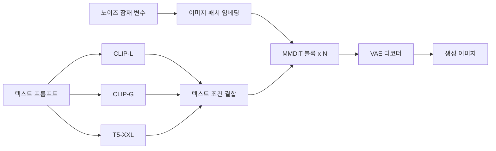
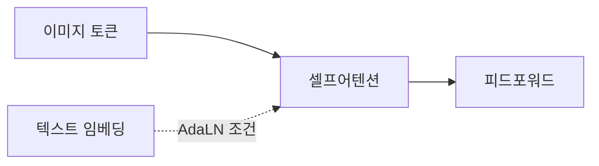
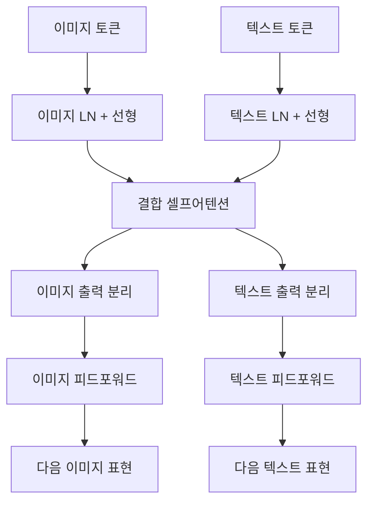

# Stable Diffusion 3 MMDiT - 멀티모달 확산 트랜스포머

## 배경

Stable Diffusion 3(SD3, Esser et al., Stability AI, 2024)는 이전 SD 시리즈(1.x, 2.x, XL)와 근본적으로 다른 아키텍처를 도입했다. U-Net 기반 확산 백본을 버리고 **MMDiT(Multimodal Diffusion Transformer)**를 채택했으며, 확산 과정도 DDPM 대신 **흐름 매칭(Flow Matching)**을 사용한다.

핵심 기여는 이미지 토큰과 텍스트 토큰을 **동등하게** 처리하는 아키텍처다. 기존 [[cross-attention]] 방식에서는 텍스트가 이미지 생성의 "조건"에 불과했지만, MMDiT에서는 두 모달리티가 서로를 조건으로 처리한다.

## 아키텍처 구조

### 전체 파이프라인

### 다중 텍스트 인코더

SD3는 세 가지 텍스트 인코더를 결합한다:

| 인코더 | 역할 |
|--------|------|
| **CLIP-L** (ViT-L/14) | 전역 의미 특징, 768차원 풀링 |
| **CLIP-G** (ViT-bigG/14) | 고차원 의미 특징, 1280차원 풀링 |
| **T5-XXL** | 상세 언어 이해, 시퀀스 임베딩 (4096차원) |

CLIP 풀링 임베딩은 타임스텝 조건에 더해지고, T5 시퀀스 임베딩은 MMDiT 블록의 입력으로 제공된다.

### MMDiT 블록 (핵심 혁신)

기존 DiT(Diffusion Transformer)와의 가장 큰 차이점:

**기존 DiT (단일 스트림)**:

**MMDiT (이중 스트림)**:

핵심: 이미지 토큰과 텍스트 토큰이 **하나의 공유 어텐션**에 함께 참여한다. 서로가 서로를 조건으로 처리할 수 있다. 단, 피드포워드 레이어는 각 모달리티별로 분리됩니다.

### 수식 표현

이미지 토큰 $x_I$와 텍스트 토큰 $x_T$에 대해:

$$[x_I', x_T'] = \text{SelfAttention}([x_I W_{Q,I}; x_T W_{Q,T}], [x_I W_{K,I}; x_T W_{K,T}], [x_I W_{V,I}; x_T W_{V,T}])$$

$$x_I'' = \text{FFN}_I(x_I')$$
$$x_T'' = \text{FFN}_T(x_T')$$

어텐션 쿼리/키/값은 각 모달리티마다 다른 가중치 행렬($W_{Q,I}, W_{Q,T}$ 등)을 사용하지만, 어텐션 연산은 합쳐진 시퀀스에 적용된다.

### 후반부 단일 스트림

SD3의 마지막 몇 개 MMDiT 블록은 텍스트 스트림 없이 **이미지 토큰만** 처리하는 단일 스트림 블록으로 전환된다. 텍스트 정보가 이미지 표현에 충분히 주입된 후, 이미지 세부 정보를 정제한다.

## 흐름 매칭 (Flow Matching)

SD3는 DDPM 대신 **직선화 흐름(Rectified Flow)** 기반 확산 과정을 사용한다:

### DDPM vs 흐름 매칭

| 항목 | DDPM | 흐름 매칭 |
|------|------|---------|
| 노이즈 경로 | 곡선적 확률 경로 | 직선 경로 |
| 샘플링 단계 | 50-1000 DDIM 스텝 | 20-50 스텝으로도 충분 |
| 훈련 목표 | 노이즈 예측 $\epsilon$ | 속도 벡터 $v = x_1 - x_0$ 예측 |

직선 경로:
$$x_t = (1 - t) x_0 + t x_1$$

- $x_0$: 데이터 (이미지)
- $x_1$: 가우시안 노이즈
- $t \in [0, 1]$: 시간스텝

모델은 각 시간점에서 이 직선을 따르는 **속도 벡터**를 예측한다. 경로가 직선이므로 적은 스텝으로도 샘플링이 가능하다.

## QK 정규화

SD3는 MMDiT의 어텐션 안정성을 위해 **QK 정규화(QK Normalization)**를 사용한다:

어텐션 연산 전에 쿼리 Q와 키 K를 RMSNorm으로 정규화:

$$Q' = \text{RMSNorm}(Q), \quad K' = \text{RMSNorm}(K)$$

이를 통해 긴 시퀀스 훈련 시 어텐션 로짓이 폭발적으로 커지는 문제를 방지한다.

## 모델 크기 변형

| 모델 | 파라미터 | MMDiT 레이어 | 모델 차원 |
|------|---------|------------|---------|
| SD3-Medium | 2B | 24 | 1536 |
| SD3-Large | 8B | 38 | 2048 |

## 성능 평가

### GenEval 벤치마크

GenEval은 텍스트-이미지 정렬을 세분화하여 평가:

| 모델 | 전체 점수 | 속성 결합 | 카운팅 | 색상 |
|------|---------|---------|-------|-----|
| SD3 | 0.84 | 높음 | 높음 | 높음 |
| SDXL | 0.55 | 낮음 | 낮음 | 중간 |
| DALL-E 3 | 0.67 | 중간 | 중간 | 높음 |

### T2I-CompBench

복잡한 구성적 프롬프트(예: "왼쪽에 파란 공, 오른쪽에 빨간 상자") 평가에서 SD3가 이전 모델들을 크게 능가했다.

## 훈련 설정

- **데이터**: LAION 5B + 재캡셔닝 합성 캡션
- **해상도**: 256x256 사전학습 후 512x512, 1024x1024 파인튜닝
- **배치 크기**: 대규모 분산 훈련 (정확한 설정 미공개)
- **캡션 재작성**: DALL-E 3 방식 유사하게 CogVLM 기반 상세 캡션 생성

## SD3 이후: SD3.5

Stability AI는 2024년 말 SD3.5 (Medium, Large, Large-Turbo) 공개:
- SD3.5 Large Turbo: 4스텝 초고속 추론
- 개선된 해부학적 정확도 (손, 얼굴)
- 더 다양한 예술 스타일

## 관련 문서

- [[dit-diffusion-transformer]]
- [[diffusion-models]]
- [[latent-diffusion-model]]
- [[flow-matching]]
- [[imagen-text-to-image]]
- [[dalle-3-architecture]]
- [[parti-autoregressive-image]]
- [[clip]]
- [[t5-text-to-text]]
- [[cross-attention]]
- [[vision-transformer]]
